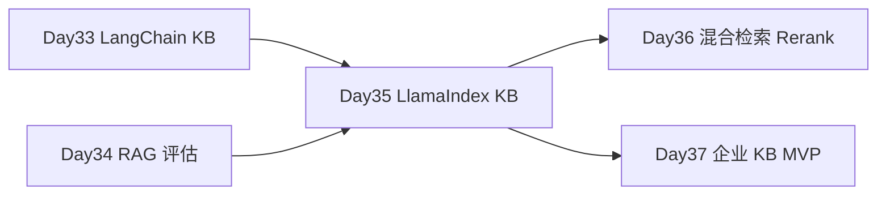

# Day 35 · LlamaIndex 入门 · 与 LangChain 对比重建知识库问答

> **旁白（讲师口吻）**  
> 周二架构评审，张工投屏两张图：左边 Day 33 的 LangChain `RetrievalQA` 链路，右边 LlamaIndex 三行代码建索引。*「客户不问你们用啥框架，但我们要 **双实现对比**——同样的 `kb_docs`、同样的 Top-K=3，Day 35 用 LlamaIndex 重建，代码量、延迟、命中率写进答辩 PPT。」*  
> 小陈补充：*「评估仍用 Day 34 的 `sample_qa_pairs.json`，不许换题库。」*

---

## 今日学习地图

| 时段 | 主题 | 产出物 |
|------|------|--------|
| 09:00–10:00 | LlamaIndex 核心概念：Document / Index / QueryEngine | `04_课堂讲义.md` 第一章 |
| 10:00–11:30 | LangChain vs LlamaIndex 对照 | `compare_frameworks.md` |
| 11:30–12:00 | 环境安装与 mock 策略 | `requirements.txt` |
| 14:00–16:00 | **主实战** `llamaindex_kb.py` | 知识库问答重建 |
| 16:00–17:00 | `verify_day35.py` 验收 + Day 36 预习 | 全绿截图 |
| 19:00–21:00 | 作业：live 模式 + 框架选型报告 | `06_课后作业.md` |

## 与前后课程的衔接



| 前序能力 | 今日升级 |
|----------|----------|
| Day 33 LangChain RAG | 平行实现同一 PRD |
| Day 34 评估集 | 共用 `sample_qa_pairs.json` 对比分数 |
| Day 20 Embedding mock | LlamaIndex mock embedding 回退 |

## 今日文件清单

| 文件 | 用途 |
|------|------|
| [01_业务背景.md](./01_业务背景.md) | 双框架对比评审背景 |
| [02_需求文档.md](./02_需求文档.md) | LlamaIndex KB PRD |
| [03_架构与设计.md](./03_架构与设计.md) | Index / QueryEngine 架构 |
| [04_课堂讲义.md](./04_课堂讲义.md) | **主课** LlamaIndex 实操 |
| [05_流程图与示意图.md](./05_流程图与示意图.md) | 双框架对照图 |
| [06_课后作业.md](./06_课后作业.md) | 必做 / 选做 / 挑战 |
| [07_作业参考答案.md](./07_作业参考答案.md) | 参考答案 |
| [08_补充讲义_LlamaIndex进阶.md](./08_补充讲义_LlamaIndex进阶.md) | NodeParser、子问题查询 |
| [code/llamaindex_kb.py](./code/llamaindex_kb.py) | **LlamaIndex / mock 知识库** |
| [code/compare_frameworks.md](./code/compare_frameworks.md) | LangChain vs LlamaIndex |
| [code/data/kb_docs/](./code/data/kb_docs/) | 知识库 Markdown |
| [code/verify_day35.py](./code/verify_day35.py) | 自动化验收 |
| [run.sh](./run.sh) | 一键演示 |

## 今日验收标准

- [ ] 能口述 LlamaIndex 的 Document → Index → QueryEngine 路径  
- [ ] 能说出 LangChain 与 LlamaIndex 各擅长什么场景  
- [ ] `llamaindex_kb.py --force-mock` 能回答「如何申请退款？」  
- [ ] 检索结果含 `source` 与 score  
- [ ] 无 `llama-index` 包时 `MockKBEngine` 可完整演示  
- [ ] `python3 verify_day35.py` 全部 `[OK]`  
- [ ] Git commit message 含 `day35`

## 快速开始

```bash
cd day35
bash run.sh
# 或
cd day35/code
pip install -r requirements.txt
python3 llamaindex_kb.py --force-mock
python3 llamaindex_kb.py --repl --force-mock
python3 verify_day35.py
```

可选 live（需安装 llama-index 与 API Key）：

```bash
pip install llama-index llama-index-embeddings-openai llama-index-llms-openai
export OPENAI_API_KEY=sk-...
unset LLAMAINDEX_FORCE_MOCK
python3 llamaindex_kb.py -q "星火智服支持哪些大模型？"
```

---

**讲师提醒**：今日重点是 **同一业务双框架平行实现**，不是站队。Day 36 将在 LangChain 主线上加混合检索与 Rerank。

**状态**：✅ Day 35 LlamaIndex 完整课件已发布
