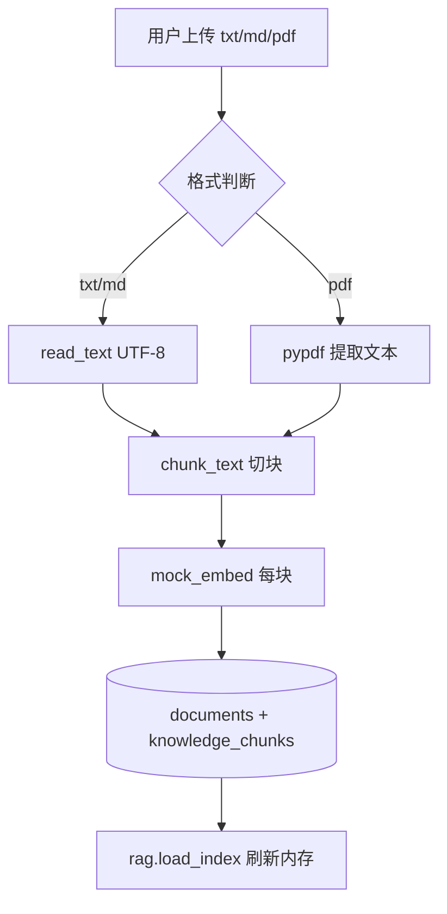
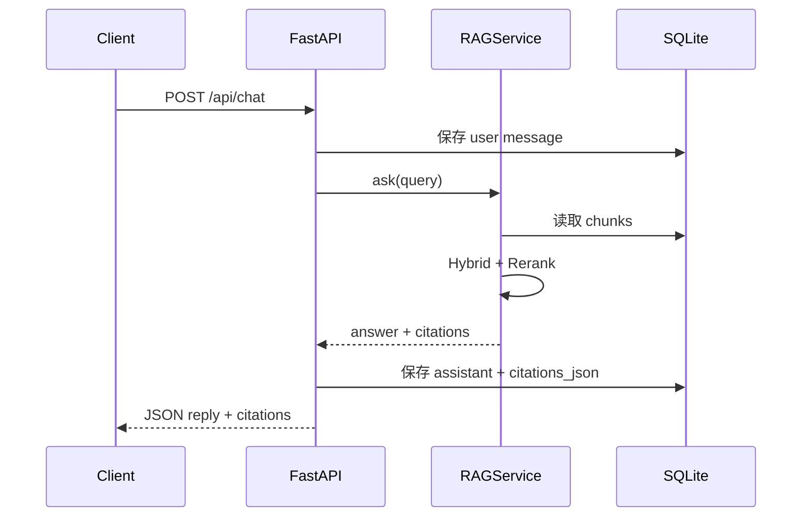
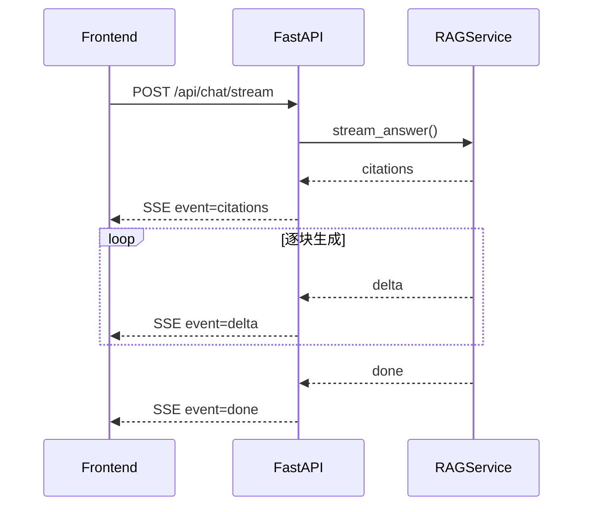

# Day 36 流程图与示意图

## 1. 文档摄取流程



## 2. 问答时序（非流式）



## 3. SSE 流式时序



## 4. 模块依赖图

```text
main.py
 ├── document_ingest ──► models / rag_common
 ├── rag_service
 │    ├── hybrid_retriever ──► rag_common
 │    └── rerank
 └── database / schemas
```

## 5. citations 数据结构

```text
CitationOut
├── chunk_id    "3-a1b2c3d4"   # 全局唯一
├── source      "refund_policy.md"
├── snippet     "用户可在订单完成后 7 天内..."
├── score       0.423          # rerank 后分数
└── chunk_index 0              # 文档内序号
```

---

*流程图 · Day 36*
