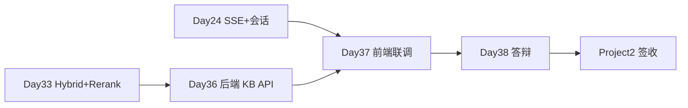

# Day 36 · STAGE PROJECT 2（上）· 企业知识库问答 — 需求与后端

> **旁白（讲师口吻）**  
> 周一晨会，产品小陈摊开三张纸：*「客户不要玩具 Chat 了，要 **真知识库**——上传制度 PDF，问退款能 **带引用**；没有依据就说不知道。」*  
> 张工在白板写下：**Project 2 三天交付**——今天搭后端骨架，明天联调前端，后天答辩。

---

## 今日学习地图

| 时段 | 主题 | 产出物 |
|------|------|--------|
| 09:00–10:00 | 需求分析 & 架构评审 | `02_需求文档.md` `03_架构与设计.md` |
| 10:00–12:00 | 多格式文档摄取 | `document_ingest.py` |
| 14:00–15:30 | Hybrid + Rerank RAG | `rag_service.py` `hybrid_retriever.py` |
| 15:30–17:00 | FastAPI 路由 & SQLite | `main.py` `models.py` |
| 17:00–17:30 | `verify_project2.py` 后端验收 | 全绿截图 |
| 19:00–21:00 | 作业：补 PDF 样本 + live 模式 | `06_课后作业.md` |

## 里程碑定位



**Day 36 是 Project 2 第一天**：完成可独立运行的后端 API，前端仅占位。

## 项目代码位置

```
day36/code/project2/
├── backend/
│   ├── main.py              # FastAPI 入口
│   ├── rag_service.py       # Hybrid + Rerank + 引用
│   ├── document_ingest.py   # txt/md/pdf 摄取
│   ├── hybrid_retriever.py  # BM25 + Vector + RRF
│   ├── rerank.py
│   ├── rag_common.py
│   ├── models.py / schemas.py / database.py
├── frontend/                # Day 37 完善
├── data/sample_docs/        # 样本知识库
├── verify_project2.py
└── run.sh
```

## 今日文件清单

| 文件 | 用途 |
|------|------|
| [01_业务背景.md](./01_业务背景.md) | 客户知识库项目立项 |
| [02_需求文档.md](./02_需求文档.md) | Project 2 PRD |
| [03_架构与设计.md](./03_架构与设计.md) | 全栈架构 & 数据模型 |
| [04_课堂讲义.md](./04_课堂讲义.md) | **主课** 后端实现 |
| [05_流程图与示意图.md](./05_流程图与示意图.md) | 摄取/RAG 时序图 |
| [06_课后作业.md](./06_课后作业.md) | 扩展作业 |
| [07_作业参考答案.md](./07_作业参考答案.md) | 参考答案 |
| [08_补充讲义_文档摄取与索引.md](./08_补充讲义_文档摄取与索引.md) | PDF/切块速查 |
| [code/project2/](./code/project2/) | **项目代码** |
| [verify_project2.py](./verify_project2.py) | 验收入口 |

## 今日验收标准

- [ ] 能解释 Hybrid + Rerank + 引用三元组设计  
- [ ] `POST /api/documents/upload` 支持 txt/md/pdf  
- [ ] `POST /api/chat` 返回 `citations` 数组  
- [ ] `POST /api/chat/stream` 先发 `citations` 再发 `delta`  
- [ ] 无 API Key 时 mock 模式完整可演示  
- [ ] `python3 verify_project2.py` 全部 `[OK]`  
- [ ] Git commit message 含 `day36`

## 快速开始

```bash
cd day36/code/project2
pip install -r requirements.txt
python3 verify_project2.py

# 仅启动后端 API
export PYTHONPATH=$PWD
uvicorn backend.main:app --reload --port 8000
# 文档 http://127.0.0.1:8000/docs
```

---

**讲师提醒**：今日 **不写漂亮 UI**，重点是 ingest → index → retrieve → cite 闭环。明天 Day 37 接 Day 24 前端模式。

**状态**：✅ Day 36 Project 2（上）完整课件已发布
