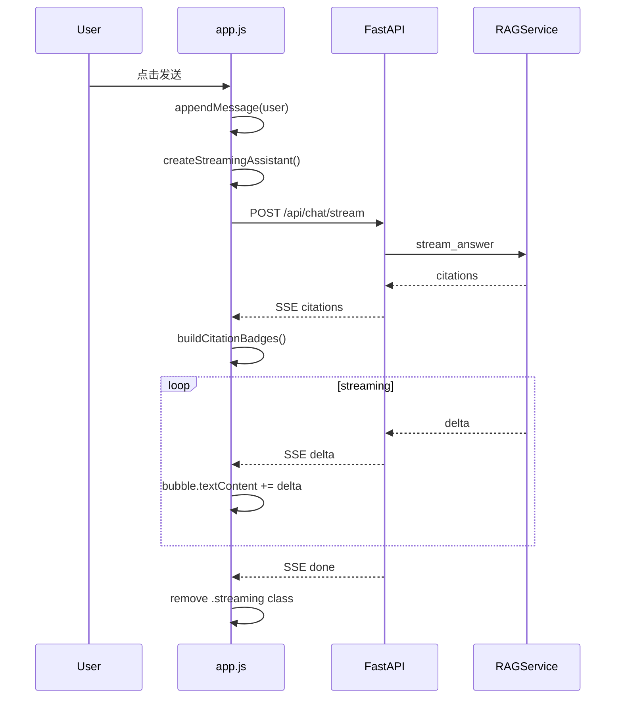
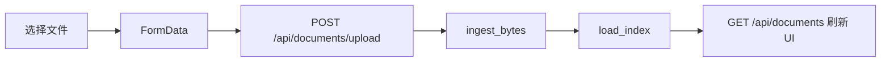

# Day 37 流程图与示意图

## 1. 用户发送消息全流程



## 2. 文档上传流程



## 3. 页面布局 ASCII

```text
+------------------------------------------------------------------+
| 星火智服 KB          |  知识库问答              [Mock · 12 块] |
| 文档上传             +------------------------------------------+
| [选择文件]           |  assistant: 关于退款...                   |
| [上传并建库]         |  [1]refund.md [2]faq.txt                 |
| - refund_policy.md   |                                          |
| - api_key_guide.md   |  user: 怎么申请 API Key?                 |
| [清空对话]           +------------------------------------------+
| [重建索引]           | [输入框........................] [发送]  |
+------------------------------------------------------------------+
```

## 4. localStorage 与后端 session 关系

```text
localStorage.sparktech_kb_session_id  ──►  chat_sessions.id
                                              └── chat_messages[]
```

---

*流程图 · Day 37*
