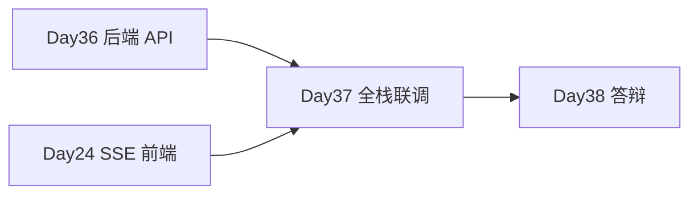

# Day 37 · STAGE PROJECT 2（中）· 前端联调与全栈集成

> **旁白（讲师口吻）**  
> 周二下午，小陈打开 Day 36 的后端 Swagger：*「API 都有了，但客户要看 **网页**——上传 PDF、边聊边出引用角标。」*  
> 张工：*「今天把 Day 24 的 SSE 壳子接上 RAG，**citations 事件先渲染再打字**。」*

---

## 今日学习地图

| 时段 | 主题 | 产出物 |
|------|------|--------|
| 09:00–10:30 | 前端布局 & 引用徽章 | `frontend/index.html` `style.css` |
| 10:30–12:00 | SSE citations + 流式 | `frontend/app.js` |
| 14:00–15:00 | 文档上传 UI 联调 | upload panel |
| 15:00–16:30 | 多轮会话 + 历史 citations | history API |
| 16:30–17:00 | `run.sh` 全栈彩排 | 客户 Demo 脚本 |
| 19:00–21:00 | 集成测试作业 | `06_课后作业.md` |

## 里程碑定位



**Day 37 是 Project 2 第二天**：前后端完整可演示，为 Day 38 答辩做准备。

## 项目代码位置

与 Day 36 共用：

```
day36/code/project2/
├── backend/     # Day 36 已完成
├── frontend/    # ★ 今日重点
│   ├── index.html
│   ├── style.css
│   └── app.js
├── run.sh       # ★ 今日交付
└── verify_project2.py
```

Day 37 目录提供快捷入口：

```bash
cd day37 && bash run.sh          # 委托 project2/run.sh
python3 verify_project2.py       # 全链路验收
```

## 今日文件清单

| 文件 | 用途 |
|------|------|
| [01_业务背景.md](./01_业务背景.md) | 全栈 Demo 验收事件 |
| [02_需求文档.md](./02_需求文档.md) | 前端 PRD 补充 |
| [03_架构与设计.md](./03_架构与设计.md) | 前端数据流 |
| [04_课堂讲义.md](./04_课堂讲义.md) | **主课** 前端实现 |
| [05_流程图与示意图.md](./05_流程图与示意图.md) | UI / SSE 时序 |
| [06_课后作业.md](./06_课后作业.md) | 联调作业 |
| [07_作业参考答案.md](./07_作业参考答案.md) | 参考答案 |
| [08_补充讲义_引用展示与SSE.md](./08_补充讲义_引用展示与SSE.md) | citations UI 速查 |
| [run.sh](./run.sh) | 一键启动 |
| [verify_project2.py](./verify_project2.py) | 验收 |

## 今日验收标准

- [ ] `bash run.sh` 后打开 `http://127.0.0.1:8080` 可见知识库 UI  
- [ ] 左侧上传 md/txt 后文档列表刷新  
- [ ] 问「退款政策」assistant 回复 **流式** 且下方有 **引用徽章**  
- [ ] 点击引用徽章可查看 snippet  
- [ ] 刷新页面历史消息含 citations  
- [ ] `python3 verify_project2.py` 全部 `[OK]`  
- [ ] Git commit message 含 `day37`

## 快速开始

```bash
cd day37
bash run.sh
# 浏览器 http://127.0.0.1:8080
# API 文档 http://127.0.0.1:8000/docs
```

---

**讲师提醒**：Demo 脚本 — 上传文档 → 问退款 → 指引用 → 刷新看历史 → 清空会话。

**状态**：✅ Day 37 Project 2（中）完整课件已发布
