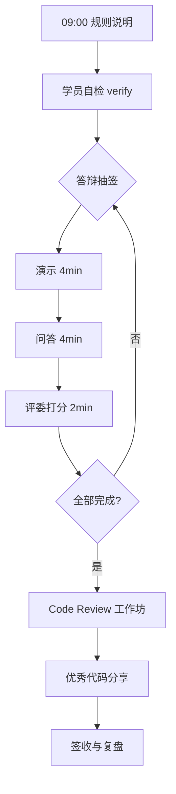

# Day 38 流程图与示意图

## 1. 答辩日流程



## 2. 评分维度权重

```text
功能完成度 ████████████████░░░░  30%
代码质量     █████████████░░░░░░░  25%
异常健壮     ████████░░░░░░░░░░░░  15%
演示表达     ████████░░░░░░░░░░░░  15%
工程化       █████░░░░░░░░░░░░░░░  10%
加分项       +10 (cap 100)
```

## 3. 知识库问答全链路（答辩白板图）

```text
  [Upload] --> [Parse] --> [Chunk] --> [Embed] --> [DB]
                                                  |
  [User Query] --> [Hybrid] --> [Rerank] --> [Citations]
                                    |
                                    v
                              [LLM / Mock]
                                    |
                                    v
                              [SSE Stream]
                                    |
                                    v
                              [UI Badges]
```

## 4. 互评信息流

```text
学员 A 代码 ──review──► 学员 B 填写 CR 清单
        ▲                        |
        └──────── feedback ──────┘
```

---

*流程图 · Day 38*
