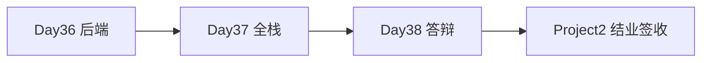

# Day 38 · STAGE PROJECT 2（下）· 项目答辩与 Code Review

> **旁白（讲师口吻）**  
> 周五下午，培训室投影仪亮起：*「三天 Project 2，今天 **答辩签收**——演示、问答、互评，张工按 Rubric 打分。」*  
> 优秀小组将分享 **引用溯源 + SSE** 实现亮点。

---

## 今日学习地图

| 时段 | 主题 | 产出物 |
|------|------|--------|
| 09:00–10:00 | 答辩流程与演示脚本 rehearsal | `04_课堂讲义.md` |
| 10:00–12:00 | 第一轮答辩（每组 10 min） | 评分表 |
| 14:00–15:30 | Code Review 工作坊 | `08_补充讲义_CodeReview清单.md` |
| 15:30–17:00 | 第二轮答辩 + 优秀代码分享 | 示范片段 |
| 17:00–17:30 | 里程碑签收 & 复盘 | README 签收栏 |

## 里程碑定位



**Day 38 是 Project 2 收官日**：无新功能硬性要求，聚焦 **演示、评审、复盘**。

## 今日文件清单

| 文件 | 用途 |
|------|------|
| [01_业务背景.md](./01_业务背景.md) | 答辩日安排 |
| [02_需求文档.md](./02_需求文档.md) | 答辩交付清单 |
| [03_架构与设计.md](./03_架构与设计.md) | 评审关注点 |
| [04_课堂讲义.md](./04_课堂讲义.md) | **答辩指南** |
| [05_流程图与示意图.md](./05_流程图与示意图.md) | 答辩流程图 |
| [06_课后作业.md](./06_课后作业.md) | 复盘作业 |
| [07_作业参考答案.md](./07_作业参考答案.md) | 复盘范例 |
| [08_补充讲义_CodeReview清单.md](./08_补充讲义_CodeReview清单.md) | CR Checklist |
| [项目答辩评分标准.md](./项目答辩评分标准.md) | **Rubric 100 分** |

## 答辩验收标准

- [ ] 10 分钟内涵盖：架构 → Demo → 引用 → 异常  
- [ ] `bash run.sh` 与 `verify_project2.py` 现场通过  
- [ ] 能解释 Hybrid / RRF / citations 事件顺序  
- [ ] 互评表提交  
- [ ] 总分 ≥ 60 分  

## 快速开始（答辩前自检）

```bash
cd day36/code/project2
python3 verify_project2.py
bash run.sh
# 浏览器彩排 Demo 脚本
```

---

**讲师提醒**：答辩失败可 3 日内补考；**verify 失败一票否决** 功能维度上限。

**状态**：✅ Day 38 Project 2（下）完整课件已发布
