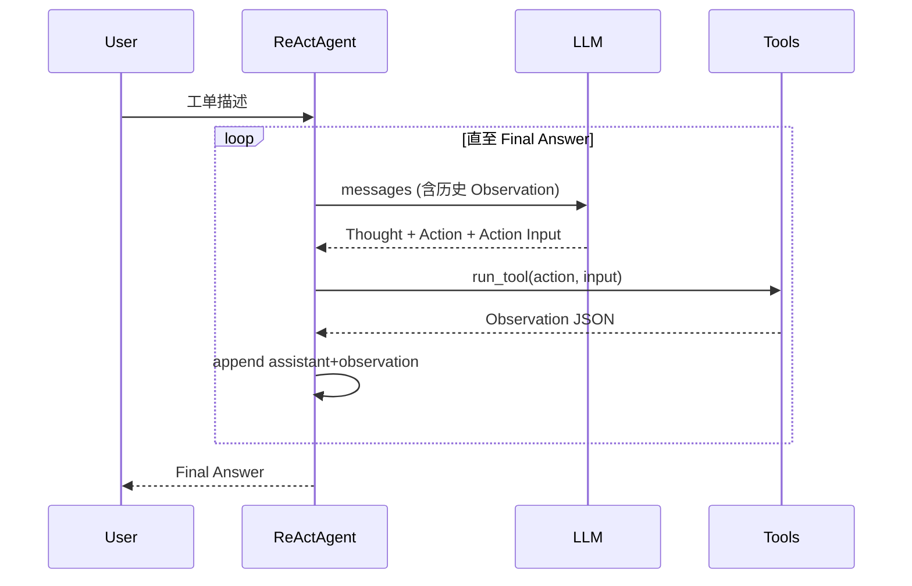

# Day 39 架构与设计 · ReAct Agent 三层架构

## 1. 总体架构

```text
┌─────────────────────────────────────────────────────────┐
│                    ReActAgent.run()                      │
│  ┌─────────┐    ┌──────────┐    ┌─────────────────────┐ │
│  │ Mock/   │───▶│ Parser   │───▶│ tools_basic.run_tool│ │
│  │ Live LLM│    │ (regex)  │    │                     │ │
│  └─────────┘    └──────────┘    └─────────────────────┘ │
│       ▲                │                    │            │
│       │                ▼                    ▼            │
│       │         Final Answer?          Observation       │
│       └──────── append to messages ──────────────────────┘
└─────────────────────────────────────────────────────────┘
```

## 2. 模块职责

| 层 | 模块 | 职责 |
|----|------|------|
| 推理层 | `mock_llm.py` / Live API | 生成 ReAct 格式文本 |
| 编排层 | `react_agent.py` | 循环控制、消息管理、轨迹记录 |
| 解析层 | `parse_react_output` | 从文本提取结构化字段 |
| 执行层 | `tools_basic.py` | 工单工具真实（mock）逻辑 |

## 3. ReAct 消息流



## 4. 与 Day 19 架构对比

```text
Day 19:
  messages → API(tools=schemas) → tool_calls[] → tool_runner → role=tool

Day 39:
  messages → LLM(text) → parse Action → run_tool → Observation 拼回文本
```

**关键差异**：Day 19 依赖 API 结构化输出；Day 39 自行解析，更灵活但更脆弱。

## 5. 与 Day 36 RAG 对接设计

| 环境 | search_kb_snippet 实现 |
|------|------------------------|
| 课堂 mock | `mock_kb_snippets.json` 关键词匹配 |
| 生产 | HTTP 调用 `day36/project2` `/api/chat` 或内嵌 `hybrid_retriever` |

```python
# 远期对接示意（今日不实现）
from day36.backend.hybrid_retriever import HybridRetriever
retriever = HybridRetriever(...)
docs = retriever.retrieve(query, k=3)
```

## 6. 状态与终止条件

| 条件 | 行为 |
|------|------|
| 解析到 `Final Answer` | 正常返回 |
| 无 Action 字段 | 用 thought/raw 作为答案 |
| `step >= max_steps` | 返回超时提示 |
| 工具执行 error | Observation 含 error JSON，LLM 自行纠错 |

## 7. 数据模型

### mock_tickets.json

工单 ID、客户 tier、subject、body。

### ReActTrace

```python
@dataclass
class ReActTrace:
    user_query: str
    steps: list[ReActStep]
    final_answer: str
```

---

*Day 39 架构设计 v1.0*
