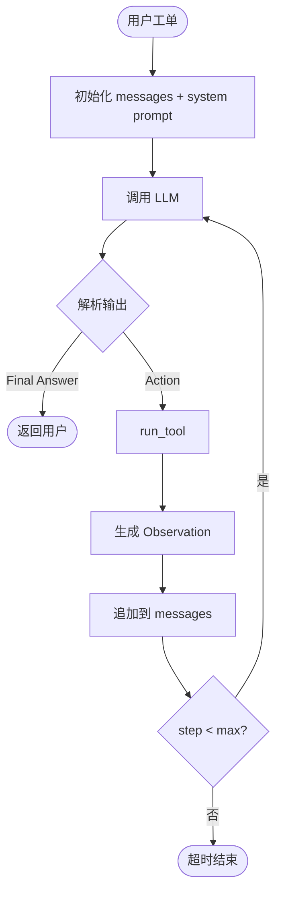
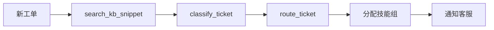
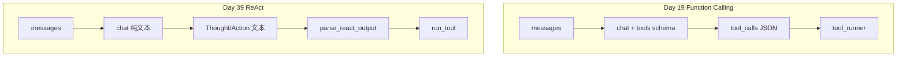

# Day 39 流程图与示意图

## 1. ReAct 主循环



## 2. 星火智服 Phase3 工单路由



## 3. Day 19 vs Day 39



## 4. 工具依赖

```text
tools_basic.py
├── classify_ticket ──▶ INTENT_KEYWORDS
├── route_ticket    ──▶ INTENT_ROUTING
├── search_kb_snippet ──▶ mock_kb_snippets.json
│                         └── (生产) day36 hybrid_retriever
└── get_ticket_by_id ──▶ mock_tickets.json
```

## 5. 课堂白板 ReAct 示例

```text
┌──────────────────────────────────────────┐
│ Thought: 退款类，先分类                    │
│ Action: classify_ticket                   │
│ Action Input: {"text": "..."}             │
├──────────────────────────────────────────┤
│ Observation: {"intent":"refund",...}     │
├──────────────────────────────────────────┤
│ Thought: 路由到 billing                    │
│ Action: route_ticket                      │
│ ...                                       │
├──────────────────────────────────────────┤
│ Final Answer: 已路由至【退款/账单组】       │
└──────────────────────────────────────────┘
```

---

*Day 39 流程图*
