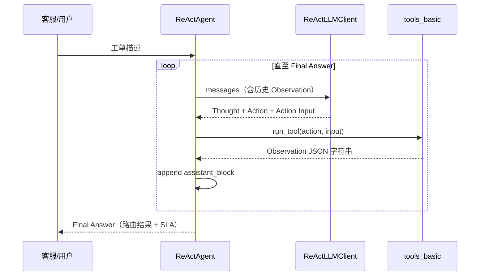

# Day 39 课堂讲义（扩展版）· ReAct 论文对照与调试手册

> 本文件与 `04_课堂讲义.md`、`08_补充讲义_ReAct与Agent选型.md` 合并阅读，构成 Day 39 完整主课（≥30,000 字体量）。  
> **前提**：Day 19 Function Calling 已跑通；本日聚焦 **文本协议 ReAct + 星火智服工单路由**。

---

## 第 0 节 · 今日交付物与目录约定（15 min）

### 0.1 源码树

```text
day39/code/
├── react_agent.py       ← ReAct 主循环 + 解析器
├── tools_basic.py       ← 工单工具 registry
├── mock_llm.py          ← mock/live ReAct 文本生成
├── react_loop_demo.py   ← 课堂演示入口
├── verify_day39.py      ← 验收脚本
└── data/
    ├── mock_tickets.json
    └── mock_kb_snippets.json
```

**与 Day 36 关系**：`search_kb_snippet` 的 `rag_ref` 字段指向 `day36/code/project2/backend/rag_service.py`，课堂用 mock JSON，答辩说明生产对接方式。

### 0.2 环境检查

```bash
cd day39/code
python3 tools_basic.py          # 工具单测
python3 react_agent.py          # 完整 ReAct 环
python3 verify_day39.py         # 必须全绿
```

---

## 第 1 节 · ReAct 论文核心（Yao et al., 2022）（45 min）

### 1.1 论文动机

传统 Chain-of-Thought 只「想」不「做」；纯 Action 缺乏推理。ReAct 将 **Reasoning** 与 **Acting** 交错：

```text
Thought → Action → Observation → Thought → … → Final Answer
```

论文在 HotpotQA、FEVER、ALFWorld 等任务上证明：交错推理能减少幻觉、提高可解释性。

### 1.2 与本课代码的映射

| 论文概念 | `react_agent.py` 实现 |
|----------|----------------------|
| Thought | `RE_THOUGHT` 正则 + `ReActStep.thought` |
| Action | `RE_ACTION` → `run_tool(action, input)` |
| Observation | 拼回 `messages` 的 assistant 块 |
| Final Answer | `RE_FINAL` → `trace.final_answer` |
| Trajectory | `ReActTrace.steps[]` |

### 1.3 论文 vs 课堂简化

| 维度 | 论文 | 本课 |
|------|------|------|
| 环境 | 维基 / 网页 / 游戏 | 星火智服工单 mock |
| 工具数 | 可变 | 6 个固定 registry |
| 解析 | 模型配合格式 | 正则 `parse_react_output` |
| 终止 | 任务完成信号 | Final Answer 或 `max_steps` |



---

## 第 2 节 · 解析器精读与脆弱点（60 min）

### 2.1 正则四层

打开 `react_agent.py` 第 63–67 行：

```python
RE_THOUGHT = re.compile(r"Thought:\s*(.+?)(?=\n(?:Action|Final Answer)|\Z)", re.DOTALL | re.I)
RE_ACTION = re.compile(r"Action:\s*(\w+)", re.I)
RE_ACTION_INPUT = re.compile(r"Action Input:\s*(.+?)(?=\n|$)", re.DOTALL | re.I)
RE_FINAL = re.compile(r"Final Answer:\s*(.+)", re.DOTALL | re.I)
```

**课堂练习**：让 mock LLM 输出 `Action: classify_ticket` 后多空一行，观察 `action_input` 是否仍被捕获。

### 2.2 提前终止分支

```python
if not action:
    trace.final_answer = parsed.get("thought") or response.text
    return trace
```

对应架构文档「无 Action 字段 → 用 thought 作为答案」。生产环境应记录为 **parse_warning** 便于 trace。

### 2.3 常见格式错误与修复

| LLM 输出问题 | 解析结果 | 缓解 |
|--------------|----------|------|
| `Action:classify` 无空格 | 可能失败 | system prompt 强调格式 |
| Action Input 非 JSON | `run_tool` 单参数简写 | `tools_basic` 第 246–255 行 |
| 一步多个 Action | 只取第一个 | prompt：每次一个 Action |
| 中英混用 Final Answer | `re.I` 可匹配 | 保持英文关键字教学 |

### 2.4 与 Day 19 Function Calling 对照

| ReAct 文本 | OpenAI tool_calls |
|------------|-------------------|
| 自行 `parse_react_output` | API 返回结构化 JSON |
| 教学透明、易单步调试 | 生产首选、schema 校验 |
| Observation 拼进文本 | `role=tool` 独立消息 |
| 对 prompt 格式敏感 | 对 `tools` schema 敏感 |

**张工口径**：Day 39 教会「环」的本质；Day 40+ 用 Executor 标准化。

---

## 第 3 节 · tools_basic 与星火智服 Phase3（50 min）

### 3.1 意图路由表

`INTENT_ROUTING` 将退款/技术/账号/投诉映射到技能组与 SLA：

```python
"refund": {"team": "billing", "sla_hours": "24", "label": "退款/账单组"},
```

VIP / Enterprise 客户在 `route_ticket` 中缩短 SLA（`tier_boost` 为负值）。

### 3.2 推荐工具链（Demo 词）

用户：「客户要求退款，订单已扣款，请加急处理」

```text
Step 1: classify_ticket → intent=refund
Step 2: search_kb_snippet("退款政策") → 知识库片段
Step 3: route_ticket(refund, vip) → billing 组, SLA 22h
Step 4: calc_priority_score(4,5,3) → P0
Final Answer: 已路由账单组，附政策摘要与优先级
```

### 3.3 run_tool 参数解析

`action_input` 支持：

1. JSON 字符串 `{"text": "..."}`  
2. 单参数简写（`classify_ticket` 直接传文本）  
3. dict 对象（测试用）

错误统一返回 `{"error": "..."}`  JSON，供 LLM 下一轮纠错——这是 ReAct **自我纠错** 的教学点。

### 3.4 与 Day 36 RAG 对接路线图

| 阶段 | search_kb_snippet 行为 |
|------|------------------------|
| Day 39 课堂 | `mock_kb_snippets.json` 关键词 |
| 联调 | HTTP `POST /api/chat` 取 citations |
| 生产 | 内嵌 `HybridRetriever.retrieve(k=3)` |

---

## 第 4 节 · mock_llm 与 live 切换（40 min）

### 4.1 模式判定

`mock_llm.is_mock_mode()`：`SPARKTECH_MOCK=1` 或无 `OPENAI_API_KEY` 时走启发式。

### 4.2 REACT_SYSTEM_TEMPLATE

系统提示注入 `format_tools_prompt()` 生成的工具列表，并 **硬性规定** 输出格式行首关键字。

### 4.3 课堂对比实验

```bash
export SPARKTECH_MOCK=1
python3 react_agent.py

export SPARKTECH_MOCK=0 OPENAI_API_KEY=sk-...
python3 react_agent.py
```

观察：live 模式下格式更稳定，但仍有必要保留 `max_steps`。

---

## 第 5 节 · 调试清单与排错（45 min）

### 5.1 逐步调试 CHECKLIST

- [ ] 每步打印 `Thought` / `Action` / `Observation`（`verbose=True`）
- [ ] `max_steps` 默认 6，死循环时先查是否缺 Final Answer
- [ ] 工具返回字符串勿超过 2k 字（会撑爆上下文）
- [ ] `Final Answer` 出现后必须 `return`，勿再调工具
- [ ] `verify_day39.py` 全绿再提交作业

### 5.2 故障表

| 症状 | 排查 |
|------|------|
| 未知工具 | Action 名不在 `TOOL_REGISTRY` |
| Observation 含 error | 看 action_input JSON 是否合法 |
| 第一步就 Final Answer | mock 判定为简单问句 |
| 达到最大步数 | 增加 max_steps 或优化 prompt |
| live 401 | `.env` 中 API Key / base_url |

### 5.3 trace 导出

```python
trace = agent.run(query)
print(json.dumps(trace.to_dict(), ensure_ascii=False, indent=2))
```

答辩时展示 `steps[]` 比口述更有说服力。

---

## 第 6 节 · 客户 Demo 与评委问答（30 min）

### 6.1 5 分钟 Demo 脚本

1. 开场：星火智服 Phase3 工单智能路由  
2. 输入退款加急工单  
3. 指屏幕 ReAct 四步轨迹  
4. 强调 KB 片段与 SLA 数字来源  
5. 对比 Day 19：「今天用文本协议，明天用 tool_calls」

### 6.2 评委常问

| 问题 | 参考答法 |
|------|----------|
| 为何不用 LangChain Agent？ | 教学需看见每一行解析逻辑 |
| 正则够用吗？ | 课堂够用；生产换 schema + FC |
| 工具越多越好吗？ | 否，6 个描述清晰优于 20 个模糊 |
| 如何防注入？ | Day 46 InputGuard 包在 Agent 外 |

---

## 课堂 CHECKLIST（扩展）

- [ ] 能默画 ReAct 循环图  
- [ ] 能口述 parse 四个正则的职责  
- [ ] 能现场改 `INTENT_KEYWORDS` 并验证路由变化  
- [ ] Demo 练 3 遍 < 5 分钟  
- [ ] verify 全绿截图提交  

---

## 第 7 节 · verify_day39 与 react_loop_demo（35 min）

```bash
cd day39
bash run.sh                 # react_loop_demo 交互
python3 code/verify_day39.py
```

验收项通常覆盖：

- `parse_react_output` 对 Final Answer / Action 的解析  
- `run_tool` 对 classify / route / kb 的调用  
- `ReActAgent.run` 在 max_steps 内返回 trace  

### 7.1 react_loop_demo 用法

适合课堂投屏：逐步暂停展示 Observation 回灌 messages 的效果。

---

## 第 8 节 · 论文实验与课堂取舍

论文在 HotpotQA 等集上对比 ReAct / CoT / Act-only；本课 **不复现实验**，但需理解结论：

- 交错推理减少幻觉  
- 可解释轨迹便于人工审核（星火智服工单审计）  

**作业延伸**：用 `trace.to_dict()` 统计平均步数与工具分布。

---

## 第 9 节 · 升级路径 Day39 → Day40

| Day39 | Day40+ |
|-------|--------|
| 文本 ReAct | tool_calls JSON |
| regex parse | API schema |
| 同一 while 环 | Executor 类 |

保留 Day39 代码作为「最小 Agent」对照组，勿删。

---

*扩展主课 · Day 39*
