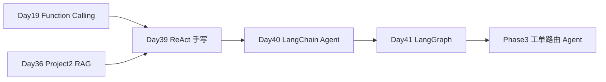

# Day 39 · Agent 概念与 ReAct · 手写最小 Agent（无框架）

> **旁白（讲师口吻）**  
> Phase3 启动会上，小陈摊开工单积压看板：*「每天 2000+ 工单靠人工分拣——**Agent 要能自己 Thought→Action→Observation 循环**，先手写 ReAct，别急着上框架。」*  
> 张工指向 [Day 19 Function Calling](../day19/)：*「那天是 JSON `tool_calls`；今天是 **自然语言 ReAct**，解析 Thought/Action，一样是无框架。」*

---

## 今日学习地图

| 时段 | 主题 | 产出物 |
|------|------|--------|
| 09:00–10:00 | Agent 概念、ReAct 论文脉络 | `01_业务背景.md` |
| 10:00–11:30 | Thought→Action→Observation 格式 | `04_课堂讲义.md` |
| 11:30–12:00 | 工单路由 mock 工具 | `tools_basic.py` |
| 14:00–15:30 | 手写 ReAct 解析与循环 | `react_agent.py` |
| 15:30–16:30 | 逐步演示 & 对比 Day 19 | `react_loop_demo.py` |
| 16:30–17:30 | `verify_day39.py` 验收 | 全绿 |
| 19:00–21:00 | 作业 | `06_课后作业.md` |

## 里程碑定位



**Day 39 是 Phase3 Agent 周第一天**：理解 Agent 循环本质，为 LangChain / LangGraph 打底。

## 与前后课程衔接

| 前序能力 | 今日升级 |
|----------|----------|
| [Day 19 Function Calling](../day19/) | JSON tool_calls → 文本 ReAct 格式 |
| [Day 36 Project2 RAG](../day36/code/project2/) | `search_kb_snippet` 概念对接 hybrid 检索 |
| Day 25–27 LangChain 基础 | 今日仍 **禁止框架**，先手写 |

## 今日文件清单

| 文件 | 用途 |
|------|------|
| [01_业务背景.md](./01_业务背景.md) | Phase3 工单路由立项 |
| [02_需求文档.md](./02_需求文档.md) | ReAct Agent PRD |
| [03_架构与设计.md](./03_架构与设计.md) | 解析器 / 循环 / 工具三层 |
| [04_课堂讲义.md](./04_课堂讲义.md) | **主课** |
| [05_流程图与示意图.md](./05_流程图与示意图.md) | ReAct 时序图 |
| [06_课后作业.md](./06_课后作业.md) | 作业 |
| [07_作业参考答案.md](./07_作业参考答案.md) | 参考答案 |
| [08_补充讲义_ReAct与Agent选型.md](./08_补充讲义_ReAct与Agent选型.md) | ReAct vs Plan-and-Execute |
| [code/tools_basic.py](./code/tools_basic.py) | 工单分类/路由/KB 工具 |
| [code/react_agent.py](./code/react_agent.py) | **手写 ReAct Agent** |
| [code/react_loop_demo.py](./code/react_loop_demo.py) | 逐步演示 |
| [code/verify_day39.py](./code/verify_day39.py) | 验收 |

## 今日验收标准

- [ ] 能口述 ReAct 四元组：Thought / Action / Action Input / Observation  
- [ ] 能对比 Day 19 `tool_calls` 与 Day 39 文本解析差异  
- [ ] `classify_ticket` + `route_ticket` 完成退款工单 mock 路由  
- [ ] `search_kb_snippet` 能说明与 Day 36 RAG 的对接关系  
- [ ] `python3 code/verify_day39.py` 全部 `[OK]`  
- [ ] Git commit message 含 `day39`

## 快速开始

```bash
cd day39
bash run.sh
cd day39/code && pip install -r requirements.txt && python3 verify_day39.py
```

---

**讲师提醒**：今日重点是 **看懂 ReAct 循环**，不是背 API。mock LLM 用启发式生成 ReAct 文本，无 Key 也能走完整链路。

**状态**：✅ Day 39 Agent & ReAct 完整课件已发布
