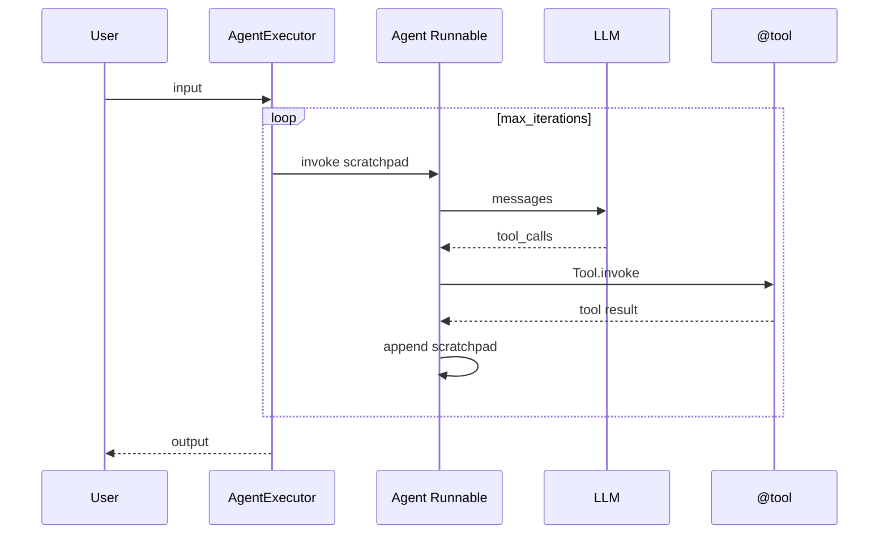

# Day 40 流程图与示意图


```mermaid
sequenceDiagram
    participant U as User
    participant E as AgentExecutor
    participant A as Agent Runnable
    participant L as LLM
    participant T as @tool

    U->>E: input
    loop max_iterations
        E->>A: invoke scratchpad
        A->>L: messages
        L-->>A: tool_calls
        A->>T: Tool.invoke
        T-->>A: tool result
        A->>A: append scratchpad
    end
    E-->>U: output
```

## AgentExecutor 状态机

```text
START → LLM → tool_calls? 
         ├─ 是 → 执行 Tool → 追加 scratchpad → LLM
         └─ 否 → 返回 output → END
```

---

*Day 40*
