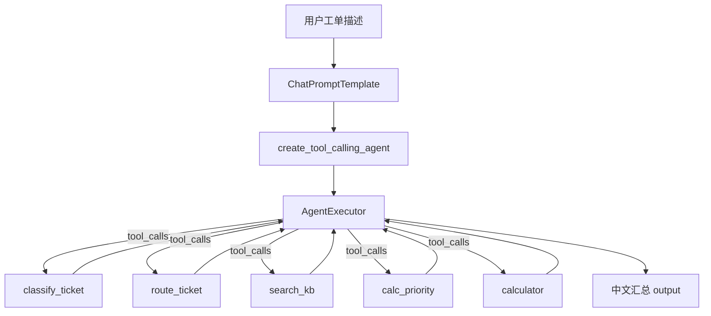
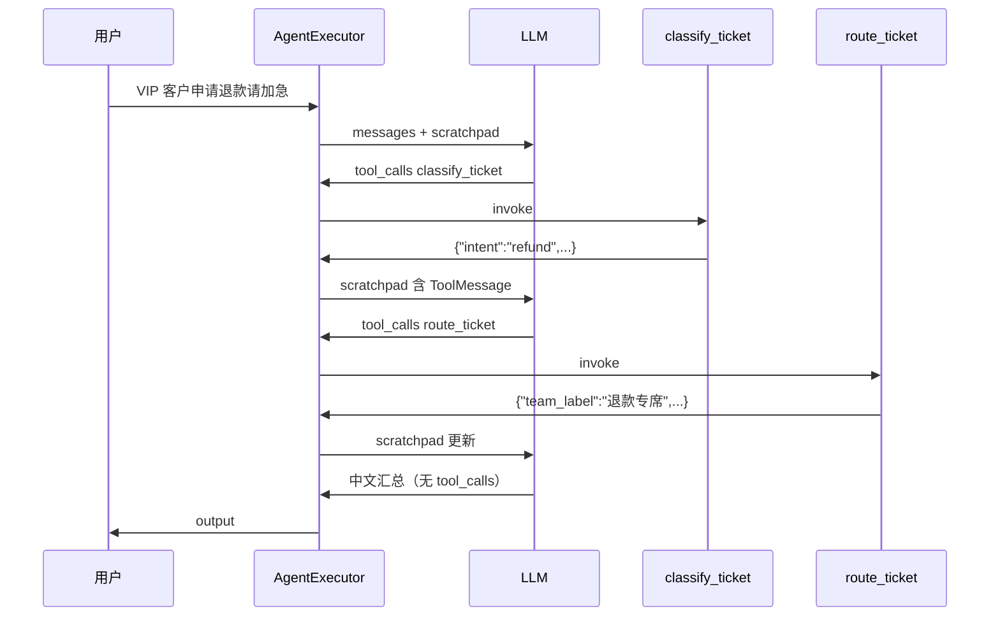

# Day 40 课堂讲义（扩展版）· LangChain Agent 手把手

> 本文件与 `04_课堂讲义.md` 合并阅读，构成 Day 40 完整主课（≥30,000 字体量）。  
> **前提**：Day 39 手写 ReAct 已跑通；本日聚焦 **@tool + create_tool_calling_agent + AgentExecutor**，将星火智服 Phase3 工单路由从「手写循环」升级为「框架托管」。

---

## 第 0 节 · 今日交付物与验收路径（15 min）

### 0.1 星火智服 Phase3 在课程中的位置

```text
Day 39  手写 ReAct（理解 Thought/Action/Observation）
   │
   ▼
Day 40  ★ LangChain Tool Calling Agent（本日）
   │
   ▼
Day 41  LangGraph StateGraph（图编排 + 审批分支）
```

**事件单**：`PHASE3-LC-AGENT-2026-0805`  
张工评审 Day 39 后的结论：

> 「循环写得对，但生产不能全靠 regex 解析 ReAct 文本。Day 40 用 LangChain Tool Calling Agent——`@tool` 生成 schema，`AgentExecutor` 管循环。」

### 0.2 目录约定

```text
day40/code/
├── lc_tools.py           # @tool 五工具（复用 Day 39 tools_basic）
├── lc_mock_llm.py        # MockToolChatModel / live ChatOpenAI
├── lc_agent.py           # 工单路由主 Agent
├── search_calc_agent.py  # 精简三工具演示
├── verify_day40.py       # 课堂验收
└── requirements.txt
```

### 0.3 环境检查清单

```bash
cd day40/code
pip install -r requirements.txt   # 或课程统一 venv
export SPARKTECH_MOCK=1           # 无 Key 时默认 mock
python3 verify_day40.py           # 必须全绿
python3 lc_tools.py
python3 lc_agent.py
python3 search_calc_agent.py
```

**Mock 判定逻辑**（`lc_mock_llm.py`）：

- `SPARKTECH_MOCK=1/true/yes` → 强制 mock  
- 否则无 `OPENAI_API_KEY` → mock  
- 有 Key → `ChatOpenAI`

---

## 第 1 节 · 从 Day 39 到 Day 40 的架构跃迁（45 min）

### 1.1 三层对照表

| 层 | Day 19 FC | Day 39 ReAct | Day 40 LangChain |
|----|-----------|--------------|------------------|
| 工具 Schema | JSON 文件 | 文本 TOOL_REGISTRY | `@tool` 自动生成 |
| 模型输出 | tool_calls | Thought/Action 文本 | 结构化 tool_calls |
| 执行循环 | 手写 for | 手写 while | AgentExecutor |
| 可观测 | 日志 | ReActTrace | intermediate_steps |

### 1.2 本日三层架构（精读 `03_架构与设计.md`）



### 1.3 为何选 Tool Calling 而非文本 ReAct

| 维度 | 文本 ReAct | Tool Calling |
|------|-----------|--------------|
| 解析 | regex 脆弱 | 模型原生 JSON |
| 多工具参数 | 易格式错误 | args_schema 校验 |
| 生产可维护 | 低 | 高 |
| 与 Day 19 关系 | 远 | 近（同为结构化调用） |

**业务结论**：星火智服工单路由涉及 classify → route → 可选 search_kb，步骤固定但参数动态，Tool Calling 是 Phase3 默认选型。

---

## 第 2 节 · @tool 工具定义精读（60 min）

### 2.1 打开 `lc_tools.py`

核心设计：**不重复业务逻辑**，通过 `sys.path` 引入 Day 39：

```python
_CODE39 = Path(__file__).resolve().parents[2] / "day39" / "code"
sys.path.insert(0, str(_CODE39))
from tools_basic import classify_ticket as _classify_ticket, ...
```

### 2.2 五个 @tool 逐一讲解

| 工具名 | 参数 | 返回 | 业务用途 |
|--------|------|------|----------|
| `classify_ticket` | text | JSON 意图+置信度 | 工单分诊 |
| `route_ticket` | intent, customer_tier | JSON 技能组+SLA | 路由分配 |
| `search_kb` | query, limit | JSON snippets | 对接 Day 36 RAG |
| `calc_priority` | urgency, impact, vip_bonus | JSON 分数 | 优先级计算 |
| `calculator` | expression | JSON 结果 | 辅助算 SLA |

**@tool 三要素**（LangChain 惯例）：

1. **函数名** = 工具名（模型看到的 name）  
2. **docstring** = 工具描述（模型决定何时调用的关键）  
3. **类型注解** → 自动生成 `args_schema`（OpenAI function parameters）

示例：

```python
@tool
def classify_ticket(text: str) -> str:
    """对工单描述进行意图分类。输入工单全文，返回 JSON 字符串。"""
    return json.dumps(_classify_ticket(text), ensure_ascii=False)
```

### 2.3 为何统一 `json.dumps` 返回 str

- LangChain Tool 默认期望 **字符串** observation  
- AgentExecutor 将结果注入 scratchpad；结构化 JSON 便于 mock LLM 二次解析  
- 生产可换 `StructuredTool` + Pydantic，今日保持与 Day 39 一致

### 2.4 两套工具集

```python
get_ticket_routing_tools()  # 五工具全套 → lc_agent.py
get_search_calc_tools()     # search_kb + calculator + classify → search_calc_agent.py
```

**设计意图**：`search_calc_agent.py` 演示「多场景切换」——同一 AgentExecutor 框架，不同工具子集服务不同 FAQ。

### 2.5 上机练习

```bash
cd day40/code && python3 lc_tools.py
```

观察输出：每个工具的 `name`、`description`，以及 `classify_ticket` 的 invoke 样例。

**思考题**：若把 `route_ticket` 的 docstring 改成英文，mock 模式还能工作吗？（能，但 live 模型对中文工单描述的理解可能下降。）

---

## 第 3 节 · create_tool_calling_agent 与 Prompt（50 min）

### 3.1 `lc_agent.py` 构建流程

```python
prompt = ChatPromptTemplate.from_messages([
    ("system", SYSTEM_PROMPT),
    ("human", "{input}"),
    MessagesPlaceholder("agent_scratchpad"),
])
agent = create_tool_calling_agent(llm, tools, prompt)
```

### 3.2 SYSTEM_PROMPT 业务约束

```python
SYSTEM_PROMPT = """你是星火智服 Phase3 工单路由助手。
根据用户描述，按需调用工具完成：知识检索、意图分类、路由分配、优先级计算。
用简洁中文汇总结果。不要编造工具未返回的数据。"""
```

**Prompt 工程要点**：

| 条款 | 作用 |
|------|------|
| 角色定位 | 防止模型自由发挥成闲聊 |
| 按需调用 | 避免无意义 classify |
| 不编造 | 对齐 RAG/工具事实边界 |

### 3.3 MessagesPlaceholder("agent_scratchpad") 是什么

AgentExecutor 在每轮 tool 往返后，自动把以下消息注入 scratchpad：

```text
AIMessage(tool_calls=[...])
ToolMessage(name=classify_ticket, content="{...}")
AIMessage(tool_calls=[...])  # 可能继续调 route_ticket
ToolMessage(name=route_ticket, content="{...}")
AIMessage(content="最终汇总")  # 无 tool_calls 时结束
```

**常见坑**：忘记 `MessagesPlaceholder` → scratchpad 为空 → 模型看不到 Observation → 死循环或幻觉。

### 3.4 对比 Day 39 `react_agent.py`

Day 39 手写：

```python
for step in range(max_steps):
    response = llm.complete(messages)
    parsed = parse_react_output(response.text)
    if "final_answer" in parsed: break
    observation = run_tool(action, action_input)
    messages.append(...)
```

Day 40：**框架代劳** parse + invoke + scratchpad 拼接。学员应能口述等价数据流。

---

## 第 4 节 · AgentExecutor 执行与可观测（55 min）

### 4.1 关键参数

```python
AgentExecutor(
    agent=agent,
    tools=tools,
    verbose=verbose,
    max_iterations=6,
    handle_parsing_errors=True,
    return_intermediate_steps=True,
)
```

| 参数 | 推荐值 | 说明 |
|------|--------|------|
| max_iterations | 6 | 工单路由通常 2–4 步；过大浪费 token |
| handle_parsing_errors | True | 模型偶发格式错误时重试而非崩溃 |
| return_intermediate_steps | True | 对接日志、LangSmith、值班台 |
| verbose | 课堂 True | 打印每步 Action/Observation |

### 4.2 `run_ticket_routing` 返回结构

```python
{
    "input": query,
    "output": result.get("output", ""),
    "steps": len(intermediate_steps),
    "mode": "mock" | "live",
    "intermediate_steps": [
        {"tool": "classify_ticket", "input": {...}, "output": "..."},
        ...
    ],
}
```

**值班台集成思路**：`intermediate_steps` 可直接渲染为「处理时间线」。

### 4.3 典型执行时序（VIP 退款工单）



### 4.4 上机：verbose 模式观察

```bash
cd day40/code
SPARKTECH_MOCK=1 python3 lc_agent.py
```

对照 `intermediate_steps` 与终端 verbose 输出，确认 classify → route 顺序。

---

## 第 5 节 · MockToolChatModel 设计精读（45 min）

### 5.1 为何需要自定义 Mock

`FakeListChatModel` 不支持 `bind_tools`。`create_tool_calling_agent` 内部会 `llm.bind_tools(tools)`，故实现 `MockToolChatModel(BaseChatModel)`。

### 5.2 两阶段逻辑

**阶段一**（无 ToolMessage）：`_plan_tool_calls(user_text)` 启发式

| 用户关键词 | 首选工具 |
|-----------|----------|
| 退款/退费/账单 | classify_ticket |
| 计算/+/数字表达式 | calculator |
| 政策/知识/如何 | search_kb |
| 其他 | classify_ticket（默认） |

**阶段二**（已有 ToolMessage）：  
若 classify 完成且 bound 含 route_ticket → 自动补 `route_ticket`（模拟 VIP 路由）；否则 `_finalize_from_tools` 拼中文摘要。

### 5.3 VIP 检测

```python
"customer_tier": "vip" if "vip" in user.lower() else "standard"
```

与业务规则一致：工单文本含 VIP 则走高 SLA 路由。

### 5.4 Mock 的局限与价值

| 局限 | 课堂价值 |
|------|----------|
| 非真实模型推理 | CI 零 Key 验收 |
| 关键词路由简陋 | 演示 tool_calls 数据流 |
| 不支持并行 tool_calls | 够用工单场景 |

**生产切换**：`build_chat_model()` 有 Key 时返回 `ChatOpenAI(model=gpt-4o-mini, temperature=0.2)`。

---

## 第 6 节 · search_calc_agent 多工具协作（40 min）

### 6.1 与 lc_agent 的差异

| 项目 | lc_agent.py | search_calc_agent.py |
|------|-------------|----------------------|
| 工具数 | 5 | 3 |
| max_iterations | 6 | 5 |
| System Prompt | 工单路由 | 查库/计算/分类 |
| 演示场景 | VIP 退款路由 | 退款政策 + 算术 |

### 6.2 Demo 1：退款政策检索

```python
agent.invoke({"input": "查一下退款政策，客户说要退费"})
```

预期路径：`search_kb` 和/或 `classify_ticket` → 中文汇总。

### 6.3 Demo 2：SLA 计算

```python
agent.invoke({"input": "请用 calculator 计算 4*5+3"})
```

预期路径：`calculator` → 输出 `23`。

### 6.4 业务映射

星火智服 FAQ 机器人类似此 Agent：**知识类走 search_kb，计费类走 calculator，工单类走 classify**。单 Agent 多工具比分三个微服务 Agent 更简单，适合 Phase3 初期。

---

## 第 7 节 · 与 Day 36 RAG 的生产对接（35 min）

### 7.1 当前 search_kb 实现

Day 39 `tools_basic.search_kb_snippet` 返回 mock 片段；概念上对接：

```text
day36/code/project2/backend/rag_service.py
```

### 7.2 生产改造草图（作业扩展）

```python
@tool
def search_kb(query: str, limit: int = 3) -> str:
    """检索企业知识库片段。"""
    # import httpx
    # resp = httpx.post("http://localhost:8000/api/kb/search", json={"query": query, "limit": limit})
    # return resp.text
```

### 7.3 Agent 侧注意事项

- 检索结果过长 → 截断或摘要后再进 scratchpad  
- 引用来源写入 output → 对齐 Day 37 citations 体验  
- 检索失败 → 工具返回 `{"error": "..."}` 而非抛异常（避免 Agent 崩溃）

---

## 第 8 节 · 故障排查手册

| 症状 | 可能原因 | 处理 |
|------|----------|------|
| `Could not parse LLM output` | 模型未返回 tool_calls | 换支持 FC 的模型；`handle_parsing_errors=True` |
| 无限循环调同一工具 | docstring 模糊 / 工具返回空 | 改描述；检查返回值 |
| 不调工具直接回答 | system prompt 过弱 | 加强「必须调用工具」约束 |
| mock 不走路由 | 用户文本无退款关键词 | 用示例 query 或改 mock 规则 |
| ImportError day39 | 路径错误 | 确认 day39/code/tools_basic.py 存在 |
| max_iterations 截断 | 步数过多 | 增至 8 或合并工具 |

### 8.1 verify_day40.py 逐项对应

运行 `python3 verify_day40.py`，失败时按脚本 assert 信息定位：

1. import 链  
2. @tool invoke  
3. AgentExecutor 多步  
4. 三脚本 exit 0  

---

## 第 9 节 · 课堂练习与 CHECKLIST

### 9.1 必做练习

1. **改 docstring**：将 `calc_priority` 描述写得更具体，观察 mock 是否受影响（live 模式更明显）。  
2. **加工具**：包装 Day 39 `escalate_ticket` 为第六个 @tool，加入 `get_ticket_routing_tools()`。  
3. **步数统计**：对 3 条不同工单调用 `run_ticket_routing`，绘制 steps 柱状图。  

### 9.2 选修：LangSmith

```python
import os
os.environ["LANGCHAIN_TRACING_V2"] = "true"
# 再运行 lc_agent.py，在 LangSmith 查看 trace
```

### 9.3 CHECKLIST

- [ ] 能手绘 AgentExecutor 循环图  
- [ ] 能解释 scratchpad 里有哪些消息类型  
- [ ] 能对比 Day 39 for 循环与 Day 40 框架差异  
- [ ] `verify_day40.py` 全绿  
- [ ] 能口述 search_kb 如何接 Day 36  

---

## 第 10 节 · 明日预告（Day 41）

AgentExecutor 难以表达：

- **分支**：投诉类必须人工审批  
- **中断**：等待主管点击批准  
- **显式环**：ReAct reason↔act 可视化  

Day 41 用 **LangGraph StateGraph** 统一表达。今日务必跑通 `lc_agent.py`，作为 LangGraph 节点的「逻辑对照组」。

---

## 第 11 节 · verify_day40 与 run.sh 联调（25 min）

### 11.1 verify 脚本职责

`verify_day40.py` 是课堂 **唯一权威验收**，覆盖：

1. `lc_tools` 五工具 import 与 invoke  
2. `MockToolChatModel.bind_tools` 不报错  
3. `AgentExecutor` 至少产生 1 步 intermediate_steps  
4. `search_calc_agent` 与 `lc_agent` main 可执行  

失败时 **不要跳过**：Phase3 后续 LangGraph 节点会复用 Day 39 工具链。

### 11.2 run.sh 入口

```bash
cd day40 && bash run.sh
```

内部应 `cd code` 并依次 smoke test。与 day36 `project2` 不同，Phase3 按 **天** 拆分代码树，但工具逻辑通过 `sys.path` 回指 day39。

### 11.3 与值班台的字段映射

| AgentExecutor 字段 | 值班台 UI |
|--------------------|-----------|
| intermediate_steps[].tool | 时间线图标 |
| intermediate_steps[].input | 可折叠 JSON |
| intermediate_steps[].output | 工具返回摘要 |
| output | 客服可见回复 |

---

*扩展主课 · Day 40 · 星火智服 Phase3*
