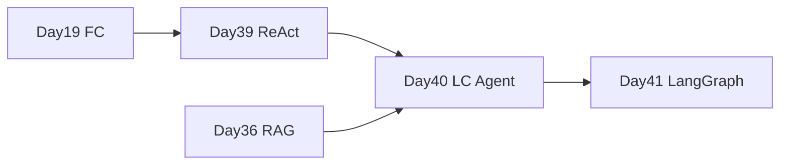

# Day 40 · LangChain Agent · @tool 与 AgentExecutor

> **旁白**  
> Day 39 你们手写了 ReAct 文本解析；张工今天开口：*「循环看懂了，**LangChain 替你绑 tool、跑 Executor**——但别糊涂，底层还是 Day 19 那套 tool_calls。」*

---

## 今日学习地图

| 时段 | 主题 | 产出物 |
|------|------|--------|
| 09:00–10:00 | @tool 装饰器、StructuredTool | `lc_tools.py` |
| 10:00–12:00 | create_tool_calling_agent | `lc_agent.py` |
| 14:00–15:30 | AgentExecutor 与 intermediate_steps | `search_calc_agent.py` |
| 15:30–17:30 | verify_day40 | 全绿 |

## 衔接



| 前序 | 今日 |
|------|------|
| [Day 19](../day19/) | 手写 tool_calls → `@tool` 自动生成 schema |
| [Day 39](../day39/) | 手写循环 → `AgentExecutor` |
| [Day 36 RAG](../day36/code/project2/) | `search_kb` 工具 |

## 文件清单

| 文件 | 用途 |
|------|------|
| 01–08 md | 课件 |
| [code/lc_tools.py](./code/lc_tools.py) | @tool 五工具 |
| [code/lc_agent.py](./code/lc_agent.py) | **AgentExecutor 主程序** |
| [code/search_calc_agent.py](./code/search_calc_agent.py) | 搜索+计算 demo |
| [code/verify_day40.py](./code/verify_day40.py) | 验收 |

## 验收

- [ ] `python3 code/verify_day40.py` 全绿  
- [ ] 能解释 AgentExecutor 与 Day 39 while 循环对应关系  
- [ ] commit 含 `day40`

## 快速开始

```bash
cd day40/code && pip install -r requirements.txt && python3 verify_day40.py
```

**状态**：✅ Day 40 完整课件已发布
