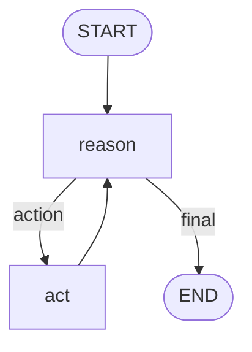
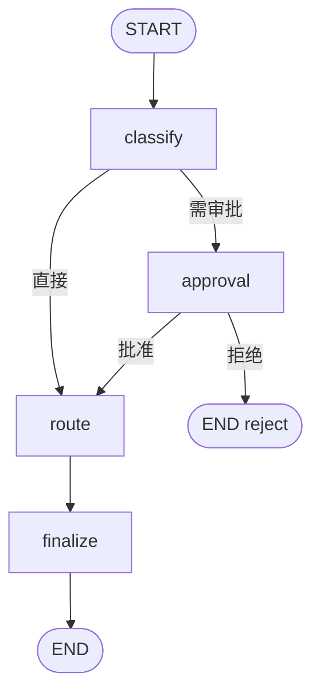

# Day 41 架构与设计

## 1. LangGraph 核心概念

| 概念 | 含义 | 今日对应 |
|------|------|----------|
| **State** | 图中流动的共享数据 | `ReActState` / `ApprovalState` |
| **Node** | 处理函数，读/写 State | `reason_node`, `act_node` |
| **Edge** | 节点间固定跳转 | `act → reason` |
| **Conditional Edge** | 按 State 动态路由 | `should_continue` |

## 2. ReAct 图结构

## 3. 审批图结构

## 4. State 设计原则

- 用 `TypedDict` 明确字段  
- 列表追加用 `Annotated[list, operator.add]`  
- 敏感字段（approved）由专用节点写入  

## 5. 与 AgentExecutor 对比

| | AgentExecutor | LangGraph |
|---|---------------|-----------|
| 结构 | 隐式循环 | 显式图 |
| 分支 | 难 | conditional_edges |
| HITL | 需 hack | interrupt / 审批节点 |
| 可视化 | 弱 | get_graph().draw_mermaid() |

---

*Day 41 架构*
