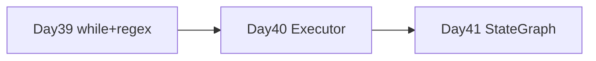

# Day 41 流程图与示意图

## ReAct StateGraph

```text
     ┌──────────┐
     │  START   │
     └────┬─────┘
          ▼
    ┌───────────┐
    │  reason   │◀────────────┐
    │  (LLM)    │             │
    └─────┬─────┘             │
          │                   │
    ┌─────┴─────┐             │
    ▼           ▼             │
┌───────┐   ┌───────┐         │
│  act  │   │  END  │         │
│(tool) │   └───────┘         │
└───┬───┘                     │
    └─────────────────────────┘
         固定 Edge
```

## Approval 条件边

| 边 | 条件 | 目标 |
|----|------|------|
| classify → ? | needs_approval | approval / route |
| approval → ? | approved | route / reject |

## 三课演进



---

*Day 41*
