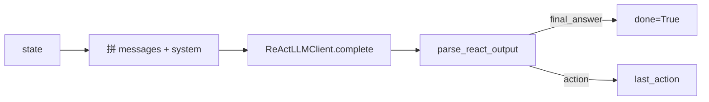
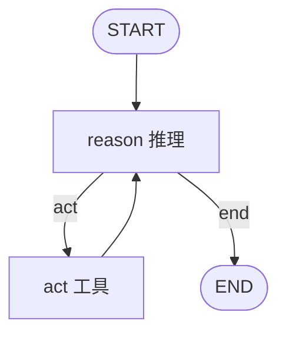
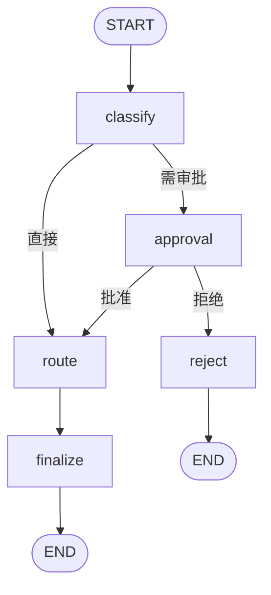
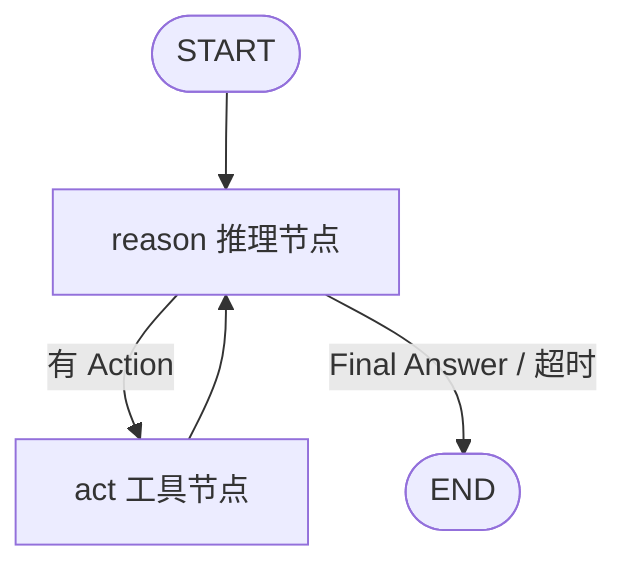

# Day 41 课堂讲义（扩展版）· LangGraph 状态图手把手

> 本文件与 `04_课堂讲义.md` 合并阅读，构成 Day 41 完整主课（≥30,000 字体量）。  
> **前提**：Day 40 LangChain AgentExecutor 已跑通；本日聚焦 **StateGraph / Node / Edge / conditional_edges**，将星火智服 Phase3 工单流升级为「可画图、可审批」的图编排。

---

## 第 0 节 · 今日交付物与业务动机（15 min）

### 0.1 事件单与审批需求

**事件单号**：`PHASE3-LANGGRAPH-2026-0806`

投诉类、大额退款类工单 **禁止全自动路由**，需值班主管在控制台点击「批准」后才会 `route_ticket`。

| 能力 | AgentExecutor (Day 40) | LangGraph (Day 41) |
|------|------------------------|---------------------|
| ReAct 循环 | 隐式 | 显式 reason↔act 图 |
| 业务分支 | 难表达 | conditional_edges |
| 人工审批 | 需 hack | approval 节点 / interrupt |
| 可视化 | 弱 | Mermaid 导出 |

### 0.2 目录与验收

```text
day41/code/
├── langgraph_react.py      # Day 39 ReAct → StateGraph
├── approval_node_demo.py   # 分类后审批分支
├── graph_visualize.py      # Mermaid / ASCII
├── output/react_graph.mmd
└── verify_day41.py
```

```bash
cd day41/code
python3 verify_day41.py
python3 langgraph_react.py
python3 approval_node_demo.py
python3 graph_visualize.py
```

### 0.3 Phase3 三周课收官图

```text
Day 39 手写 ReAct  →  理解循环本质
Day 40 LC Agent    →  框架托管 tool_calls
Day 41 LangGraph   →  图编排 + HITL 雏形 ★
下周               →  真实工单 API + Day 36 RAG
```

---

## 第 1 节 · LangGraph 核心概念（50 min）

### 1.1 四元组

| 概念 | 含义 | 代码 API |
|------|------|----------|
| **State** | 图内共享数据 | `StateGraph(ReActState)` |
| **Node** | `(state) -> partial_state` | `add_node("reason", fn)` |
| **Edge** | 固定跳转 | `add_edge("act", "reason")` |
| **Conditional Edge** | 路由函数返回值选下一节点 | `add_conditional_edges` |

### 1.2 最小计数器（课堂白板）

```python
class MyState(TypedDict):
    count: int

def increment(state: MyState):
    return {"count": state["count"] + 1}

g = StateGraph(MyState)
g.add_node("inc", increment)
g.set_entry_point("inc")
g.add_edge("inc", END)
app = g.compile()
app.invoke({"count": 0})  # {"count": 1}
```

**关键语义**：节点返回 **partial state**（字典子集），框架 merge 进全局 state。

### 1.3 END 与 START

- `set_entry_point("reason")` 或 `add_edge(START, "reason")`  
- 边指向 `END` 表示图终止  
- 编译后 `app.invoke(initial_state)` 返回最终 state

---

## 第 2 节 · ReActState 与 Annotated 合并（45 min）

### 2.1 `langgraph_react.py` 状态定义

```python
class ReActState(TypedDict):
    messages: Annotated[list[dict[str, str]], operator.add]
    user_query: str
    step: int
    last_action: str
    last_observation: str
    final_answer: str
    done: bool
```

### 2.2 为何 messages 用 `Annotated[..., operator.add]`

默认 merge 是 **覆盖**。ReAct 需要 **追加** 对话历史：

```python
# reason_node 返回
{"messages": [{"role": "assistant", "content": response.text}]}
# act_node 再追加带 Observation 的消息
```

`operator.add` 使两条 list 拼接，而非后者覆盖前者。

### 2.3 与 Day 39 messages 列表对照

Day 39 手写 `messages.append(...)`；Day 41 通过 **state reducer** 声明追加策略——更易测试、更利于 Checkpointer 序列化。

---

## 第 3 节 · reason_node 与 act_node 精读（60 min）

### 3.1 模块加载策略

为避免与 day40 `mock_llm` 冲突，使用 `importlib` 按路径加载 Day 39：

```python
_day39_mock = _load_module("day39_mock_llm", _CODE39 / "mock_llm.py")
_day39_react = _load_module("day39_react_agent", _CODE39 / "react_agent.py")
_day39_tools = _load_module("day39_tools_basic", _CODE39 / "tools_basic.py")
```

**生产建议**：抽公共 `sparktech_tools` 包，避免多 day 路径 hack。

### 3.2 reason_node 流程



核心代码逻辑：

1. 用 `build_system_prompt(format_tools_prompt())` 注入工具说明  
2. 若无 user 消息，追加 `user_query`  
3. 若解析出 `final_answer` → `done=True`  
4. 否则记录 `last_action`，等待 act 节点

### 3.3 act_node 流程

1. 从 `messages[-1]` 再解析 Action  
2. `run_tool(action, action_input)` 执行 Day 39 工具  
3. 将 `Observation` 拼回 assistant 消息，追加到 messages  

### 3.4 与 Day 39 for 循环等价性

| Day 39 | Day 41 节点 |
|--------|-------------|
| LLM complete | reason_node |
| parse + run_tool | act_node |
| step += 1 | state["step"] |
| break on Final | done / should_continue |

**学员练习**：对照 `day39/code/react_agent.py` 与 `langgraph_react.py`，标出等价行。

---

## 第 4 节 · 条件边 should_continue（40 min）

### 4.1 路由函数

```python
def should_continue(state: ReActState) -> Literal["act", "end"]:
    if state.get("done"):
        return "end"
    if state.get("step", 0) >= 6:
        return "end"
    last = state["messages"][-1]["content"] if state.get("messages") else ""
    if "Final Answer" in last:
        return "end"
    if parse_react_output(last).get("action"):
        return "act"
    return "end"
```

### 4.2 图结构



注册方式：

```python
graph.add_conditional_edges("reason", should_continue, {"act": "act", "end": END})
graph.add_edge("act", "reason")
```

### 4.3 死循环防护

三重保险：`done` 标志、`step >= 6`、无法解析 Action 时走 end。  
对比 Day 40 `max_iterations=6`——语义一致，实现位置不同。

### 4.4 run_react_graph 兜底

若 `final_answer` 为空，从 messages 反向扫描解析 Final Answer——兼容模型格式变异。

---

## 第 5 节 · approval_node_demo 审批图（55 min）

### 5.1 业务规则

| 意图 | 路径 |
|------|------|
| complaint / refund | classify → **approval** → route/reject |
| 其他 | classify → **直接 route** |

### 5.2 ApprovalState 字段

```python
class ApprovalState(TypedDict):
    ticket_text: str
    classification: dict
    route_result: dict
    needs_approval: bool
    approved: bool | None
    final_message: str
```

### 5.3 节点职责

| 节点 | 输入 | 输出 |
|------|------|------|
| classify | ticket_text | classification, needs_approval |
| approval | ticket_text 关键词 | approved |
| route | classification | route_result |
| reject | — | final_message 拒绝文案 |
| finalize | route_result | final_message 成功文案 |

### 5.4 条件边

```python
def after_classify(state) -> Literal["approval", "route"]:
    if state.get("needs_approval"):
        return "approval"
    return "route"

def after_approval(state) -> Literal["route", "reject"]:
    if state.get("approved"):
        return "route"
    return "reject"
```

### 5.5 审批图 Mermaid



### 5.6 mock 审批逻辑（课堂）

```python
def approval_node(state):
    text = state["ticket_text"].lower()
    if "拒绝" in text or "reject" in text:
        approved = False
    elif "vip" in text or "加急" in text:
        approved = True
    else:
        approved = True  # 默认通过，便于演示
```

**生产**：`approval_node` 改为 `interrupt()`，等待控制台 API（Day 42）。

### 5.7 三条用例跑通

```bash
python3 approval_node_demo.py
```

| 工单 | 预期 |
|------|------|
| 修改收货地址 | 无审批，直接 finalize |
| VIP 投诉退款 | approval → route |
| 明确拒绝 | approval → reject |

### 5.8 MemorySaver 预习

`compile_with_memory()` 已预留 Checkpointer——Day 42 用于真 HITL 暂停恢复。

---

## 第 6 节 · graph_visualize 与 Mermaid（35 min）

### 6.1 手写模板

`graph_visualize.py` 导出 `output/react_graph.mmd`：



### 6.2 LangGraph 自动生成

```python
app = compile_react_agent()
g = app.get_graph()
print(g.draw_mermaid())  # 若版本支持
```

### 6.3 教学用途

- 答辩投影：「图即文档」  
- Code Review：新增节点必须更新 Mermaid  
- 与产品对齐：节点名 = 业务阶段名

### 6.4 ASCII 图

无 Mermaid 渲染环境时，`export_ascii()` 打印终端友好图。

---

## 第 7 节 · AgentExecutor vs LangGraph 选型（30 min）

| 场景 | 推荐 |
|------|------|
| 单 Agent 多工具循环 | AgentExecutor |
| 固定审批分支 | LangGraph conditional_edges |
| 跨天恢复会话 | LangGraph + Checkpointer |
| 并行调研 | LangGraph fan-out（Day 42） |
| 快速原型 | AgentExecutor |

**星火智服 Phase3 结论**：工单主路径可用 AgentExecutor；**合规审批链**必须 LangGraph。

---

## 第 8 节 · 故障排查

| 症状 | 原因 | 处理 |
|------|------|------|
| messages 被覆盖 | 未用 operator.add | Annotated 修正 |
| 图不终止 | should_continue 永远 act | 检查 step 上限 |
| Import day39 失败 | 路径 | 确认 day39/code 存在 |
| approval 未触发 | intent 非 complaint/refund | 查 classify 返回 |
| draw_mermaid 报错 | 版本差异 | 用手写 mmd |
| 节点返回多余字段 | TypedDict 不报错但难调试 | 对齐 ApprovalState 键名 |

---

## 第 9 节 · 练习与 CHECKLIST

### 9.1 必做

1. 在 `approval_node_demo` 增加 `calc_priority` 节点（路由前算分）。  
2. 修改 `should_continue` 将 max step 改为 4，观察截断行为。  
3. 将审批图 Mermaid 粘贴到飞书文档，标注每条边业务含义。  

### 9.2 选修

- 用 `compile(checkpointer=MemorySaver())` 跑 approval 图，同一 thread 重入。  
- 对比 LangChain `create_react_agent` 预构建图与手写图差异。

### 9.3 CHECKLIST

- [ ] 能白板画出 ReAct 双节点环  
- [ ] 能解释 partial state merge  
- [ ] 能讲清 approval 两条条件边  
- [ ] `verify_day41.py` 全绿  
- [ ] 能说出 Day 42 interrupt 与今日 approval 区别  

---

## 第 10 节 · 与项目三（Day 48）衔接

`office_graph.py` 节点规划：

```text
planner → researcher → writer → human_gate → executor
```

今日 approval 节点 = 明日 `human_gate` 原型；今日 ReAct 图 = 单 Agent 工具环参考实现。

---

## 第 11 节 · StateGraph 编译与 Runnable 语义（40 min）

### 11.1 compile() 之后得到什么

`build_react_graph().compile()` 返回 LangChain **Runnable**：

- `invoke(state)` → 最终 state dict  
- `stream(state)` → 逐节点事件（选修）  
- `get_graph()` → 图结构 introspection  

与 Day 40 `executor.invoke({"input": ...})` 输入格式不同：LangGraph 直接传 **完整初始 state**。

### 11.2 初始 state 必填字段清单

**ReActState** 缺字段不会报错，但节点内 `KeyError`：

```python
init: ReActState = {
    "messages": [],
    "user_query": query,
    "step": 0,
    "last_action": "",
    "last_observation": "",
    "final_answer": "",
    "done": False,
}
```

**ApprovalState** 同理：`approved: None` 表示尚未审批，区别于 `False` 拒绝。

### 11.3 条件边映射表完整性

`add_conditional_edges("supervisor", fn, {"searcher": "searcher", ...})` 中：

- 路由函数返回值 **必须** 是映射 dict 的 key  
- 遗漏 key → 运行期 `KeyError`  
- 多余 key → 无害，但文档应同步  

课堂练习：故意删掉 `"end": END` 映射，观察报错栈。

---

## 第 12 节 · approval 与合规策略扩展（35 min）

### 12.1 意图与审批矩阵

| intent | needs_approval | 业务依据 |
|--------|----------------|----------|
| refund | True | 资金风险 |
| complaint | True | 舆情风险 |
| technical | False | 标准技能组 |
| general | False | 自助解决 |

可在 `classify_node` 增加 `billing_dispute` 等 Phase3 新意图，无需改图拓扑，只改条件。

### 12.2 VIP 加急与审批并存

当前 demo：VIP 投诉走 approval → 默认 approved。  
生产规则可能是：**VIP 仍需审批，但 SLA 更短**。实现方式：

1. `route_node` 读 `ticket_text` 中 vip 提高优先级  
2. `finalize_node` 文案区分「VIP 加急通道」  

### 12.3 从假审批到真 HITL 的迁移路径

```text
Day 41 approval_node（关键词模拟）
    → Day 42 interrupt_before + Checkpointer
    → Day 48 FastAPI resume 端点
```

学员应能按时间线讲清三步差异。

---

## 第 13 节 · graph_visualize 课堂演示脚本（30 min）

### 13.1 投影顺序

1. 终端运行 `python3 graph_visualize.py`  
2. 展示 ASCII 图（不依赖 Mermaid 插件）  
3. 打开 `output/react_graph.mmd` 在 VS Code Mermaid 预览  
4. 讲解 `demo_conditional_edges()` 打印的伪代码  
5. 尝试 `get_graph().draw_mermaid()` 对比手写版  

### 13.2 审批图作业

学员手绘 approval 五节点图，与 `03_架构与设计.md` 对照提交。  
要求：标出 **两条** conditional_edges 的返回值集合。

---

## 第 14 节 · 与 Day 40 AgentExecutor 共存策略

生产可同时保留：

- **快速路径**：简单 FAQ → Day 40 `search_calc_agent`  
- **合规路径**：投诉退款 → Day 41 approval 图  
- **复杂多步**：Day 42+ 写作 / 多 Agent  

网关层按意图分类路由到不同 `compile()` 实例，共享同一 `tools_basic` 业务内核。

---

## 第 15 节 · stream 模式与节点级可观测（选修 30 min）

LangGraph `app.stream(initial, config)` 产出 **逐 super-step 事件**，适合：

- 前端进度条：「正在推理…」「正在执行工具…」  
- 日志：每个 node 名称 + 耗时  

```python
for chunk in compile_react_agent().stream(init):
    print(chunk)  # 观察 reason / act 交替
```

approval 图 stream 可看到 classify → approval 分支差异，无需等整图结束。

### 15.1 与 Day 37 SSE 类比

| Day 37 前端 SSE | Day 41 LangGraph stream |
|-----------------|-------------------------|
| event: delta | node 输出 state 片段 |
| citations 先到 | 可先 push「进入审批」 |
| POST /chat/stream | 后端 `app.stream` 转 SSE |

Day 48 项目三可能合并：**图 stream → FastAPI SSE → 控制台**。

### 15.2 recursion_limit

除 `step` 自计数外，LangGraph 支持 `config={"recursion_limit": 25}` 硬上限。  
与 `should_continue` 的 `step >= 6` **叠加**使用，双保险防死循环。

---

## 第 16 节 · 课堂综合练习：合并 ReAct 与审批（40 min）

**需求**：VIP 退款走 `langgraph_react` 工具环，若最终 intent=complaint 再转入 approval 子图。

实现提示（不要求课堂完成，作业可交）：

1. 新建 `ReActApprovalState` 合并字段  
2. react 子图 compile 后作为节点 `react_route`  
3. 条件边读 `classification.intent` 决定是否进 approval  

此练习理解 **图组合** 而非单一大图。

---

*扩展主课 · Day 41 · 星火智服 Phase3*
