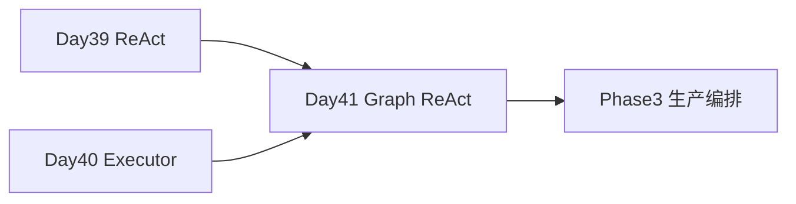

# Day 41 · LangGraph · State / Node / Edge · ReAct 图编排

> **旁白**  
> 周三，小陈提新需求：*「投诉升级不能自动转，要 **人工点批准**。」* 张工：*「AgentExecutor 是一条链；**LangGraph 画成图**——节点、边、条件分支、审批中断。」*

---

## 今日学习地图

| 时段 | 主题 | 产出物 |
|------|------|--------|
| 09:00–10:30 | State / Node / Edge 概念 | `04_课堂讲义.md` |
| 10:30–12:00 | ReAct 改写为 StateGraph | `langgraph_react.py` |
| 14:00–15:00 | 图可视化 | `graph_visualize.py` |
| 15:00–17:00 | 审批节点 HITL demo | `approval_node_demo.py` |

## 衔接



## 文件清单

| 文件 | 用途 |
|------|------|
| [langgraph_react.py](./code/langgraph_react.py) | **ReAct StateGraph** |
| [graph_visualize.py](./code/graph_visualize.py) | Mermaid 导出 |
| [approval_node_demo.py](./code/approval_node_demo.py) | 人工审批 |
| [verify_day41.py](./code/verify_day41.py) | 验收 |

## 验收

```bash
cd day41/code && pip install -r requirements.txt && python3 verify_day41.py
```

**状态**：✅ Day 41 完整课件已发布
