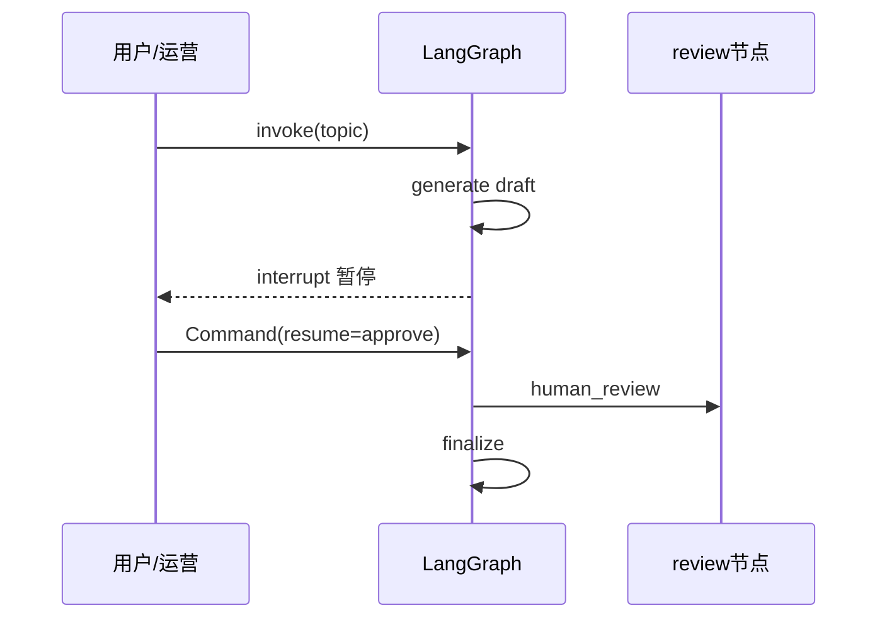
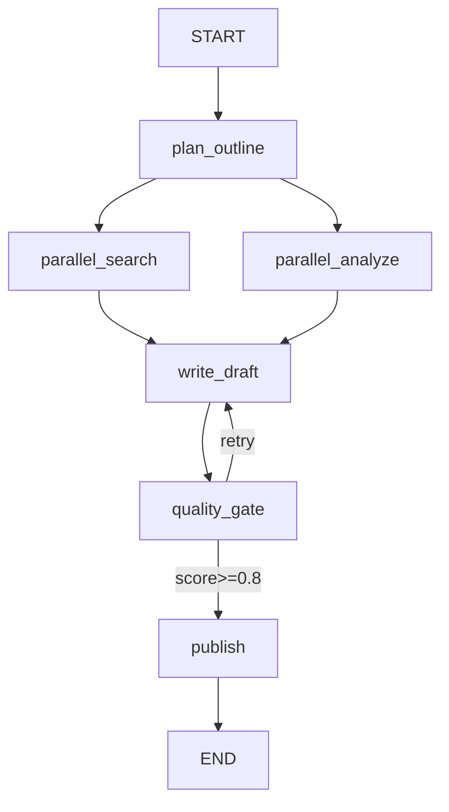

# Day 42 架构与设计 · LangGraph 进阶图结构

## 1. Checkpointer 架构


要点：
- `compile(checkpointer=MemorySaver())`  
- `config = {"configurable": {"thread_id": "..."}}`  
- 续跑时传 `{}`，勿覆盖已有字段（如 `count: 0`）

## 2. Human-in-the-Loop



## 3. Writing Agent 主图



### 3.1 子图

`RESEARCH_SUBGRAPH`：输入 `query`，输出 `notes`。主图 `parallel_search` / `parallel_analyze` 各调一次。

### 3.2 并行合并

```python
research_notes: Annotated[list[str], operator.add]
```

### 3.3 重试策略

| retry_count | quality_score | 动作 |
|-------------|---------------|------|
| 0–1 | 0.4 (mock) | 回 write |
| 2 | 0.85 | 通过 publish |

## 4. 模块依赖

```text
mock_llm.py           → FakeListChatModel
checkpointer_demo.py  → 计数器图 + MemorySaver
human_in_loop.py      → interrupt + Command
writing_agent_graph.py → 子图 + 并行 + 重试
verify_day42.py       → 自动化验收
```
