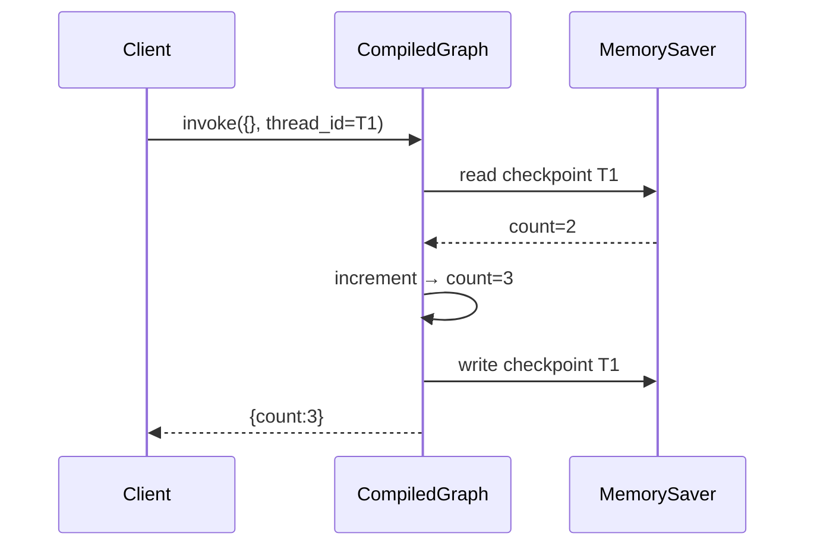

# Day 42 流程图与示意图

## 1. Checkpointer 时序



## 2. HITL 状态机

```ascii
  [generate] --> [review*] --> [finalize] --> END
                  ^
                  | interrupt
                  v
              (等待人工)
                  |
                  | Command(resume)
                  v
              [review 继续]
```

## 3. Writing Agent 数据流

```text
topic
  → outline (plan)
  → research_notes[] (search ∥ analyze，子图)
  → draft (write，可重试)
  → quality_score
  → publish / rewrite
```

## 4. 与 Day 48 项目三映射

| Day 42 概念 | 项目三场景 |
|-------------|------------|
| checkpointer | 请假条草稿断点续写 |
| interrupt | 经理审批节点 |
| 并行 search+analyze | 制度检索 + 合规分析 |
| 重试 | 格式校验失败重新生成 |
