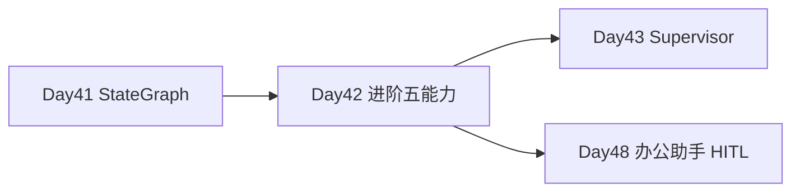
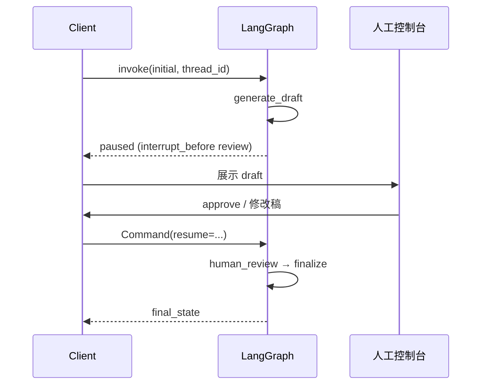
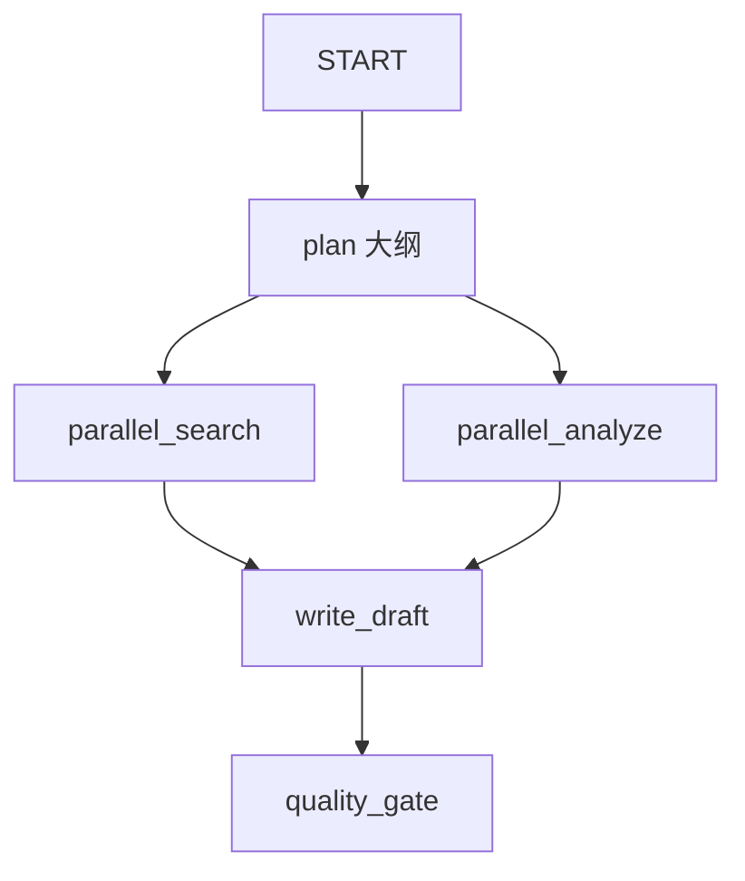

# Day 42 课堂讲义（扩展版）· Checkpointer 与 HITL 手把手

> 本文件与 `04_课堂讲义.md` 合并阅读，构成 Day 42 完整主课（≥30,000 字体量）。  
> **前提**：Day 41 StateGraph 与审批分支已理解；本日聚焦 **Checkpointer 持久化、interrupt/resume、子图、并行、质检重试**，把星火智服「智能写作助手」从 Demo 升级为可上线工作流。

---

## 第 0 节 · 事件回顾与五能力地图（20 min）

### 0.1 事件单 INC-AGENT-FLOW-2026-1102

运营内测反馈：

| 问题 | 现象 | LangGraph 解法 |
|------|------|----------------|
| 进程崩溃丢进度 | 写到一半重启从头来 | **Checkpointer** |
| 无人工把关 | AI 直接发公告 | **interrupt / HITL** |
| 调研太慢 | 搜索与分析串行 | **并行 fan-out** |
| 主图臃肿 | 逻辑全堆一个文件 | **子图** |
| 质量不稳 | 一次生成即发布 | **条件边重试环** |

张工原话：

> 「LangGraph 不是画张图就完事。生产要 Checkpointer、interrupt、子图、并行、质检重试。今天五个能力一次练齐。」

### 0.2 今日代码地图

```text
day42/code/
├── checkpointer_demo.py    # MemorySaver + thread_id
├── human_in_loop.py        # interrupt_before + Command(resume)
├── writing_agent_graph.py  # 子图 + 并行 + 重试
├── data/checkpoint_threads.json
└── verify_day42.py
```

```bash
cd day42/code
export SPARKTECH_MOCK=1
python3 verify_day42.py
python3 checkpointer_demo.py
python3 human_in_loop.py
python3 writing_agent_graph.py
```

### 0.3 在业务链中的位置



---

## 第 1 节 · Checkpointer 与 thread_id（55 min）

### 1.1 为什么需要 Checkpointer

长事务 Agent（写作、审批、多轮工具）状态不能只放内存：

- 进程重启 / 滚动发布  
- 用户隔天继续编辑  
- 多 tab 同一会话  

**Checkpointer** 在每次 super-step 后持久化 state snapshot。

### 1.2 CounterState 最小示例（checkpointer_demo.py）

```python
class CounterState(TypedDict):
    count: int
    last_action: str

def increment_node(state: CounterState) -> dict:
    return {
        "count": state.get("count", 0) + 1,
        "last_action": "increment",
    }
```

编译：

```python
app = graph.compile(checkpointer=MemorySaver())
config = {"configurable": {"thread_id": "demo-thread-1"}}
```

### 1.3 连续 invoke 语义

```python
out1 = app.invoke({"count": 0, "last_action": "init"}, config)  # count=1
out2 = app.invoke({}, config)                                   # count=2
out3 = app.invoke({}, config)                                   # count=3
```

**关键**：第二次起传 `{}`，框架从 checkpoint **恢复** 再执行节点，而非重置。

### 1.4 踩坑：续跑覆盖初始值

```python
# 错误：每次 invoke 都传 count: 0
app.invoke({"count": 0}, config)  # 永远得到 1
```

正确：仅 **首次** 传完整初始 state；续跑传空或只传 **增量字段**。

### 1.5 thread_id 隔离

`compare_threads()` 演示：

- `thread-a` 累加至 2  
- `thread-b` 从 0 开始独立  

**业务映射**：`thread_id` = 用户 session_id 或工单号。

### 1.6 get_state 与日志

```python
snapshot = app.get_state(config)
# snapshot.values, snapshot.next, checkpoint_id
```

`checkpointer_demo.py` 写入 `data/checkpoint_threads.json`，便于课堂对比。

### 1.7 MemorySaver vs SqliteSaver

| Checkpointer | 场景 | 备注 |
|--------------|------|------|
| MemorySaver | 开发、单进程、课堂 | 今日默认 |
| SqliteSaver | 重启恢复、答辩加分 | `SqliteSaver.from_conn_string("checkpoints.db")` |
| PostgresSaver | 生产多副本 | Day 48 可选 |

---

## 第 2 节 · interrupt / resume 人机协同（60 min）

### 2.1 业务场景

星火智服公告发布、退款审批、敏感回复 —— 统一模式：**AI 起草 + 人工放行**。

### 2.2 ReviewState 与三节点

```python
class ReviewState(TypedDict):
    topic: str
    draft: str
    human_feedback: str
    approved: bool
    revision_count: int
```

```text
generate → review(interrupt) → finalize
```

### 2.3 编译时声明中断点

```python
app = build_review_graph().compile(
    checkpointer=MemorySaver(),
    interrupt_before=["review"],
)
```

**语义**：执行停在 `review` **之前**，`review` 节点尚未运行；调用方拿到 paused state。

### 2.4 human_review 节点内的 interrupt

```python
def human_review(state: ReviewState) -> dict:
    payload = {
        "draft": state["draft"],
        "topic": state["topic"],
        "hint": "resume 传 'approve' 通过，或传修改后的全文",
    }
    feedback = interrupt(payload)
    if str(feedback).strip().lower() == "approve":
        return {"approved": True, "human_feedback": "approved"}
    return {
        "draft": str(feedback),
        "approved": False,
        "human_feedback": str(feedback),
        "revision_count": state.get("revision_count", 0) + 1,
    }
```

`interrupt()` 将 payload 交给外部（控制台 UI），线程挂起直到 `Command(resume=...)`。

### 2.5 完整 HITL 流程（human_in_loop.py）

```python
paused = app.invoke(initial, config)
snapshot = app.get_state(config)
pending_nodes = snapshot.next  # ('review',)

resumed = app.invoke(Command(resume=human_decision), config)
```



### 2.6 resume 载荷约定

| resume 值 | 行为 |
|-----------|------|
| `"approve"` | approved=True，原 draft 发布 |
| 其他字符串 | 视为新 draft，revision_count+1 |

### 2.7 与 Day 41 approval_node 对比

| | Day 41 approval_node | Day 42 interrupt |
|--|---------------------|------------------|
| 等待方式 | 同步函数内 if 关键词 | 真暂停，跨进程可恢复 |
| Checkpointer | 可选 | **必须** |
| Web 集成 | 难 | FastAPI 轮询 snapshot.next |

### 2.8 Web 集成草图（Day 48 预习）

```text
POST /workflows/{thread_id}/start  → invoke
GET  /workflows/{thread_id}/state  → get_state, 若 next 含 review 返回 draft
POST /workflows/{thread_id}/resume → Command(resume=body)
```

---

## 第 3 节 · 子图封装（45 min）

### 3.1 ResearchSubState 子图

```python
def _research_subgraph():
    def collect(state: ResearchSubState) -> dict:
        note = f"[子图] 检索「{state['query']}」→ 命中 SparkTech 知识库 3 条"
        return {"notes": note}

    sg = StateGraph(ResearchSubState)
    sg.add_node("collect", collect)
    sg.add_edge(START, "collect")
    sg.add_edge("collect", END)
    return sg.compile()

RESEARCH_SUBGRAPH = _research_subgraph()
```

### 3.2 主图节点内调用

```python
sub_out = RESEARCH_SUBGRAPH.invoke(
    {"query": f"{state['topic']} 官方文档", "notes": ""}
)
return {"research_notes": [f"[searcher] {sub_out['notes']}"]}
```

### 3.3 子图价值

| 价值 | 说明 |
|------|------|
| 复用 | search / analyze 共用 RESEARCH_SUBGRAPH |
| 测试 | 子图单独 invoke 单元测 |
| 权限 | 子图可换不同 checkpointer 策略 |
| 团队协作 | 不同人维护不同 compile 单元 |

### 3.4 注意 state 隔离

子图 state **不自动** 并入主图；主节点负责映射输入输出字段。

---

## 第 4 节 · 并行 fan-out（40 min）

### 4.1 图结构

```python
graph.add_edge(START, "plan")
graph.add_edge("plan", "search")
graph.add_edge("plan", "analyze")
graph.add_edge("search", "write")
graph.add_edge("analyze", "write")
```



### 4.2 research_notes 合并

```python
research_notes: Annotated[list[str], operator.add]
```

`parallel_search` 与 `parallel_analyze` 各返回一条 list 元素，LangGraph 合并为两条笔记后 `write` 节点消费。

### 4.3 并行与性能

课堂 `time.sleep(0.01)` 模拟 IO；生产并行调 RAG / 搜索 API，可显著降低 SLA。

### 4.4 write 等待两路完成

两路边都指向 `write` 时，框架在 **两父节点均完成** 后触发 write（join 语义）。

---

## 第 5 节 · 质检重试环（45 min）

### 5.1 quality_gate 与路由

```python
def quality_gate(state: WritingState) -> dict:
    passed = state.get("quality_score", 0) >= 0.8
    if passed:
        return {"status": "passed"}
    return {
        "retry_count": state.get("retry_count", 0) + 1,
        "status": "retry",
    }

def route_after_quality(state: WritingState) -> str:
    if state.get("status") == "passed":
        return "publish"
    if state.get("retry_count", 0) >= MAX_WRITE_RETRIES:
        return "publish"  # 降级发布
    return "rewrite"
```

### 5.2 课堂故意低分

`write_draft` 中 `score = 0.4 if retry < 2 else 0.85` —— 演示第三次才通过。

### 5.3 重试环 Mermaid


### 5.4 业务策略

| 策略 | 实现 |
|------|------|
| 最多 3 次 | MAX_WRITE_RETRIES |
| 降级发布 | retry 超限仍 publish，status 标记 |
| 人工介入 | 可改 route 到 interrupt 节点 |

---

## 第 6 节 · writing_agent_graph 端到端（35 min）

### 6.1 运行观察

```bash
python3 writing_agent_graph.py
```

关注输出：

- `research_notes` 长度 = 2（searcher + analyst）  
- `retry_count` 最终值  
- `quality_score` 与 `status`（已发布 / 降级发布）  

### 6.2 compile 带 Checkpointer

```python
def compile_writing_app():
    return build_writing_graph().compile(checkpointer=MemorySaver())
```

长写作任务可中断后续跑 —— 与 HITL 组合即完整生产链路。

---

## 第 7 节 · 故障排查手册

| 症状 | 原因 | 处理 |
|------|------|------|
| resume 无效 | thread_id 不一致 | config 完全相同 |
| 状态丢失 | 未挂 checkpointer | compile 时传入 |
| count 不累加 | 每次传 count:0 | 续跑传 {} |
| interrupt 不停 | 未 interrupt_before | 检查 compile 参数 |
| 并行只一路笔记 | reducer 未 add | Annotated operator.add |
| write 不触发 | 仅一路 parent 完成 | 检查边是否断开 |
| 无限重试 | route 未判 MAX | 检查 route_after_quality |

---

## 第 8 节 · 练习与 CHECKLIST

### 8.1 必做练习

1. 将 `human_in_loop` 的 resume 改为修改稿字符串，观察 `revision_count`。  
2. 把 `MAX_WRITE_RETRIES` 改为 1，看降级发布路径。  
3. 用不同 `thread_id` 各跑 `checkpointer_demo`，对比 JSON 日志。  

### 8.2 选修

- SqliteSaver 替换 MemorySaver，重启进程验证 count 续跑。  
- 在 publish 前加 `interrupt_before=["publish"]` 二次审批。

### 8.3 CHECKLIST

- [ ] 能解释 thread_id 与 checkpoint 关系  
- [ ] 能演示 Command(resume) 全流程  
- [ ] 能画出 plan→并行→write→重试 图  
- [ ] `verify_day42.py` 全绿  
- [ ] 能说出 Day 43 Supervisor 与今日子图区别  

---

## 第 9 节 · 明日预告

Day 43 **Supervisor 多 Agent**：中央调度 Searcher / Analyst / Writer，worker 完成后 **回到 supervisor** 而非固定 pipeline。今日并行与子图是「单图内模块化」；明日是「多角色协作」。

---

## 第 10 节 · 并行 join 语义与常见误解（35 min）

### 10.1 为何 search 与 analyze 都连 write

LangGraph 在 **多个父节点指向同一子节点** 时，默认等待全部父节点完成后再执行 write。这不是「谁先完成谁触发」，而是 **join**。

若只需任一路结果即可写作，应改为：

- 单节点内 `asyncio.gather` 调两路 API，或  
- 使用 `Send` API 动态 fan-out（高阶选修）  

### 10.2 research_notes 顺序

`operator.add` 合并顺序取决于节点完成先后，课堂 `sleep(0.01)` 几乎同时。生产若需固定顺序，在 `write_draft` 内 sort 或打 tag。

### 10.3 子图失败处理

子图 `invoke` 抛异常时，主节点应 try/except 返回降级笔记，避免整图失败：

```python
try:
    sub_out = RESEARCH_SUBGRAPH.invoke(...)
except Exception as e:
    return {"research_notes": [f"[searcher] 降级: {e}"]}
```

---

## 第 11 节 · 星火智服「写作助手」产品映射（30 min）

| 产品阶段 | 图节点 | 用户可见 |
|----------|--------|----------|
| 列大纲 | plan | 「正在规划结构…」 |
| 双路调研 | search+analyze | 「正在检索…」 |
| 初稿 | write | 草稿预览 |
| 质检 | quality | 分数/建议 |
| 人工 | interrupt（扩展） | 批准/修改 |
| 发布 | publish | 已上线/降级 |

与事件单 INC-AGENT-FLOW 三问题一一对应，答辩时可对照讲述。

---

## 第 12 节 · checkpoint_threads.json 解读

`checkpointer_demo.py` 写入的 JSON 含：

- `invocations`：每次 invoke 后的 count  
- `final_values`：get_state 快照  
- `checkpoint_id`：调试续跑  

运维可将此结构对接 ELK，做「会话状态审计」。

---

*扩展主课 · Day 42 · 星火智服 Phase3*
