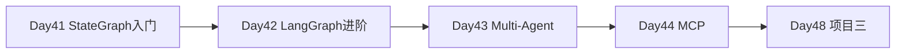

# Day 42 · LangGraph 进阶 · Checkpointer / HITL / 子图 / 并行 / 重试

> **旁白（讲师口吻）**  
> 项目三启动前，张工在白板上画了一条线：*「Day 41 的 StateGraph 能跑通单 Agent，但生产要 **断点续跑、人工审批、子任务并行、失败重试**——今天全部在 LangGraph 里落地。」*  
> 小陈：*「interrupt 暂停后，Web 端怎么 resume？先 CLI mock 跑通 `verify_day42.py`。」*

---

## 今日学习地图

| 时段 | 主题 | 产出物 |
|------|------|--------|
| 09:00–10:00 | Checkpointer 与 thread_id | `checkpointer_demo.py` |
| 10:00–11:30 | interrupt / resume HITL | `human_in_loop.py` |
| 11:30–12:00 | mock 冒烟 | `verify_day42.py` |
| 14:00–15:30 | 子图 + 并行节点 | `writing_agent_graph.py` |
| 15:30–16:30 | 条件边 + 重试环 | `writing_agent_graph.py` |
| 16:30–17:00 | 全链路验收 | 全绿 |
| 19:00–21:00 | 作业 | `06_课后作业.md` |

## 与前后课程的衔接



| 前序能力 | 今日用法 |
|----------|----------|
| Day 41 StateGraph | 今日图更复杂：checkpointer、interrupt |
| Day 27 Memory / session_id | thread_id 概念对齐 |
| Day 36–38 项目二 RAG | writing_agent 子图可接 KB |

## 今日文件清单

| 文件 | 用途 |
|------|------|
| [01_业务背景.md](./01_业务背景.md) | 审批流与断点续跑需求 |
| [02_需求文档.md](./02_需求文档.md) | LangGraph 进阶 PRD |
| [03_架构与设计.md](./03_架构与设计.md) | 图结构、checkpointer、HITL |
| [04_课堂讲义.md](./04_课堂讲义.md) | **主课** |
| [05_流程图与示意图.md](./05_流程图与示意图.md) | Mermaid 图 |
| [06_课后作业.md](./06_课后作业.md) | 作业 |
| [07_作业参考答案.md](./07_作业参考答案.md) | 参考答案 |
| [08_补充讲义_LangGraph进阶速查.md](./08_补充讲义_LangGraph进阶速查.md) | API 速查 |
| [code/checkpointer_demo.py](./code/checkpointer_demo.py) | Checkpointer 演示 |
| [code/human_in_loop.py](./code/human_in_loop.py) | **HITL interrupt** |
| [code/writing_agent_graph.py](./code/writing_agent_graph.py) | **子图+并行+重试** |
| [code/verify_day42.py](./code/verify_day42.py) | 验收 |

## 今日验收标准

- [ ] `python3 code/verify_day42.py` 全部 `[OK]`
- [ ] 同一 thread_id 连续 invoke，count 累加 1→2→3
- [ ] interrupt 在 review 节点暂停，Command(resume) 可继续
- [ ] writing graph 并行产出 ≥2 条 research_notes
- [ ] 质检未通过时触发重试，最终发布
- [ ] Git commit message 含 `day42`

## 快速开始

```bash
cd day42
bash run.sh
cd day42/code && python3 verify_day42.py
```

---

**讲师提醒**：checkpointer 的关键是 **thread_id**；HITL 的关键是 **interrupt_before + Command(resume)**。

**状态**：✅ Day 42 LangGraph 进阶完整课件已发布
