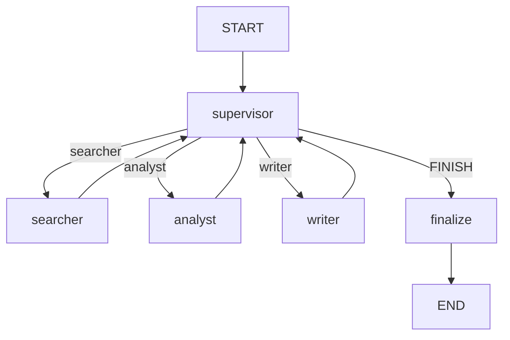

# Day 43 架构与设计 · Supervisor 研究团队

## 1. 总体架构



## 2. TeamState

| 字段 | 说明 |
|------|------|
| task | 用户研究课题 |
| search_result | Searcher 输出 |
| analysis_result | Analyst 输出 |
| report | Writer 成稿 |
| steps | 路由步数 |
| messages | 审计日志 |

## 3. 路由逻辑（mock）

```python
if not has_search: return "searcher"
if not has_analysis: return "analyst"
if not has_report: return "writer"
return "FINISH"
```

生产可换 LLM 解析 Supervisor 决策；课堂用确定性规则保证可测。

## 4. Handoff

`format_handoff` 将上游 `AgentResult` 拼成 context 字符串，注入下一角色 prompt。

## 5. 模块依赖

```text
mock_llm.py              → FakeListChatModel
agent_roles.py           → 角色 + run_agent
supervisor_multi_agent.py → LangGraph 编排
verify_day43.py          → 验收
```
