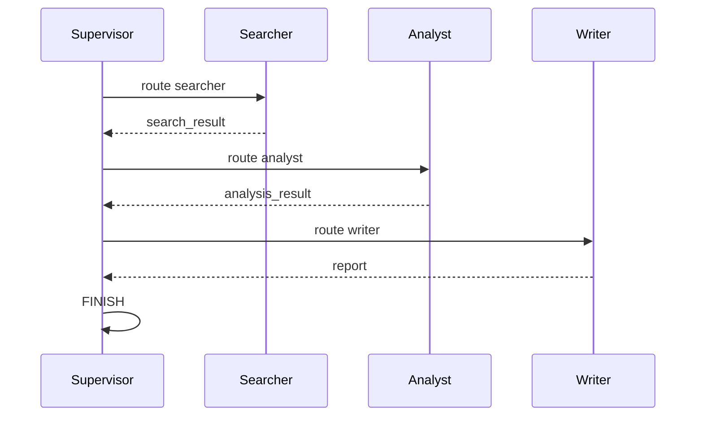

# Day 43 流程图与示意图

## 1. Supervisor 循环

```ascii
    +-------------+
    | supervisor  |
    +------+------+
           |
    +------+------+------+
    |      |      |      |
    v      v      v      v
searcher analyst writer FINISH
    |      |      |
    +------+------+ (回到 supervisor)
```

## 2. 消息流



## 3. 与 Day 42 写作图对比

| 维度 | Day 42 writing_agent | Day 43 supervisor |
|------|----------------------|-------------------|
| 路由 | 固定 + 条件重试 | Supervisor 动态 |
| 并行 | search ∥ analyze | 串行协作 |
| 角色 | 节点函数 | 独立 Agent 定义 |
