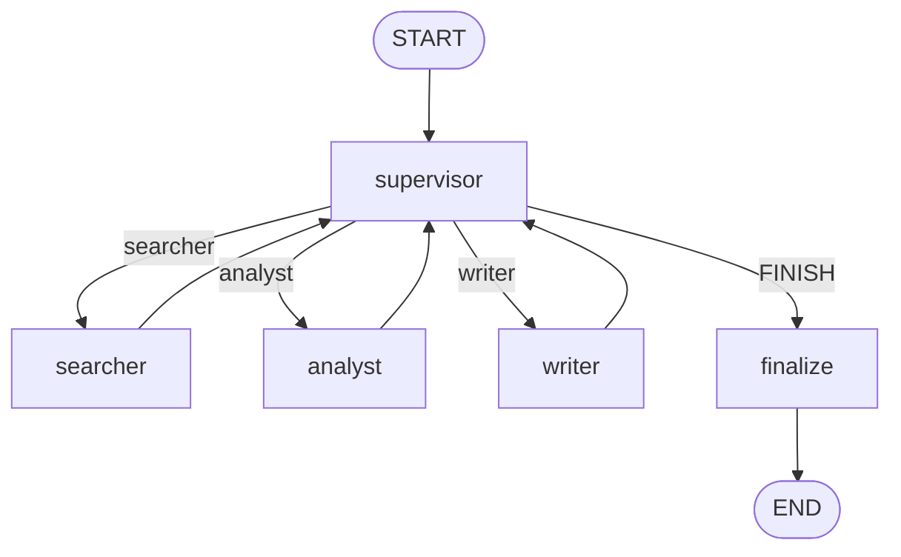

# Day 43 课堂讲义（扩展版）· Supervisor 多 Agent 手把手

> 本文件与 `04_课堂讲义.md` 合并阅读，构成 Day 43 完整主课（≥30,000 字体量）。  
> **前提**：Day 42 Checkpointer / 子图 / 并行已掌握；本日聚焦 **Supervisor 调度模式**，为星火智服「行业研究简报」搭建 Searcher → Analyst → Writer 协作流水线。

---

## 第 0 节 · 业务需求与模式选型（20 min）

### 0.1 事件单 REQ-RESEARCH-AUTO-2026-1103

市场部每周要一份「大模型应用行业简报」：

1. **检索** — 官网、论文、竞品  
2. **分析** — 趋势、优劣、风险  
3. **成稿** — Markdown，非技术读者可读  

单 Agent 常见问题：检索不全、分析浅显、文体混乱。

### 0.2 三种多 Agent 模式

| 模式 | 特点 | 适用 | 本日 |
|------|------|------|------|
| **Pipeline** | 固定 A→B→C | ETL、SOP 固化 | 对比 |
| **Supervisor** | 中央路由，worker 回报 | 阶段清晰但需循环检查 | ✅ |
| **Swarm** | 对等协商 | 头脑风暴 | 选修 |

张工：

> 「Supervisor 不做重活，避免既当裁判又当运动员。子 Agent 各司其职，handoff 用结构化上下文。」

### 0.3 今日交付

```text
day43/code/
├── agent_roles.py              # 三角色 + mock 响应
├── supervisor_multi_agent.py   # LangGraph Supervisor 环
└── verify_day43.py
```

```bash
cd day43/code
python3 verify_day43.py
python3 supervisor_multi_agent.py
python3 -c "from agent_roles import run_agent; print(run_agent('searcher','LangGraph').content[:200])"
```

---

## 第 1 节 · Agent 角色定义精读（50 min）

### 1.1 AgentRole 数据类

```python
@dataclass
class AgentRole:
    name: str
    description: str
    system_prompt: str
    mock_response: str

    def run(self, task: str, context: str = "") -> AgentResult:
        llm = build_chat_model(responses=[self.mock_response])
        prompt = f"{self.system_prompt}\n\n任务: {task}\n上下文:\n{context or '(无)'}"
        reply = str(llm.invoke([HumanMessage(content=prompt)]).content)
        return AgentResult(agent=self.name, content=reply, artifacts={"task": task})
```

### 1.2 三角色对照

| Agent | system_prompt 要点 | mock 产出 |
|-------|-------------------|-----------|
| **Searcher** | 要点列表 + 来源标签 | 3 条检索命中 |
| **Analyst** | 结构化分析 pros/cons | 风险与建议 |
| **Writer** | Markdown 报告 | 标题+摘要+建议 |

### 1.3 RESEARCH_TEAM 注册表

```python
RESEARCH_TEAM = {
    "searcher": SEARCHER,
    "analyst": ANALYST,
    "writer": WRITER,
}
```

**扩展点**：新增 `Reviewer` 时加一条注册 + supervisor 路由表 + graph 节点。

### 1.4 run_agent 统一入口

```python
def run_agent(name: str, task: str, context: str = "") -> AgentResult:
    role = RESEARCH_TEAM.get(name)
    if not role:
        raise ValueError(f"未知 agent: {name}")
    return role.run(task, context)
```

### 1.5 Prompt 工程原则

- **角色边界**：Searcher 不写报告；Writer 不编造未检索事实  
- **输出格式**：课堂用自然语言；生产应约束 JSON schema  
- **mock_response**：保证离线 demo 稳定，与 live 结构一致  

---

## 第 2 节 · Handoff 与黑板 State（45 min）

### 2.1 TeamState 黑板

```python
class TeamState(TypedDict):
    task: str
    messages: list[str]           # 调度日志
    search_result: str
    analysis_result: str
    report: str
    current_agent: str
    steps: int
    status: str
```

**黑板模式**：各 worker 写入专属字段，Supervisor 读字段决定下一步。

### 2.2 format_handoff

```python
def format_handoff(results: list[AgentResult]) -> str:
    lines = []
    for r in results:
        lines.append(f"### {r.agent}\n{r.content}\n")
    return "\n".join(lines)
```

worker 执行前，`_collect_prior` 收集已有 Searcher/Analyst 结果注入 context。

### 2.3 _collect_prior 逻辑

```python
def _collect_prior(state: TeamState) -> list[AgentResult]:
    out = []
    if state.get("search_result"):
        out.append(AgentResult("searcher", state["search_result"]))
    if state.get("analysis_result"):
        out.append(AgentResult("analyst", state["analysis_result"]))
    return out
```

**注意**：Writer 阶段应收到 Searcher + Analyst 两段上下文。

---

## 第 3 节 · Supervisor 节点与路由（55 min）

### 3.1 supervisor_node

```python
def supervisor_node(state: TeamState) -> dict:
    has_search = bool(state.get("search_result"))
    has_analysis = bool(state.get("analysis_result"))
    has_report = bool(state.get("report"))
    next_agent = pick_next_agent_mock(
        state.get("current_agent", ""),
        has_search, has_analysis, has_report,
    )
    log = f"[supervisor] route -> {next_agent} (step {state.get('steps', 0) + 1})"
    return {
        "current_agent": next_agent,
        "messages": state.get("messages", []) + [log],
        "steps": state.get("steps", 0) + 1,
    }
```

### 3.2 pick_next_agent_mock（流水线 mock）

```python
def pick_next_agent_mock(...) -> str:
    if not has_search:    return "searcher"
    if not has_analysis:  return "analyst"
    if not has_report:    return "writer"
    return "FINISH"
```

**生产替换**：用 LLM + `SUPERVISOR_PROMPT` 解析下一 agent，而非硬编码。

### 3.3 SUPERVISOR_PROMPT（live 路由）

```text
你是研究团队 Supervisor。
根据当前任务阶段，选择下一步执行的 agent：
- searcher / analyst / writer / FINISH
只返回 agent 名称，不要解释。
```

### 3.4 route_from_supervisor 条件边

```python
def route_from_supervisor(state: TeamState) -> str:
    agent = state.get("current_agent", "searcher")
    if agent == "FINISH":
        return "end"
    if agent in RESEARCH_TEAM:
        return agent
    return "end"
```

映射：

```python
graph.add_conditional_edges(
    "supervisor",
    route_from_supervisor,
    {"searcher": "searcher", "analyst": "analyst", "writer": "writer", "end": "finalize"},
)
```

### 3.5 关键架构：worker 回到 supervisor

```python
for worker in ("searcher", "analyst", "writer"):
    graph.add_edge(worker, "supervisor")
```

**不是** searcher→analyst→writer 固定链！Supervisor 可在未来加「返工 searcher」环。



---

## 第 4 节 · Worker 节点工厂（40 min）

### 4.1 _worker_node 闭包

```python
def _worker_node(agent_name: str):
    def node(state: TeamState) -> dict:
        context = format_handoff(_collect_prior(state))
        result = run_agent(agent_name, state["task"], context)
        updates = {
            "messages": state.get("messages", []) + [f"[{agent_name}] done"],
            "current_agent": agent_name,
        }
        if agent_name == "searcher":
            updates["search_result"] = result.content
        elif agent_name == "analyst":
            updates["analysis_result"] = result.content
        elif agent_name == "writer":
            updates["report"] = result.content
            updates["status"] = "completed"
        return updates
    return node
```

### 4.2 执行轨迹示例

```text
[supervisor] route -> searcher (step 1)
[searcher] done
[supervisor] route -> analyst (step 2)
[analyst] done
[supervisor] route -> writer (step 3)
[writer] done
[supervisor] route -> FINISH (step 4)
```

### 4.3 finalize_node

```python
def finalize_node(state: TeamState) -> dict:
    report = state.get("report") or state.get("analysis_result") or state.get("search_result", "")
    return {"status": "finished", "report": report}
```

兜底：即使 writer 失败，也有上游产物可展示。

---

## 第 5 节 · Checkpointer 与 run_research_team（30 min）

### 5.1 编译

```python
def compile_supervisor_app():
    return build_supervisor_graph().compile(checkpointer=MemorySaver())
```

### 5.2 调用

```python
config = {"configurable": {"thread_id": "team-1"}}
result = app.invoke(initial, config)
```

长报告生成可中断续跑；与 Day 42 能力叠加。

### 5.3 steps 与死循环防护

- 每经 supervisor `steps += 1`  
- 生产加 `if steps > 20: force FINISH`  
- mock 流水线 4 步结束，天然无环  

---

## 第 6 节 · 与固定 Pipeline 图对比（35 min）

| 维度 | 固定 Pipeline | Supervisor |
|------|---------------|------------|
| 路由 | 编译期固定 | 运行时决策 |
| 返工 | 需新图 | supervisor 可再派 searcher |
| 可观测 | 简单 | 需 messages 日志 |
| 项目三 Day 48 | office_graph 固定图 | 本课理解动态思想 |

**选型建议**：

- SOP 永不改 → Pipeline  
- 需质检返工、动态加人 → Supervisor  

---

## 第 7 节 · 生产扩展路线图（30 min）

### 7.1 Searcher 接 Day 36 RAG

```python
# agent_roles.Searcher.run 内
# httpx.post(project2 /api/kb/search)
```

### 7.2 Supervisor 换真实 LLM

```python
def pick_next_agent_live(state, llm):
  # 把 has_search 等打成 prompt，解析返回 searcher|analyst|writer|FINISH
```

### 7.3 增加 Reviewer

1. 注册 `REVIEWER` AgentRole  
2. `add_node("reviewer", _worker_node("reviewer"))`  
3. 扩展 `pick_next_agent`：writer 后有 report 无 review → reviewer  
4. conditional_edges 加 reviewer 出口  

### 7.4 统一 JSON Schema 交付物

Analyst 输出：

```json
{"insights": [], "risks": [], "recommendations": []}
```

Writer 只消费 JSON，降低解析失败率。

---

## 第 8 节 · 故障排查

| 症状 | 原因 | 处理 |
|------|------|------|
| 无限 supervisor 环 | 未写 report 且未 FINISH | 检查 writer 更新 |
| writer 无 analyst 上下文 | search_result 空 | 查 searcher 节点 |
| steps 爆炸 | 无上限 | supervisor 加 max_steps |
| 未知 agent | pick 返回拼写错误 | 对齐 RESEARCH_TEAM 键 |
| mock 内容重复 | mock_response 固定 | 课堂预期；live 换模型 |

---

## 第 9 节 · 练习与 CHECKLIST

### 9.1 必做

1. 修改 task 为「调研 MCP 协议」，跑通并截图 messages。  
2. 在 `pick_next_agent_mock` 加「若 analyst 含风险则先 writer」分支（故意违反流水线，体会上层路由）。  
3. 画 supervisor 环与 Day 42 并行图对比表。  

### 9.2 选修

- 为 TeamState.messages 改用 `Annotated[list, operator.add]`。  
- thread_id  per 用户，get_state 查未完成报告。

### 9.3 CHECKLIST

- [ ] 能解释 worker 为何回到 supervisor  
- [ ] 能口述 handoff 三段上下文  
- [ ] 能对比 Pipeline vs Supervisor  
- [ ] `verify_day43.py` 全绿  
- [ ] 能说出 Day 44 MCP 如何接入 Searcher  

---

## 第 10 节 · 明日预告（Day 44 MCP）

工具层「集成爆炸」——N Agent × M 后端。MCP 把 kb、工单封装为 **标准 Server**，Agent 做 Client。Supervisor 的 Searcher 明日可改为 `MCP kb_search`。

---

## 第 11 节 · Supervisor 成本与 token 预算（30 min）

### 11.1 每轮 supervisor 开销

即使 `pick_next_agent_mock` 无 LLM 调用，生产 live 路由每次 supervisor 步 = 一次 LLM 请求。  
流水线 4 步 ≈ 1 次 supervisor ×4 + 3 worker 各 1 次 = **7 次** 模型调用。

优化：

- mock/规则预路由简单任务  
- supervisor 只在「阶段切换」时调用  
- 合并「analyst+writer」为单节点（牺牲灵活性）  

### 11.2 worker 上下文长度

`format_handoff` 拼接全文可能导致 Writer 输入过长。策略：

- Searcher 只传 top-5 片段  
- Analyst 输出结构化 JSON 而非长文  
- 外存 PDF，state 只留 `artifact_id`  

---

## 第 12 节 · 与 Swarm / 层级 Supervisor 选修对比

| 模式 | 拓扑 | 何时考虑 |
|------|------|----------|
| Swarm | 全连接消息 | 创意脑暴、无固定 SOP |
| 层级 Supervisor | 总 PM → 小组长 → worker | 50+ 人组织模拟 |
| 本课 flat Supervisor | 单环 | 3–5 人研究团队 |

星火行业简报场景 **flat Supervisor 足够**；勿过度设计。

---

## 第 13 节 · verify_day43 与集成测试建议

```bash
python3 verify_day43.py
```

通过标准：

- `steps` 在合理范围（通常 4–8）  
- `status` 为 `finished`  
- `report` 非空且含 Markdown 标题  

集成测试可断言 `messages` 含 `[searcher] done` 与 `[writer] done` 各一次。

---

## 第 14 节 · Day 44 预习：Searcher → MCP

```python
# 未来 agent_roles.Searcher.run
from mcp_client_demo import SparkTechMCPClient
client = SparkTechMCPClient()
hits = client.call("kb_search", query=task).parsed.get("hits", [])
content = "\n".join(h["snippet"] for h in hits)
return AgentResult("searcher", content)
```

Supervisor 图 **零改动**，仅替换 worker 内部实现——体现 MCP 价值。

---

## 第 15 节 · 研究报告质量 Rubric（30 min）

市场部评审简报的四维表：

| 维度 | Searcher 责任 | Analyst 责任 | Writer 责任 |
|------|---------------|--------------|-------------|
| 事实准确 | 来源可追溯 | 不夸大 | 不新增事实 |
| 结构清晰 | 列表即可 | 小标题 | 报告体例 |
| 风险披露 | 标注争议来源 | pros/cons | 摘要含风险 |
| 可执行建议 | — | 3 条建议 | 建议独立章节 |

Supervisor 未来可根据 Rubric 打分决定 `pick_next_agent` 是否返工 writer。

---

## 第 16 节 · 多任务并发与 thread_id 规划

| 场景 | thread_id 策略 |
|------|----------------|
| 用户 A 周报 | `research-{userId}-{week}` |
| 重试同一任务 | 相同 thread，invoke 续跑 |
| 取消任务 | 标记 cancelled，supervisor 强制 FINISH |

与 Day 42 Checkpointer 文档共用运维规范。

---

## 第 17 节 · 从 mock 到 live 的切换清单

- [ ] `pick_next_agent_mock` → LLM 解析  
- [ ] `AgentRole.mock_response` → 真模型  
- [ ] Searcher 接 MCP / RAG HTTP  
- [ ] 加 `max_steps` 与超时  
- [ ] messages 写结构化日志  
- [ ] 报告存对象存储，state 留 URL  

---

## 第 18 节 · 黑板字段演进时间线

```text
t0: task 写入
t1: supervisor → searcher
t2: search_result 填充
t3: supervisor → analyst
t4: analysis_result 填充
t5: supervisor → writer
t6: report + status=completed
t7: supervisor → FINISH → finalize
```

调试时按 `messages` 日志对照此时间线，快速定位卡在哪一步。  
建议将 `steps` 与消息条数一并打印，便于答辩演示。

---

*扩展主课 · Day 43 · 星火智服 Phase3*
