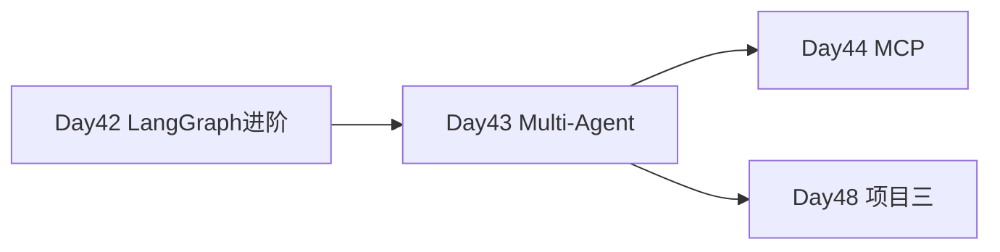

# Day 43 · Multi-Agent · Supervisor 模式与研究团队

> **旁白（讲师口吻）**  
> 周二站会，产品提了新需求：*「写行业报告要 **先搜、再分析、再成稿**——一个 Agent 包打天下不行，要 **Supervisor 带队**。」*  
> 张工：*「今天搭 Searcher + Analyst + Writer，Supervisor 只负责路由，不管具体活。」*

---

## 今日学习地图

| 时段 | 主题 | 产出物 |
|------|------|--------|
| 09:00–10:00 | 多 Agent 模式对比 | `01_业务背景.md` |
| 10:00–11:30 | Agent 角色定义 | `agent_roles.py` |
| 11:30–12:00 | mock 冒烟 | `verify_day43.py` |
| 14:00–16:00 | Supervisor 图编排 | `supervisor_multi_agent.py` |
| 16:00–17:00 | 全链路验收 | 全绿 |
| 19:00–21:00 | 作业 | `06_课后作业.md` |

## 与前后课程的衔接



## 今日文件清单

| 文件 | 用途 |
|------|------|
| [01_业务背景.md](./01_业务背景.md) | 研究报告自动化需求 |
| [02_需求文档.md](./02_需求文档.md) | Multi-Agent PRD |
| [03_架构与设计.md](./03_架构与设计.md) | Supervisor 架构 |
| [04_课堂讲义.md](./04_课堂讲义.md) | **主课** |
| [05_流程图与示意图.md](./05_流程图与示意图.md) | 协作图 |
| [06_课后作业.md](./06_课后作业.md) | 作业 |
| [07_作业参考答案.md](./07_作业参考答案.md) | 参考答案 |
| [08_补充讲义_Supervisor模式选型.md](./08_补充讲义_Supervisor模式选型.md) | 模式对比 |
| [code/agent_roles.py](./code/agent_roles.py) | **三角色定义** |
| [code/supervisor_multi_agent.py](./code/supervisor_multi_agent.py) | **Supervisor 图** |
| [code/verify_day43.py](./code/verify_day43.py) | 验收 |

## 今日验收标准

- [ ] `python3 code/verify_day43.py` 全部 `[OK]`
- [ ] Searcher / Analyst / Writer 均可独立 `run()`
- [ ] Supervisor 流水线产出 search → analysis → report
- [ ] `steps >= 4`（含多次 supervisor 路由）
- [ ] Git commit message 含 `day43`

## 快速开始

```bash
cd day43
bash run.sh
cd day43/code && python3 verify_day43.py
```

---

**状态**：✅ Day 43 Multi-Agent 完整课件已发布
