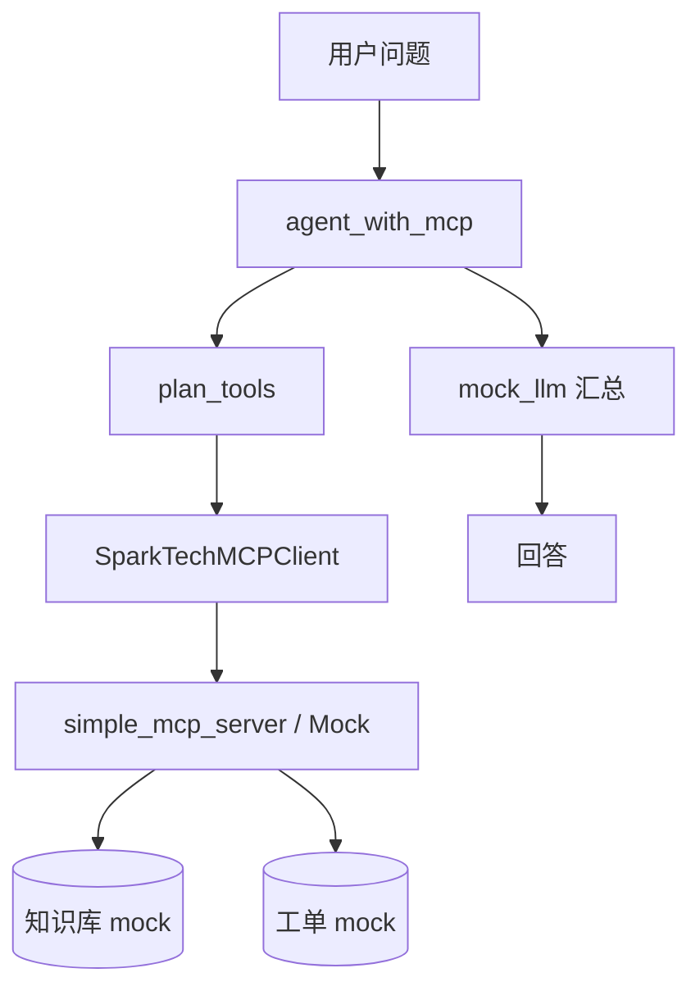

# Day 44 架构与设计 · MCP 与 Agent

## 1. 分层架构



## 2. MCP 协议要素（课堂版）

| 概念 | 说明 |
|------|------|
| Server | 暴露 tools / resources |
| Client | 发现工具、发起 call |
| Tool | 具名函数 + JSON Schema 参数 |
| Transport | stdio / SSE（今日 stdio 选做） |

## 3. 兼容层设计

```python
if MCP_AVAILABLE:
    # FastMCP @mcp.tool()
else:
    MockMCPServer.list_tools() / call_tool()
```

保证 `verify_day44.py` 在 CI 无 mcp 依赖时仍通过。

## 4. Agent 工具选择

| 问题特征 | 工具 |
|----------|------|
| 含退款/API/政策 | kb_search |
| 含 INC-xxx 或「工单」 | ticket_status |
| 其他 | 默认 kb_search |

## 5. 模块依赖

```text
mcp_compat.py         → SDK 检测 + MockMCPServer
simple_mcp_server.py  → 工具实现
mcp_client_demo.py    → Client 封装
mock_llm.py           → 回答生成
agent_with_mcp.py     → 编排
verify_day44.py       → 验收
```
