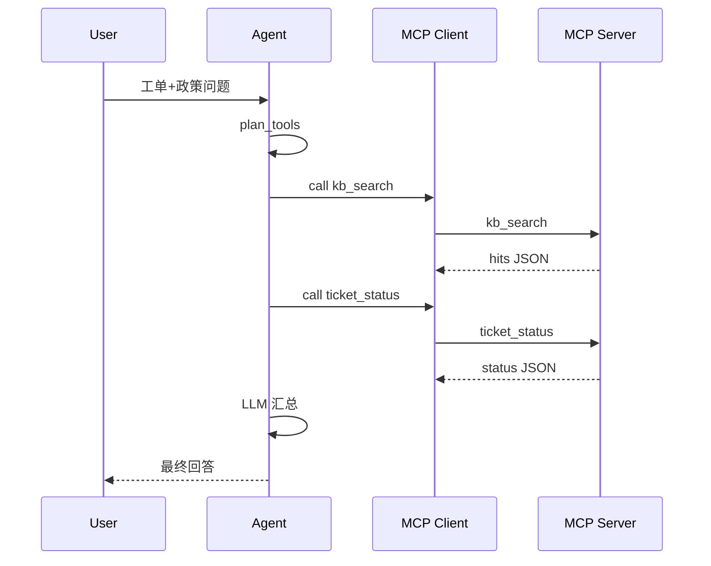

# Day 44 流程图与示意图

## 1. MCP 连接模型

```ascii
 +----------+    JSON-RPC     +----------------+
 | MCP      | <-------------> | MCP Server     |
 | Client   |   list_tools    | (kb + ticket)  |
 | (Agent)  |   call_tool     +----------------+
 +----------+
```

## 2. Agent 工具调用序列



## 3. 与项目三映射

| MCP 工具 | 项目三场景 |
|----------|------------|
| kb_search | 制度 / FAQ 检索 |
| ticket_status | 请假 / 报销单进度 |
| （扩展）calendar | 会议室预定 |
