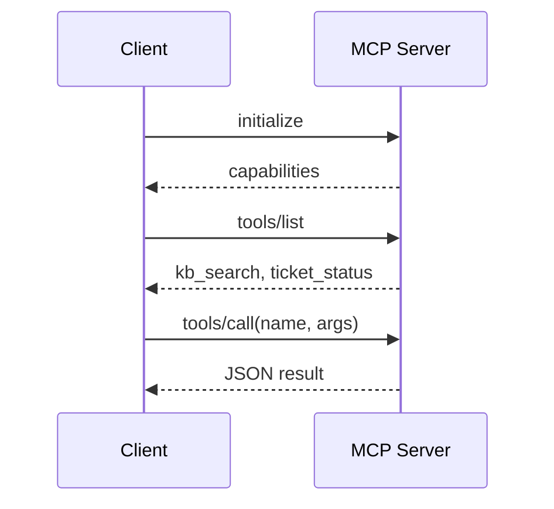
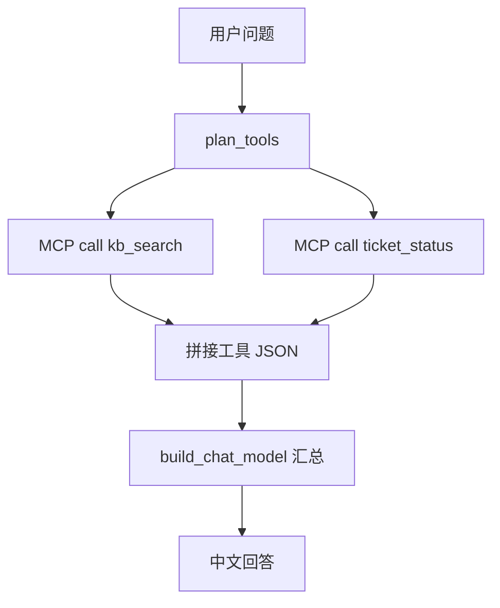
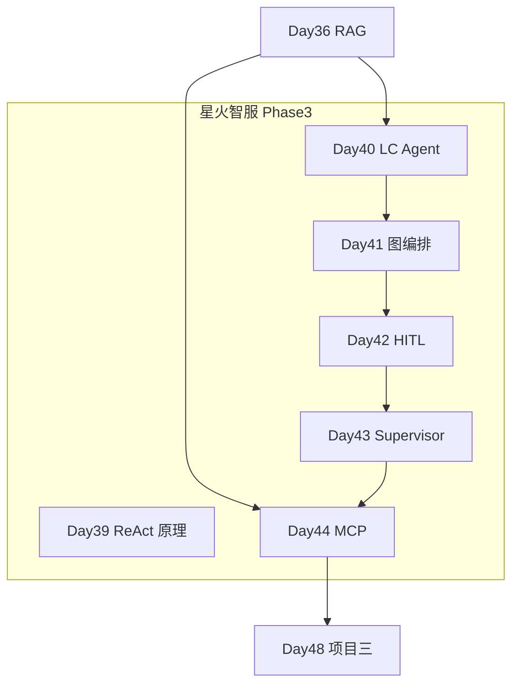

# Day 44 课堂讲义（扩展版）· MCP 协议与 Agent 接入手把手

> 本文件与 `04_课堂讲义.md` 合并阅读，构成 Day 44 完整主课（≥30,000 字体量）。  
> **前提**：Day 43 Supervisor 多 Agent 已跑通；本日聚焦 **Model Context Protocol (MCP)**，为星火智服工具层建立「标准插座」，解决 N Agent × M 后端的集成爆炸问题。

---

## 第 0 节 · 架构痛点与 MCP 定位（20 min）

### 0.1 事件单 ARCH-MCP-INT-2026-1104

| 现状 | 问题 |
|------|------|
| 每个 Agent 内嵌工具函数 | 重复实现、难单测 |
| KB / 工单 / CRM 各写 adapter | 集成成本高 |
| IDE 与业务 Agent 工具不互通 | 生态割裂 |

### 0.2 MCP 是什么

**Model Context Protocol**：把工具、资源、提示词封装为 **独立 Server**，Client（Claude Desktop、Cursor、自研 Agent）通过标准协议连接。

```text
  Agent (MCP Client)  <--JSON-RPC-->  kb_mcp_server
                                  └--> ticket_mcp_server
```

张工：

> 「Function Calling 是模型侧协议；MCP 是应用侧工具总线。项目三办公助手的外围系统，优先 MCP 接入。」

### 0.3 与 Day 19 / Day 40 对照

| | Day 19 FC | Day 40 @tool | Day 44 MCP |
|--|-----------|--------------|------------|
| 范围 | 单次 LLM 请求内 | 进程内 Python 函数 | 跨进程/跨语言服务 |
| 发现 | 代码注册 | import tools | `list_tools()` 协议 |
| 部署 | 同进程 | 同进程 | 独立进程 stdio/SSE |

### 0.4 今日交付

```text
day44/code/
├── mcp_compat.py           # SDK 检测 + MockMCPServer
├── simple_mcp_server.py    # kb_search / ticket_status
├── mcp_client_demo.py      # SparkTechMCPClient
├── agent_with_mcp.py       # 规划 + 调用 + 汇总
└── verify_day44.py
```

```bash
cd day44/code
python3 verify_day44.py
python3 simple_mcp_server.py
python3 mcp_client_demo.py
python3 agent_with_mcp.py
```

---

## 第 1 节 · MCP 核心概念（45 min）

### 1.1 三角角色

| 角色 | 职责 | 本课对应 |
|------|------|----------|
| **MCP Server** | 暴露 tools/resources | `simple_mcp_server.py` |
| **MCP Client** | 发现与调用 | `SparkTechMCPClient` |
| **Transport** | 通信载体 | stdio（课堂）/ SSE（生产） |

### 1.2 Tool 生命周期



### 1.3 list_tools 与 call_tool 契约

Mock 与 SDK 统一语义（`mcp_compat.py`）：

```python
def list_tools(self) -> list[dict]:
    return [{"name": "kb_search", "description": "...", "inputSchema": {...}}, ...]

def call_tool(self, name: str, arguments: dict) -> str:
    return json.dumps(...)
```

**关键**：返回 **字符串**（常为 JSON 文本），与 LangChain ToolMessage 一致。

### 1.4 inputSchema

```json
{
  "type": "object",
  "properties": {"query": {"type": "string"}},
  "required": ["query"]
}
```

Client 可据此做参数校验；Agent 可自动生成 tool 描述给 LLM。

---

## 第 2 节 · mcp_compat 与双模式运行（40 min）

### 2.1 SDK 检测

```python
MCP_AVAILABLE = False
try:
    from mcp.server.fastmcp import FastMCP as _FastMCP
    FastMCP = _FastMCP
    MCP_AVAILABLE = True
except ImportError:
    pass
```

**课堂默认**：无 `mcp` 包 → `MockMCPServer`，保证 CI 零依赖。

### 2.2 MockMCPServer

实现最小：

- `list_tools()` — 返回 kb_search、ticket_status 元数据  
- `call_tool(name, args)` — 内存 mock 数据  

与 FastMCP 版 **业务数据语义对齐**，避免 demo 与生产两套行为。

### 2.3 为何需要 compat 层

| 问题 | compat 解法 |
|------|-------------|
| 学员环境无 SDK | 自动 mock |
| 答辩要真 stdio | `pip install mcp` + `--stdio` |
| 测试断言 | 统一 `demo_call_tool` 入口 |

---

## 第 3 节 · simple_mcp_server 精读（55 min）

### 3.1 业务工具实现

**kb_search**（对接星火智服知识库概念）：

```python
def _kb_search_impl(query: str) -> str:
    return json.dumps({
        "query": query,
        "hits": [
            {"doc": "refund_policy.md", "score": 0.92, "snippet": "7 天内原路退款"},
            {"doc": "api_key_guide.md", "score": 0.81, "snippet": "企业版 API Key 审批流程"},
        ],
    }, ensure_ascii=False)
```

**ticket_status**（工单系统）：

```python
def _ticket_status_impl(ticket_id: str) -> str:
    return json.dumps({
        "ticket_id": ticket_id,
        "status": "open",
        "priority": "P2",
        "assignee": "小陈",
    }, ensure_ascii=False)
```

### 3.2 FastMCP 注册

```python
def build_fastmcp_server():
    mcp = FastMCP("sparktech-simple-mcp")

    @mcp.tool()
    def kb_search(query: str) -> str:
        """搜索星火智服知识库，返回相关文档片段。"""
        return _kb_search_impl(query)

    @mcp.tool()
    def ticket_status(ticket_id: str) -> str:
        """查询工单当前状态与负责人。"""
        return _ticket_status_impl(ticket_id)

    return mcp
```

### 3.3 demo_list_tools / demo_call_tool

课堂统一入口，SDK 有无均可：

```python
def demo_call_tool(name: str, arguments: dict) -> str:
    if MCP_AVAILABLE:
        if name == "kb_search":
            return _kb_search_impl(arguments.get("query", ""))
        ...
    return run_mock_server().call_tool(name, arguments)
```

### 3.4 stdio 启动（生产形态）

```bash
pip install mcp
python3 simple_mcp_server.py --stdio
```

Client（如 Cursor）配置 command 指向该进程，通过 stdin/stdout 交换 JSON-RPC。

### 3.5 安全原则

- Server 权限最小化（只暴露必要工具）  
- **禁止** tool 内执行任意 shell  
- 敏感参数（ticket_id）做格式校验与鉴权（生产）  

---

## 第 4 节 · SparkTechMCPClient（40 min）

### 4.1 类设计

```python
@dataclass
class ToolCallResult:
    tool: str
    arguments: dict
    raw: str

    @property
    def parsed(self) -> dict:
        try:
            return json.loads(self.raw)
        except json.JSONDecodeError:
            return {"raw": self.raw}

class SparkTechMCPClient:
    def __init__(self):
        self._tools = {t["name"]: t for t in demo_list_tools()}

    def list_tools(self) -> list[str]:
        return list(self._tools.keys())

    def call(self, tool: str, **arguments) -> ToolCallResult:
        raw = demo_call_tool(tool, arguments)
        return ToolCallResult(tool=tool, arguments=arguments, raw=raw)
```

### 4.2 run_client_demo

```python
kb = client.call("kb_search", query="API Key 申请")
ticket = client.call("ticket_status", ticket_id="INC-2026-042")
```

验证：`kb_hits` 数量、`ticket_status` 字段。

### 4.3 与官方 MCP Client 关系

课堂轻量封装 **list + call**；生产换官方 `mcp` Client Session，传输层接 stdio/SSE，**业务层 plan/call 逻辑可复用**。

---

## 第 5 节 · agent_with_mcp 编排（50 min）

### 5.1 AgentTrace 可观测

```python
@dataclass
class AgentTrace:
    question: str
    steps: list[AgentStep]
    tool_results: list[dict]
    answer: str
```

对接值班台：steps = 时间线；tool_results = 结构化证据。

### 5.2 plan_tools 启发式

```python
def plan_tools(question: str) -> list[tuple[str, dict]]:
    planned = []
    if _needs_kb(question):
        planned.append(("kb_search", {"query": question}))
    if _needs_ticket(question):
        planned.append(("ticket_status", {"ticket_id": tid}))
    if not planned:
        planned.append(("kb_search", {"query": question}))
    return planned
```

| 检测函数 | 触发条件 |
|----------|----------|
| `_needs_kb` | 退款/API/密钥/政策等关键词 |
| `_needs_ticket` | `INC-\d+` 或「工单」 |

**生产升级**：用 LLM + bind_tools 替代关键词，或 Supervisor 路由。

### 5.3 run_agent_with_mcp 主流程



```python
for tool_name, args in plan_tools(question):
    result = client.call(tool_name, **args)
    context_parts.append(f"[{tool_name}]\n{json.dumps(parsed)}")

llm.invoke([SystemMessage(...), HumanMessage(...)])
```

### 5.4 System Prompt 边界

```python
"你是星火智服助手。仅根据 MCP 工具返回的事实回答，简洁专业。"
```

对齐 RAG「不编造」原则 —— 无 tool 结果不臆测工单状态。

### 5.5 示例问题

```text
工单 INC-2026-042 进展如何？另外 API Key 怎么申请？
```

预期：plan 两个工具 → LLM 综合 hits 与 ticket status。

---

## 第 6 节 · MCP 与 LangChain @tool 桥接（35 min）

### 6.1 动态 @tool 包装

```python
def mcp_tool(name: str, schema: dict):
    @tool
    def _dynamic(**kwargs) -> str:
        return client.call(name, **kwargs).raw
    _dynamic.name = name
    _dynamic.description = schema.get("description", "")
    return _dynamic
```

AgentExecutor 可 bind 来自 MCP 的工具列表，实现 **运行时工具发现**。

### 6.2 Day 43 Searcher 接 MCP

```python
# agent_roles.Searcher.run 内
client = SparkTechMCPClient()
raw = client.call("kb_search", query=task).parsed
```

Supervisor 架构不变，仅 worker 后端换 MCP。

### 6.3 多 Server 聚合

```text
SparkTechMCPClient 可扩展为:
  - kb_client → kb_server
  - ticket_client → ticket_server
  - merge list_tools 时加 prefix: kb::search
```

---

## 第 7 节 · 部署与 Cursor 类比（30 min）

### 7.1 课堂 Demo 词

「Cursor 的 MCP 让 Agent 读 GitHub、数据库——我们课上的 `kb_search` 就是缩小版企业知识库插座。」

### 7.2 配置示意（概念）

```json
{
  "mcpServers": {
    "sparktech-kb": {
      "command": "python3",
      "args": ["/path/day44/code/simple_mcp_server.py", "--stdio"]
    }
  }
}
```

### 7.3 与 Day 36 project2 关系

| 组件 | 关系 |
|------|------|
| project2 RAG API | kb_search Server 后端实现 |
| Day 40 search_kb @tool | 进程内版；MCP 为进程外版 |
| Day 37 citations | MCP hits 可映射 source 徽章 |

---

## 第 8 节 · 故障排查

| 症状 | 原因 | 处理 |
|------|------|------|
| MCP_AVAILABLE False | 未装 mcp 包 | mock 正常；要 stdio 则 pip install |
| tool not found | 名拼写 | list_tools 核对 |
| JSON parse 失败 | Server 返回非 JSON | call_tool 统一 dumps |
| Agent 编造工单 | 未调 ticket_status | 强化 plan + prompt |
| 双 plan 重复 | plan_tools 调两次 | run_agent 内缓存 plan 结果 |
| stdio 挂死 | 缓冲/block | 查 SDK 文档 flush 策略 |

---

## 第 9 节 · 练习与 CHECKLIST

### 9.1 必做

1. 在 `MockMCPServer` 增加 `user_profile` 工具，Client 能 list/call。  
2. 修改 `plan_tools`：含「负责人」只调 ticket_status。  
3. 打印 `AgentTrace.tool_results` 交作业截图。  

### 9.2 选修

- 真 FastMCP stdio + 另一终端手写 JSON-RPC list_tools  
- 用 LangChain `create_tool_calling_agent` bind 动态 MCP 工具  

### 9.3 CHECKLIST

- [ ] 能画 Client-Server 时序图  
- [ ] 能解释 mock 与 FastMCP 关系  
- [ ] 能对比 FC / @tool / MCP 三层  
- [ ] `verify_day44.py` 全绿  
- [ ] 能说出项目三如何挂 MCP  

---

## 第 10 节 · Phase3 收官与项目三预告

```text
Day 39 手写 ReAct
Day 40 LangChain Agent
Day 41 LangGraph 图 + 审批
Day 42 Checkpointer + HITL + 子图并行
Day 43 Supervisor 多 Agent
Day 44 MCP 工具总线 ★
        ↓
Day 48 项目三：办公助手（图 + HITL + MCP 外围系统）
```

**一句话总结**：让工具像 USB 一样「插上就能用」，Agent 专注选工具与综合。

---

## 第 11 节 · JSON-RPC 消息形态（概念）（35 min）

MCP 基于 JSON-RPC 2.0，课堂 mock 省略线协议，但答辩应知：

```json
{"jsonrpc": "2.0", "id": 1, "method": "tools/list", "params": {}}
```

响应：

```json
{"jsonrpc": "2.0", "id": 1, "result": {"tools": [...]}}
```

`tools/call` 的 `params` 含 `name` 与 `arguments`。  
stdio 传输时 **每条消息一行 JSON + 换行**，Client/Server 各自解析。

---

## 第 12 节 · 多 Server 聚合 Client 草图

```python
class AggregatedMCPClient:
    def __init__(self, clients: dict[str, SparkTechMCPClient]):
        self._clients = clients

    def list_tools(self) -> list[str]:
        out = []
        for prefix, c in self._clients.items():
            for t in c.list_tools():
                out.append(f"{prefix}::{t}")
        return out

    def call(self, qualified: str, **kwargs):
        prefix, name = qualified.split("::", 1)
        return self._clients[prefix].call(name, **kwargs)
```

Agent `plan_tools` 即可跨 `kb::kb_search` 与 `ticket::ticket_status` 规划。

---

## 第 13 节 · Phase3 技术栈总览图



---

## 第 14 节 · 观测：AgentTrace 对接日志

```python
import logging
def log_trace(trace: AgentTrace):
    for step in trace.steps:
        logging.info("mcp_agent step=%s detail=%s", step.action, step.detail)
    for tr in trace.tool_results:
        logging.info("mcp_tool tool=%s args=%s", tr["tool"], tr["args"])
```

生产将 `tool_results` 存审计表，满足金融客户「工具调用可追溯」要求。

---

## 第 15 节 · 企业 MCP 治理（30 min）

星火科技工具委员会建议：

| 政策 | 说明 |
|------|------|
| 一工具一 Server | 边界清晰，独立扩缩容 |
| 版本号 | Server 名 `sparktech-kb@v1` |
| 审批上架 | 新 tool 需安全评审 |
| 沙箱 | 先 mock Server 联调，再上生产 |

与内部 API 网关关系：MCP 可跑在 sidecar，网关只做 mTLS。

---

## 第 16 节 · 完整联调脚本（从零到 Agent）

```bash
cd day44/code
export SPARKTECH_MOCK=1
python3 verify_day44.py && \
python3 simple_mcp_server.py && \
python3 mcp_client_demo.py && \
python3 agent_with_mcp.py
```

全绿后，将 `agent_with_mcp` 的 question 改为评委现场提问，展示 plan 变化。

---

## 第 17 节 · Phase3 结业知识图谱（自测）

学员应能不看代码回答：

1. ReAct 三要素  
2. @tool 三要素  
3. StateGraph 四元组  
4. Checkpointer 与 thread_id  
5. interrupt 与 resume API  
6. Supervisor 环与 Pipeline 差  
7. MCP list/call 与 FC 差  

---

*扩展主课 · Day 44 · 星火智服 Phase3*
