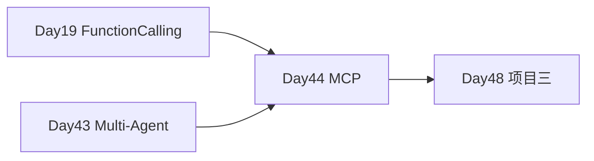

# Day 44 · MCP 协议 · Server 开发与 Agent 接入

> **旁白（讲师口吻）**  
> 周四技术分享，架构组介绍 **Model Context Protocol (MCP)**：*「工具不再写死在 Agent 里，而是 **独立 MCP Server** 暴露，Cursor、Claude Desktop、我们的办公助手都能连。」*  
> 张工：*「今天写一个 `kb_search` + `ticket_status` 服务，再让 Agent 通过 MCP Client 调用。」*

---

## 今日学习地图

| 时段 | 主题 | 产出物 |
|------|------|--------|
| 09:00–10:00 | MCP 协议概念 | `01_业务背景.md` |
| 10:00–11:30 | MCP Server 开发 | `simple_mcp_server.py` |
| 11:30–12:00 | Client 调用 | `mcp_client_demo.py` |
| 14:00–16:00 | Agent + MCP 编排 | `agent_with_mcp.py` |
| 16:00–17:00 | verify（mock 可过） | `verify_day44.py` |
| 19:00–21:00 | 作业 | `06_课后作业.md` |

## 与前后课程的衔接



## 今日文件清单

| 文件 | 用途 |
|------|------|
| [01_业务背景.md](./01_业务背景.md) | MCP 统一工具层 |
| [02_需求文档.md](./02_需求文档.md) | MCP PRD |
| [03_架构与设计.md](./03_架构与设计.md) | 协议与模块 |
| [04_课堂讲义.md](./04_课堂讲义.md) | **主课** |
| [05_流程图与示意图.md](./05_流程图与示意图.md) | 架构图 |
| [06_课后作业.md](./06_课后作业.md) | 作业 |
| [07_作业参考答案.md](./07_作业参考答案.md) | 参考答案 |
| [08_补充讲义_MCP协议速查.md](./08_补充讲义_MCP协议速查.md) | 协议速查 |
| [code/simple_mcp_server.py](./code/simple_mcp_server.py) | **MCP Server** |
| [code/mcp_client_demo.py](./code/mcp_client_demo.py) | **Client** |
| [code/agent_with_mcp.py](./code/agent_with_mcp.py) | **Agent 编排** |
| [code/mcp_compat.py](./code/mcp_compat.py) | SDK/mock 兼容层 |
| [code/verify_day44.py](./code/verify_day44.py) | 验收 |

## 今日验收标准

- [ ] `python3 code/verify_day44.py` 全部 `[OK]`（无 mcp SDK 时走 mock）
- [ ] Server 暴露 ≥2 个工具
- [ ] Client 可 list_tools + call_tool
- [ ] Agent 根据问题自动选择工具并生成回答
- [ ] Git commit message 含 `day44`

## 快速开始

```bash
cd day44
bash run.sh
cd day44/code && python3 verify_day44.py
```

---

**状态**：✅ Day 44 MCP 完整课件已发布
