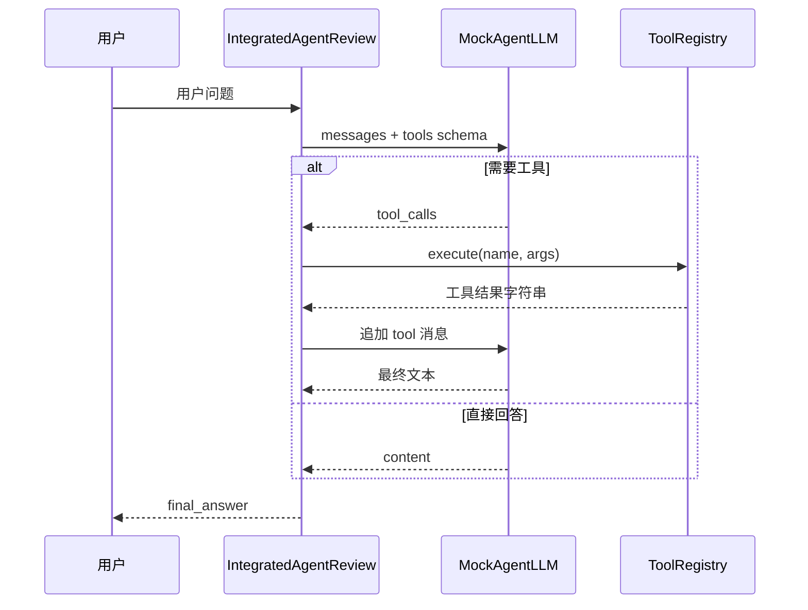

# Day 45 流程图与示意图

## 1. Agent 工具环（ReAct）



## 2. Dify 工作流等价图

```text
┌─────────┐    ┌─────────┐    ┌──────────┐
│  开始   │───▶│ LLM节点 │───▶│ 条件分支 │
└─────────┘    └─────────┘    └────┬─────┘
                                   │
              ┌────────────────────┼────────────────────┐
              ▼                    ▼                    ▼
        ┌──────────┐        ┌──────────┐        ┌──────────┐
        │ 知识检索  │        │ HTTP工具  │        │ 直接回复  │
        └────┬─────┘        └────┬─────┘        └────┬─────┘
             └──────────────────┴──────────────────┘
                                ▼
                          ┌──────────┐
                          │ 回答 LLM │
                          └──────────┘
```

## 3. Week 5 在 70 天路径中的位置

```text
Day 36-38 项目二 RAG
        │
        ▼
Day 39-44 Agent 专题周
        │
        ▼
Day 45 ★ 周测 + 低代码
        │
        ▼
Day 46-47 稳定性 + Text-to-SQL
        │
        ▼
Day 48-50 项目三 多 Agent
```

## 4. 模块依赖

```text
integrated_agent_review.py
    ├── mock_llm.py
    └── (stdlib)

verify_day45.py
    └── integrated_agent_review.py
```

---

*返回 [README.md](./README.md)*
