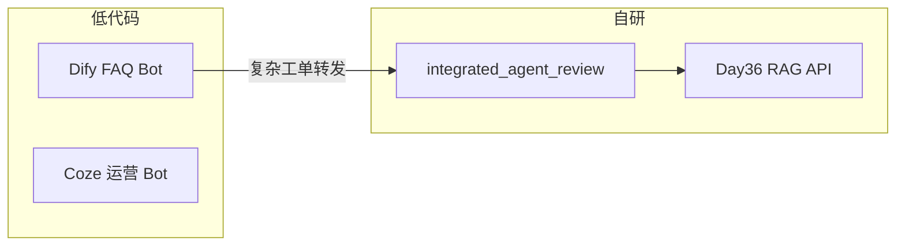

# Day 45 课堂讲义（扩展版）· 第五周周测讲评与 Dify 对照

> 本文件与 `04_课堂讲义.md`、`code/dify_workflow_notes.md` 合并阅读。  
> **前提**：Day 39–44 Agent 专题已完成；本日 **上午测验、下午低代码边界 + integrated_agent_review**。

---

## 第 0 节 · Week 5 知识地图（20 min）

### 0.1 五天主线回顾

| 天 | 主题 | 关键产物 |
|----|------|----------|
| Day 39 | 手写 ReAct | `react_agent.py` |
| Day 40 | Tool Executor | 标准化 tool_calls |
| Day 41–42 | LangGraph 入门 | StateGraph 概念 |
| Day 43–44 | 多 Agent / MCP | Supervisor 模式 |
| **Day 45** | **综合 + 低代码** | `integrated_agent_review.py` |

### 0.2 星火智服 Phase3 语境

产品问：「运营能否自己改 Prompt、接知识库？」  
张工答：**PoC 用 Dify；核心工单链路保留 Python + verify 回归**。



---

## 第 1 节 · 周测选择题讲评（45 min）

测验卷见 `code/week5_review_quiz.md`（共 33 题：选择 15 + 判断 10 + 简答 5 + 实操 3），以下为 **易错题精讲**。

### 1.0 分值分布

| 题型 | 题量 | 分值 |
|------|------|------|
| 选择 | 15 | 30 |
| 判断 | 10 | 20 |
| 简答 | 5 | 25 |
| 实操 | 3 | 25 |

及格线建议 60 分；低于 60 需补交 `integrated_agent_review` 走读笔记。

### 1.1 第 1 题 · ReAct 的 Act

**正确答案 B**：调用工具或执行环境动作。  
干扰项 A「激活 GPU」——考试常见玩笑项，勿选。

### 1.2 第 6 题 · tools schema 位置

**正确答案 B**：请求体 `tools` 字段随 messages 发送。  
对照 Day 19 `function_calling_agent.py` 中 `client.chat.completions.create(tools=...)`。

### 1.3 第 8 题 · Dify 工作流类比

**正确答案 B**：有向图 / 状态机编排。  
与 LangGraph `StateGraph.add_node` / `add_conditional_edges` 一一对应。

### 1.4 第 12 题 · 工具描述不清

**正确答案 B**：模型选错工具或根本不调用。  
课堂反例：两个工具都叫「查数据」，一个查订单一个查天气——路由准确率骤降。

### 1.5 得分段建议

| 分数段 | 诊断 | 补救 |
|--------|------|------|
| < 60 | ReAct 环未建立 | 重跑 day39 `react_loop_demo` |
| 60–80 | 概念懂、代码弱 | 精读 `integrated_agent_review.py` |
| > 80 | 可进入 Day 46 稳定性 | 预习 guardrails |

---

## 第 2 节 · 判断题与简答题要点（40 min）

### 2.1 判断题速记

| 题号 | 答案 | 一句话理由 |
|------|------|------------|
| 16 | × | 工具多 ≠ 效果好，描述与粒度更重要 |
| 17 | √ | mock 验证编排，不验证模型智商 |
| 18 | × | ERP/审批/CI 仍需代码 |
| 19 | √ | RAG 作 tool 可动态决定是否检索 |
| 20 | √ | checkpoint + interrupt 恢复长任务 |
| 22 | × | 生产需 LangSmith / OTel，非 print |

### 2.2 简答 26 · ReAct 交替

**参考答案骨架**：

1. 模型先输出 Thought 说明缺什么信息；  
2. 再输出 Action 调工具，环境返回 Observation；  
3. 将 Observation 拼回上下文，进入下一轮 Thought，直至 Final Answer。

### 2.3 简答 27 · Dify vs 自研场景

| 选型 | 场景示例 |
|------|----------|
| Dify | 一周内给业务方 FAQ 可点 Demo |
| 自研 | 星火智服与 FastAPI 审批流、SSO 深度耦合 |

### 2.4 简答 29 · search_knowledge tool 设计

- **输入**：`query: str`, 可选 `limit: int`  
- **输出**：`{snippets: [{title, content, score}], source}`  
- **错误**：`{error: "..."}` 供 Agent 重试或改问法  

对照 `integrated_agent_review.py` 中知识库工具实现。

---

## 第 3 节 · Dify 工作流与代码对照（60 min）

### 3.1 概念映射表（精读 `dify_workflow_notes.md`）

| Dify 概念 | 代码类比 |
|-----------|----------|
| App | `integrated_agent_review.py` 进程 |
| Workflow | `for round_idx in range(MAX_ROUNDS)` |
| LLM 节点 | `mock_llm.complete(messages)` |
| 知识检索节点 | `search_knowledge` tool |
| 条件分支 | 意图判断 / 工具选择 |
| 结束节点 | `final_answer` 返回 |

### 3.2 典型客服工作流 ASCII

```text
[用户输入] → [意图分类 LLM] → 条件分支
                ├─ FAQ → [知识库检索] → [回答 LLM] → [输出]
                ├─ 工单 → [HTTP 创建工单] → [确认话术]
                └─ 闲聊 → [直接 LLM]
```

**课堂任务**：三人一组在纸上画与 `integrated_agent_review` 等价的 Dify 草图，标出可低代码化的节点。

### 3.3 Dify vs Coze vs 自研（补全作业 32 行）

| 维度 | Dify | Coze（扣子） | 自研 Python |
|------|------|--------------|-------------|
| 可视化编排 | ✅ 强 | ✅ 强 | LangGraph Studio |
| **私有部署** | **✅ 开源可自建** | **以云服务为主** | **✅ 完全自控** |
| 国内模型 | 需配置 | 较便捷 | 自行封装 Client |
| CI/CD | 较弱 | 较弱 | pytest + verify |
| 适合阶段 | PoC、运营迭代 | 快速 Bot | 生产核心链路 |

### 3.4 integrated_agent_review 四条冒烟路径

```bash
cd day45/code
python3 integrated_agent_review.py --demo
```

| 用户输入 | 期望工具 |
|----------|----------|
| 北京天气 | get_weather |
| 订单 ST-10086 | lookup_order |
| 知识库 退款 | search_knowledge |
| 计算 12+8 | calc |

会话命令：`/tools`、`/clear`、`/trace`——`/trace` 输出 JSON 与 Dify 运行日志对照阅读。

---

## 第 4 节 · 迁移清单：项目二 → Dify（45 min）

### 4.1 组件级决策

| 组件 | 可迁 Dify | 建议保留自研 |
|------|-----------|--------------|
| 文档摄取 | Knowledge 数据集 | 复杂 PDF 流水线 |
| 混合检索 + Rerank | 部分支持 | 调参实验台 |
| citations JSON | 可配置 | 合同规定格式 |
| SSO / 审计 | 平台 RBAC | 企业对接层 |

### 4.2 实操 33 参考答法

> 保留 **混合检索调参层 + 引用溯源 API 契约 + 与企业 SSO 对接的 FastAPI 网关**。

### 4.3 混合策略（企业常见）

```text
Dify 外部 FAQ Bot → 复杂工单 POST 自研 Agent API → Day36 RAG
```

答辩时避免极端立场：「全 Dify」或「全自研」都不符合星火智服真实采购场景。

---

## 第 5 节 · 验收与 Day 46 预习（30 min）

```bash
python3 verify_day45.py
```

### 5.1 Week 5 知识清单

- [ ] ReAct 循环与 Observation 回传  
- [ ] tools schema 与 registry  
- [ ] Agent + RAG tool 化  
- [ ] LangGraph 状态机概念  
- [ ] 低代码边界能讲 2 分钟  

### 5.2 Day 46 预告

无论 Dify 还是自研，上线都要：**guardrails、tracing、重试、熔断**。  
阅读 `day46/01_业务背景.md` 中 OPS-AGENT-LOOP 事件单。

---

## 第 6 节 · 测验监考备忘

| 环节 | 时长 | 材料 |
|------|------|------|
| 闭卷 | 45 min | `week5_review_quiz.md` 打印 |
| 讲评 | 30 min | 本附录第 1–2 节 |
| 上机 | 90 min | integrated_agent + Dify 笔记 |

答卷命名：`week5_quiz_姓名.md`，实操题附 `--demo` 截图。

---

## 课堂 CHECKLIST（扩展）

- [ ] 能默写 Agent 三板斧：规划 / 执行 / 观察  
- [ ] 能画 Dify 工作流与 ReAct 环对照图  
- [ ] 能说明项目二哪一层不迁 Dify  
- [ ] verify_day45 全绿  

---

## 第 7 节 · integrated_agent_review 源码走读（50 min）

### 7.1 主循环结构

打开 `day45/code/integrated_agent_review.py`，定位 `IntegratedAgentReview.run`：

```text
while round_idx < MAX_ROUNDS:
    response = llm.complete(messages, tools=schemas)
    if no tool_calls: return final_answer
    for call in tool_calls:
        result = registry.execute(call)
        messages.append(tool_message)
```

与 Dify 画布对照：LLM 节点 → 工具节点 → 回边 LLM 节点。

### 7.2 工具注册表

| 工具名 | 业务含义 | Dify 节点类比 |
|--------|----------|---------------|
| get_weather | 查天气 | HTTP / 插件 |
| lookup_order | 查订单 | 数据库 / ERP 连接器 |
| search_knowledge | 知识检索 | Knowledge 检索节点 |
| calc | 安全计算 | Code 节点 |

### 7.3 /trace 输出解读

```json
{
  "rounds": [
    {"tool": "search_knowledge", "input": {"query": "退款"}, "output": {...}}
  ]
}
```

作业：将 JSON 贴到 Dify 笔记「与代码对照」一节。

---

## 第 8 节 · Coze 补充对照（30 min）

| 能力 | Coze | Dify | 自研 |
|------|------|------|------|
| Bot 发布 | 飞书/抖音等 | Web / API | 自行部署 |
| 工作流 | ✅ | ✅ | LangGraph |
| 知识库 | ✅ | ✅ | Day36 Chroma |
| 插件市场 | ✅ | ✅ | pip 任意包 |
| 审计日志 | 平台提供 | 自建版可扩展 | 完全自定义 |

**课堂结论**：国内运营向选 Coze 上手快；要私有部署与源码审计选 Dify 开源或自研。

---

## 第 9 节 · 周测实操题评分细则

| 题号 | 分值 | 评分点 |
|------|------|--------|
| 31 | 10 | 四条 demo 截图清晰、工具名可见 |
| 32 | 8 | 对比表「私有部署」行有论据 |
| 33 | 7 | 明确保留自研层（检索/契约/SSO 任一） |

**31 题常见扣分**：只截一条、看不清工具名、未在 day45/code 目录运行。

---

## 第 10 节 · 与 Day 46–48 衔接话术

答辩统一口径：

> Week 5 用 integrated_agent 证明 **Agent 环** 可测；低代码加速 PoC；Week 6 起 Project3 证明 **状态机 + 审批** 只有代码能精控。Day 46 稳定性套件两条线都要加。

---

## 第 11 节 · 周测全真模拟卷使用说明

1. 讲师提前 1 天发 `week5_review_quiz.md` PDF（无答案）。  
2. 闭卷 45 分钟，允许草稿纸，禁止联网。  
3. 交卷后当场讲评选择 1–15（见本附录第 1 节）。  
4. 简答 26–30 课后互评，对照 `07_作业参考答案.md`。  
5. 实操 31–33 作为上机作业，与 Dify 笔记绑定批改。  

**防作弊**：实操题要求终端 `hostname` 或时间戳水印截图。

---

## 第 12 节 · Dify 画布手绘规范（作业）

A4 纸竖版，必须包含：

- [ ] 开始节点（用户输入）  
- [ ] 至少 1 个 LLM 节点  
- [ ] 至少 1 个工具/知识库节点  
- [ ] 条件菱形（FAQ vs 工单）  
- [ ] 结束节点  

与 `integrated_agent_review` 工具名 **一一标注**。

---

*扩展主课 · Day 45*
