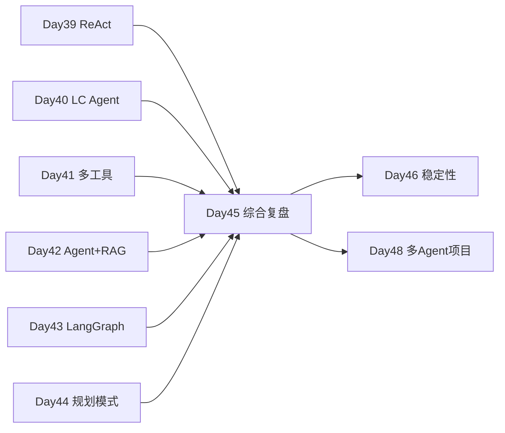

# Day 45 · Week 5 阶段测验 · Agent 综合复盘 + Dify/Coze 低代码边界

> **旁白（讲师口吻）**  
> 周五上午，张工在群里发了一行字：*「Week 5 结业考不是选择题——上午 `week5_review_quiz` 检验 Day 39–44 Agent 概念；下午把 `integrated_agent_review.py` 跑通，并讨论 Dify/Coze 与自研代码的边界。」*  
> 产品老王补充：*「答辩时必问：为什么项目二不用 Dify？今天把答案写进 `dify_workflow_notes.md`。」*

---

## 今日学习地图

| 时段 | 主题 | 产出物 |
|------|------|--------|
| 09:00–10:00 | Week 5 知识回顾测验 | `code/week5_review_quiz.md` |
| 10:00–10:30 | 测验讲评 & Agent 薄弱点 | 讲师白板 |
| 10:30–12:00 | Dify / Coze 工作流与选型 | `code/dify_workflow_notes.md` |
| 14:00–16:30 | **主实战**：`integrated_agent_review.py` | 四工具 Agent 闭环 |
| 16:30–17:00 | `verify_day45.py` 验收 | 全绿截图 |
| 17:00–17:30 | Week 5 复盘 & Day 46 预习 | `06_课后作业.md` |
| 19:00–21:00 | 错题订正 / 低代码对比表 | `homework/day45/` |

## 与前后课程的衔接



| 前序能力 | 今日综合用法 |
|----------|--------------|
| Day 19 Function Calling | `ToolRegistry` + tool 消息回传 |
| Day 21 综合助手 | 多轮会话 + 流式（今日聚焦工具环） |
| Day 36–38 知识库 | `search_knowledge` mock 检索 |
| Day 38 答辩 Q4 | Dify 边界讨论 |

## 今日文件清单

| 文件 | 用途 |
|------|------|
| [01_业务背景.md](./01_业务背景.md) | Week 5 结业考与低代码选型背景 |
| [02_需求文档.md](./02_需求文档.md) | 综合复盘 Agent PRD |
| [03_架构与设计.md](./03_架构与设计.md) | 工具环、低代码对照 |
| [04_课堂讲义.md](./04_课堂讲义.md) | **主课**（测验 + Dify + 编码） |
| [05_流程图与示意图.md](./05_流程图与示意图.md) | Agent 环、工作流图 |
| [06_课后作业.md](./06_课后作业.md) | 错题订正 + 对比表 |
| [07_作业参考答案.md](./07_作业参考答案.md) | 测验答案与讲评 |
| [08_补充讲义_低代码选型速查.md](./08_补充讲义_低代码选型速查.md) | Dify/Coze 速查 |
| [code/week5_review_quiz.md](./code/week5_review_quiz.md) | **Week 5 测验题** |
| [code/dify_workflow_notes.md](./code/dify_workflow_notes.md) | **低代码工作流笔记** |
| [code/integrated_agent_review.py](./code/integrated_agent_review.py) | **综合复盘主程序** |
| [code/verify_day45.py](./code/verify_day45.py) | 自动化验收 |
| [run.sh](./run.sh) | 一键启动 |

## 今日验收标准

- [ ] 完成 `week5_review_quiz.md` 测验，正确率 ≥ 80%  
- [ ] 完成 `dify_workflow_notes.md` 对比表「私有部署」行  
- [ ] 无 API Key 时 `python3 integrated_agent_review.py` 进入 mock REPL  
- [ ] 天气 / 订单 / 知识库 / 计算 四类问题各触发正确工具  
- [ ] `python3 verify_day45.py` 全部 `[OK]`  
- [ ] Git commit message 含 `day45`

## 快速开始

```bash
cd day45
bash run.sh
# 或
cd day45/code
pip install -r requirements.txt
python3 integrated_agent_review.py --demo
python3 verify_day45.py
```

---

**讲师提醒**：今日重点是 **模式汇合 + 选型边界**——Agent 环在代码里跑通，同时能说清何时用 Dify/Coze、何时坚持自研。

**状态**：✅ Day 45 Week 5 测验 + 低代码讨论完整课件已发布
