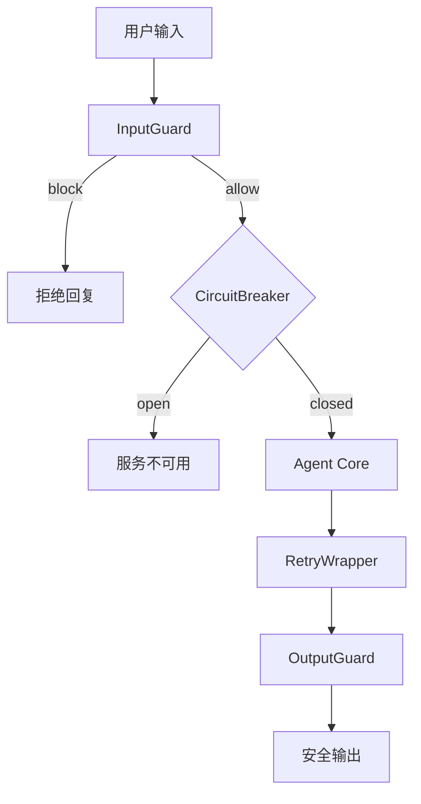
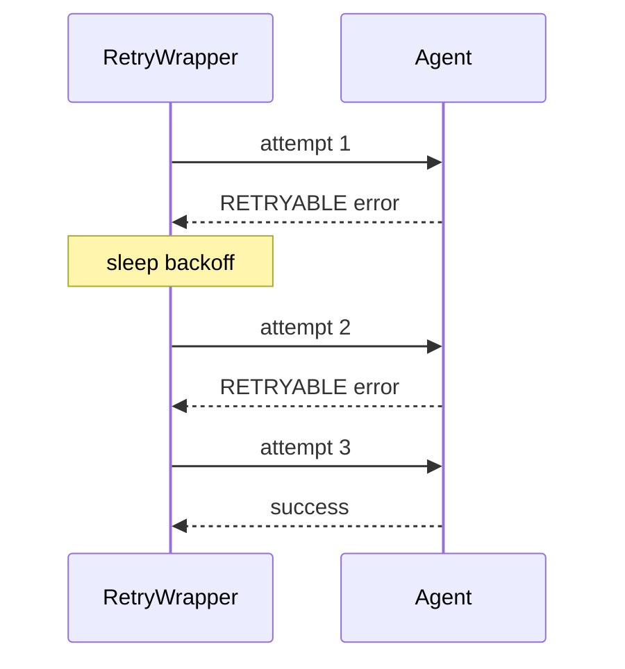

# Day 46 流程图与示意图

## 1. 稳定性分层



## 2. Trace 树示例

```text
agent_run (45ms)
├─ llm_plan (22ms)
├─ tool_lookup_order (10ms)
└─ llm_summarize (15ms)
```

## 3. 重试时序



## 4. 失败 trace

```text
agent_run
├─ llm_round_1
├─ llm_round_2
└─ guard_max_rounds ERROR=max_rounds_exceeded
```

---

*返回 [README.md](./README.md)*
