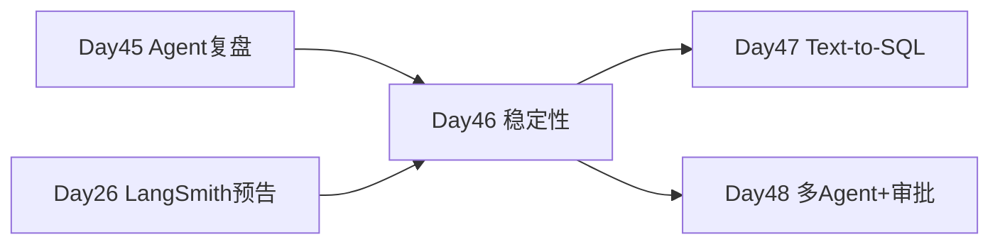

# Day 46 · Agent 稳定性 · 失败模式、可观测性、护栏与成本

> **旁白（讲师口吻）**  
> 周一早会，运维反馈预发环境 Agent 昨晚「卡死」——同一用户问题触发 12 轮 `search_knowledge`，账单暴涨。张工：*「Day 46 不赶新功能，把 **失败模式、LangSmith 级 tracing、输入输出护栏、重试熔断** 补齐；没 Key 就 mock trace，但逻辑必须 production-ready。」*

---

## 今日学习地图

| 时段 | 主题 | 产出物 |
|------|------|--------|
| 09:00–10:30 | Agent 失败模式分类 | `04_课堂讲义.md` 第一章 |
| 10:30–12:00 | LangSmith / tracing 概念 | `observability_demo.py` |
| 14:00–15:30 | 输入输出护栏 | `agent_guardrails.py` |
| 15:30–17:00 | 重试、退避、熔断 | `retry_agent_wrapper.py` |
| 17:00–17:30 | 成本与延迟权衡 | `08_补充讲义` |
| 19:00–21:00 | 作业：扩展护栏规则 | `06_课后作业.md` |

## 与前后课程的衔接



## 今日文件清单

| 文件 | 用途 |
|------|------|
| [01_业务背景.md](./01_业务背景.md) | 预发 Agent 死循环事件 |
| [02_需求文档.md](./02_需求文档.md) | 稳定性套件 PRD |
| [03_架构与设计.md](./03_架构与设计.md) | 护栏 / trace / 重试分层 |
| [04_课堂讲义.md](./04_课堂讲义.md) | **主课** |
| [05_流程图与示意图.md](./05_流程图与示意图.md) | 失败路径与 trace 树 |
| [06_课后作业.md](./06_课后作业.md) | 扩展作业 |
| [07_作业参考答案.md](./07_作业参考答案.md) | 参考答案 |
| [08_补充讲义_成本与延迟速查.md](./08_补充讲义_成本与延迟速查.md) | token / 延迟表 |
| [code/agent_guardrails.py](./code/agent_guardrails.py) | **输入输出护栏** |
| [code/observability_demo.py](./code/observability_demo.py) | **mock tracing** |
| [code/retry_agent_wrapper.py](./code/retry_agent_wrapper.py) | **重试与熔断** |
| [code/verify_day46.py](./code/verify_day46.py) | 自动化验收 |
| [run.sh](./run.sh) | 一键演示 |

## 今日验收标准

- [ ] 能列举 4 类 Agent 失败模式并对应缓解手段  
- [ ] `observability_demo.py` 输出 trace 树与 JSON  
- [ ] 注入类输入被 `InputGuard` 拦截  
- [ ] PII 在输出中被打码  
- [ ] `RetryAgentWrapper` 对可重试错误成功恢复  
- [ ] `python3 verify_day46.py` 全部 `[OK]`  

## 快速开始

```bash
cd day46/code
python3 verify_day46.py
bash ../run.sh
```

---

**状态**：✅ Day 46 Agent 稳定性完整课件已发布
