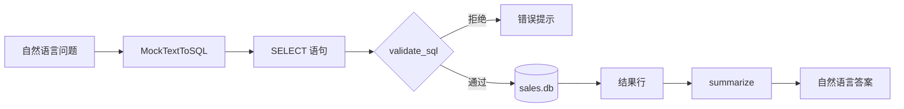
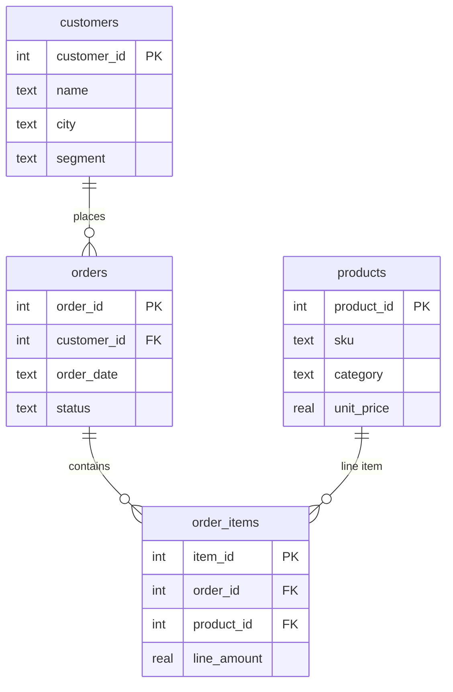

# Day 47 流程图与示意图

## 1. Text-to-SQL 主流程



## 2. ER 图



## 3. 安全边界

```text
允许：SELECT ... FROM ... WHERE ... GROUP BY ...
拒绝：INSERT / UPDATE / DELETE / DROP / PRAGMA / 多语句
```

---

*返回 [README.md](./README.md)*
