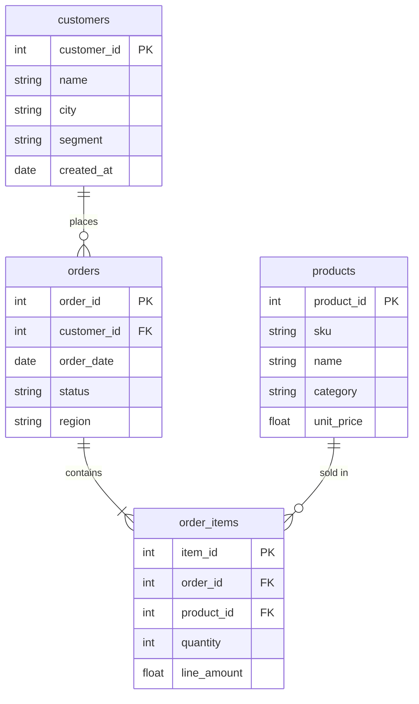

# Day 47 附录 B · 销售库 Schema 精读与恶意 SQL 实验室

> 与 `09_附录_Text2SQL安全与面试.md` 合并阅读。上机材料：`day47/code/sales_schema.sql`、`data/sales.db`。

---

## 一、ER 关系图



---

## 二、字段业务含义（星火智服虚构销售库）

| 表.字段 | 含义 | Demo 问法触发词 |
|---------|------|-----------------|
| customers.segment | Standard / Enterprise | 企业客户、Enterprise |
| customers.city | 上海、北京等 | 城市、各地 |
| products.category | 品类 | 品类收入、category |
| order_items.line_amount | 行金额 | 销售额、收入 |
| orders.status | pending/shipped | 待处理订单 |

---

## 三、标准 SQL 范文（答辩背诵用）

### 3.1 总销售额

```sql
SELECT SUM(line_amount) AS total_sales FROM order_items;
```

### 3.2 各品类收入

```sql
SELECT p.category, SUM(oi.line_amount) AS revenue
FROM order_items oi
JOIN products p ON oi.product_id = p.product_id
GROUP BY p.category
ORDER BY revenue DESC;
```

### 3.3 各城市订单数

```sql
SELECT c.city, COUNT(o.order_id) AS order_count
FROM customers c
JOIN orders o ON c.customer_id = o.customer_id
GROUP BY c.city
ORDER BY order_count DESC;
```

### 3.4 Enterprise 客户销售额

```sql
SELECT c.name, SUM(oi.line_amount) AS total
FROM customers c
JOIN orders o ON c.customer_id = o.customer_id
JOIN order_items oi ON o.order_id = oi.order_id
WHERE c.segment = 'Enterprise'
GROUP BY c.name
ORDER BY total DESC;
```

---

## 四、恶意 SQL 实验室（必须被 validate_sql 拦截）

在 REPL 或单测中尝试以下字符串，**期望全部抛 ValueError**：

| # | 恶意 SQL | 攻击意图 |
|---|----------|----------|
| M1 | `DROP TABLE orders` | 删表 |
| M2 | `SELECT 1; DELETE FROM orders` | 多语句 |
| M3 | `INSERT INTO orders VALUES (...)` | 写数据 |
| M4 | `SELECT * FROM orders; ATTACH DATABASE 'x.db' AS x` | 挂载 |
| M5 | `PRAGMA table_info(orders)` | 信息泄露 |
| M6 | `UPDATE orders SET status='hacked'` | 改状态 |

```python
from text_to_sql_agent import validate_sql
for sql in malicious_list:
    try:
        validate_sql(sql)
        print("FAIL - should block:", sql)
    except ValueError as e:
        print("OK blocked:", e)
```

---

## 五、与 Agent 工具化设计（Day 40+ 预习）

若将 Text-to-SQL 封装为 Agent tool：

```python
def run_sales_query(question: str) -> dict:
  sql = llm.generate_sql(question)
  sql = validate_sql(sql)
  rows = execute_sql(DB_PATH, sql)
  return {"sql": sql, "rows": rows, "summary": summarize(question, rows)}
```

**tool description 必须写**：「仅支持销售库只读查询，禁止写操作」。

---

## 六、自然语言总结模板

` summarize()` 逻辑（简化）：

- 单行单列 → 「答案是 key=val」  
- 多行 → 预览前 3 行 + 总行数  

**扩展**：将 `rows` JSON 再喂给 LLM 生成高管摘要（注意 token 成本）。

---

## 七、排错速查

| 错误信息 | 原因 |
|----------|------|
| 仅允许 SELECT 查询 | 非 SELECT 开头 |
| 检测到危险 SQL 关键字 | FORBIDDEN 命中 |
| 不允许多语句 | 中间含 `;` |
| no such column | schema 与问题不符，优化 prompt |

---

## 八、seed 数据样例查询

```bash
sqlite3 data/sales.db "SELECT city, segment, COUNT(*) FROM customers GROUP BY city, segment LIMIT 5;"
```

理解 seed 分布有助于解释「为何 Enterprise 只有部分客户有订单」。

---

## 九、JOIN 路径口诀

```text
要金额 → 先想到 order_items.line_amount
要客户属性 → customers JOIN orders
要品类 → products JOIN order_items
```

手绘 JOIN 图是答辩加分项。

---

## 十、LIMIT 与分页（作业扩展）

在 `validate_sql` 后处理：

```python
if "limit" not in sql.lower():
    sql = sql.rstrip(";") + " LIMIT 100;"
```

防止 `SELECT *` 拖垮 Agent 上下文。

---

## 十一、多轮 Text-to-SQL Agent（预习）

```text
用户：销售额多少？
Agent：100 万
用户：那上海呢？
```

需保留上一轮 SQL 或结果摘要进 messages；注意 **每轮仍 validate**。

---

## 十二、面试追问参考答案

**Q：LLM 生成子查询怎么办？**  
A：validate 只允许单层 SELECT；子查询若只读可放行（作业讨论）。

**Q：如何评估 SQL 正确性？**  
A：黄金集 question-sql 对 + 执行结果快照对比。

---

## 十三、黄金集 question-sql 示例（10 条）

| # | 自然语言 | 期望 SQL 含 |
|---|----------|-------------|
| 1 | 总销售额 | `SUM`, `order_items`, `unit_price` |
| 2 | 各城市销售额 | `GROUP BY`, `city` |
| 3 | Enterprise 客户数 | `tier`, `Enterprise` |
| 4 | 上月订单数 | `order_date`, `LIKE` |
| 5 | Top3 产品 | `ORDER BY`, `LIMIT 3` |
| 6 | 平均每单金额 | `AVG`, 子查询或 JOIN |
| 7 | 某城市客户名单 | `WHERE city=` |
| 8 | 各品类销量 | `category`, `GROUP BY` |
| 9 | 未完成订单 | `status` |
| 10 | 客单价最高客户 | `ORDER BY` + `LIMIT 1` |

将上表录入 `tests/golden_sql.yaml`（作业），`verify_day47.py` 可扩展读取。

---

## 十四、SQLite EXPLAIN 课堂演示

对任意生成 SQL 执行：

```bash
sqlite3 data/sales.db "EXPLAIN QUERY PLAN SELECT ..."
```

观察是否出现 `SCAN TABLE` 全表扫描；讨论生产加索引 `orders(order_date)`、`customers(city)` 的收益。答辩可一句话带过「性能不是本课重点，但工程师要有意识」。

---

*附录 B · Day 47*
