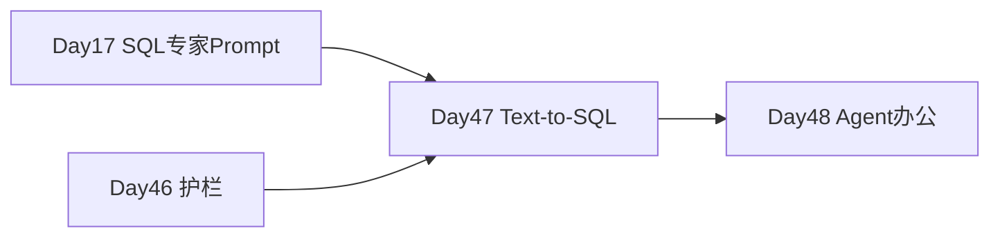

# Day 47 · Text-to-SQL Agent · SQLite 销售分析库

> **旁白（讲师口吻）**  
> 周二，财务 BP 在飞书扔来需求：*「能不能用自然语言查销售库？别让我写 SQL。」* 张工：*「Day 47 用 SQLite 教学库做 **Text-to-SQL Agent**——schema 进 Prompt、只读 SELECT、危险语句一律拒；mock LLM 先闭环，有 Key 再切 live。」*

---

## 今日学习地图

| 时段 | 主题 | 产出物 |
|------|------|--------|
| 09:00–10:30 | Text-to-SQL 架构与安全 | `04_课堂讲义.md` |
| 10:30–12:00 | 销售 schema 与种子数据 | `sales_schema.sql` + `seed_sales_data.py` |
| 14:00–16:30 | **主实战**：`text_to_sql_agent.py` | 自然语言 → SQL → 总结 |
| 16:30–17:00 | `verify_day47.py` 验收 | 全绿 |
| 19:00–21:00 | 作业：新增分析问题 | `06_课后作业.md` |

## 与前后课程的衔接



## 今日文件清单

| 文件 | 用途 |
|------|------|
| [01_业务背景.md](./01_业务背景.md) | 财务 BP 自然语言查数 |
| [02_需求文档.md](./02_需求文档.md) | Text-to-SQL PRD |
| [03_架构与设计.md](./03_架构与设计.md) | schema / 安全 / 执行流 |
| [04_课堂讲义.md](./04_课堂讲义.md) | **主课** |
| [05_流程图与示意图.md](./05_流程图与示意图.md) | NL→SQL 流程图 |
| [06_课后作业.md](./06_课后作业.md) | 扩展查询 |
| [07_作业参考答案.md](./07_作业参考答案.md) | 参考答案 |
| [08_补充讲义_SQL安全与排错.md](./08_补充讲义_SQL安全与排错.md) | 注入防护 |
| [code/sales_schema.sql](./code/sales_schema.sql) | **销售库 DDL** |
| [code/seed_sales_data.py](./code/seed_sales_data.py) | **种子数据** |
| [code/text_to_sql_agent.py](./code/text_to_sql_agent.py) | **主程序** |
| [code/verify_day47.py](./code/verify_day47.py) | 验收 |
| [run.sh](./run.sh) | 一键初始化并启动 |

## 今日验收标准

- [ ] `seed_sales_data.py` 生成 `data/sales.db`  
- [ ] 仅 `SELECT` 可通过 `validate_sql`  
- [ ] 「总销售额」「各品类收入」「各城市订单数」查询正确  
- [ ] `python3 verify_day47.py` 全部 `[OK]`  

## 快速开始

```bash
cd day47
bash run.sh
```

---

**状态**：✅ Day 47 Text-to-SQL Agent 完整课件已发布
