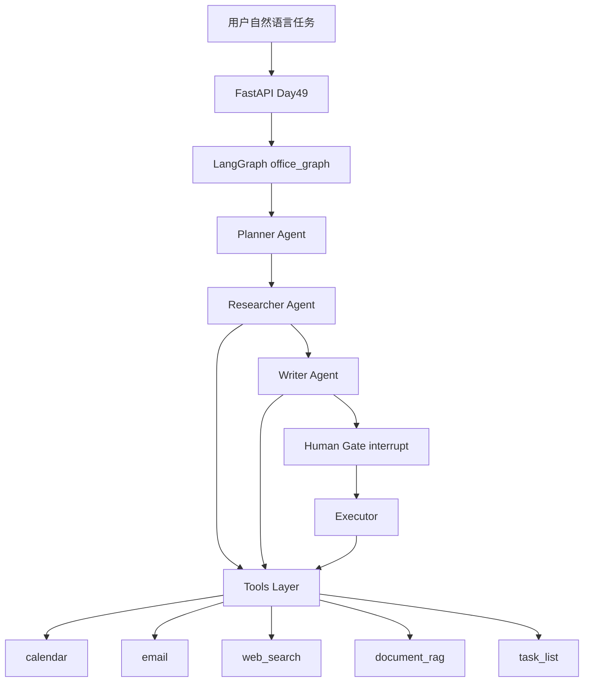

# Day 48 架构与设计 · 多 Agent 办公助手

## 1. 总体架构



## 2. Agent 职责矩阵

| Agent | 输入 | 输出 | 可用工具 |
|-------|------|------|----------|
| Planner | `user_request` | `plan[]` | 无（纯规划） |
| Researcher | `user_request`, `plan` | `research_summary` | rag, web_search |
| Writer | `user_request`, `summary` | `draft_id`, `email_preview` | email_draft |
| Executor | 审批后 state | `result` | email_send, calendar_schedule |

**设计原则**：一 Agent 一职责；工具调用集中在 Researcher / Executor，避免 Writer 直接 `email_send`。

## 3. 工具注册表

```python
TOOL_REGISTRY = {
    "calendar_list": calendar_list,
    "calendar_schedule": calendar_schedule,
    "email_draft": email_draft,
    "email_send": email_send,
    "web_search": web_search,
    "document_rag_search": document_rag_search,
    "task_list_add": task_list_add,
    "task_list_list": task_list_list,
}
```

### 3.1 工具返回契约

每个工具返回：

```json
{
  "tool": "tool_name",
  "status": "optional",
  "...": "payload"
}
```

便于 `steps[].details` 审计与答辩演示。

## 4. 状态模型（预习）

`graph/state.py` 中 `OfficeState` 关键字段：

| 字段 | 说明 |
|------|------|
| `thread_id` | LangGraph configurable thread |
| `plan` | Planner 输出 |
| `steps` | 每节点摘要轨迹 |
| `pending_approval` | interrupt 时展示 |
| `approval_decision` | approve / reject |
| `result` | 最终执行结果 |

## 5. Mock 策略

| 组件 | Mock 行为 |
|------|-----------|
| LLM | `backend/mock_llm.py` 规则生成 plan / 邮件 |
| RAG | 关键词 overlap 打分 |
| Web | 固定三条资讯模板 |
| Email/Calendar | 内存 store |

环境变量：`SPARKTECH_MOCK=1`（默认开启）

## 6. 目录与依赖方向

```
agents/  →  tools/, backend/mock_llm
graph/   →  agents/, tools/
backend/ →  graph/, tools/
```

**禁止**：`tools/` import `agents/`（保持工具纯净可单测）

## 7. 与 Day 4 任务列表的衔接

`tools/task_list.py` 字段与 Day 4 `todos` CRUD 同构：`id`, `title`, `status`, `priority`。  
答辩时可强调：**办公助手的「工作记忆」就是结构化任务列表的升级版**。

---

*Day 48 架构文档 v1.0*
