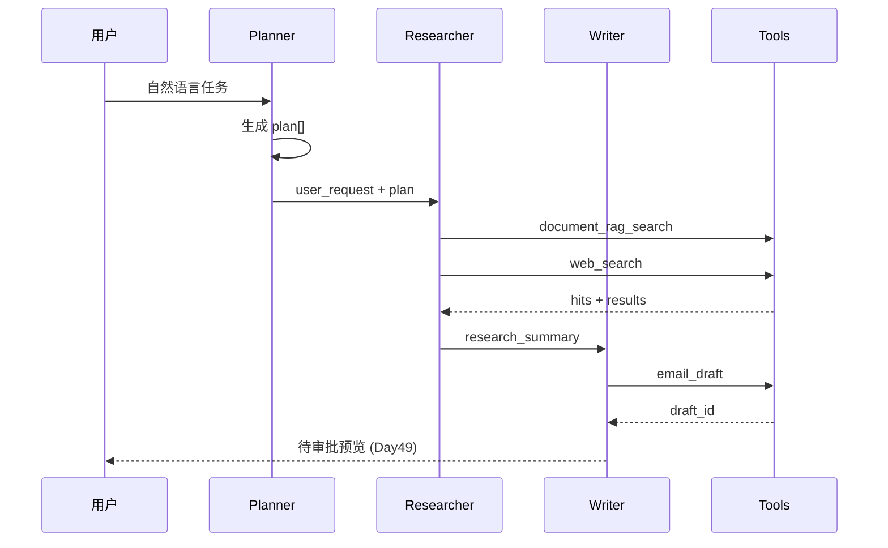
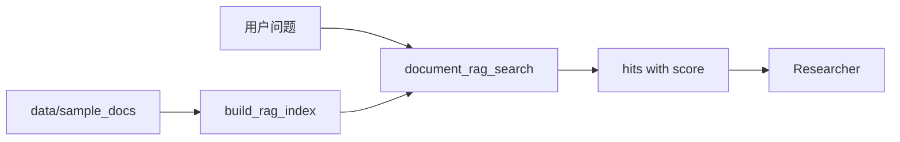
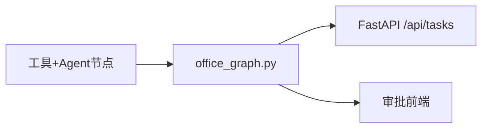

# Day 48 流程图与示意图

## 1. Agent 协作总览



## 2. 工具调用分层

```
┌─────────────────────────────────────┐
│           Agent Layer               │
│  planner │ researcher │ writer       │
└──────────────┬──────────────────────┘
               │
┌──────────────▼──────────────────────┐
│           Tool Layer                │
│ calendar │ email │ search │ rag     │
│ task_list                           │
└─────────────────────────────────────┘
```

## 3. 敏感动作分类

| 类型 | 工具 | Day 48 | Day 49 |
|------|------|--------|--------|
| 只读 | list, rag, search | ✅ | ✅ |
| 草稿 | email_draft | ✅ | ✅ |
| 写/外发 | email_send, schedule | 实现 | + interrupt |

## 4. 数据流（RAG）



## 5. Day 48 → Day 49 衔接



---

*Day 48 流程图 · 可贴 PPT*
