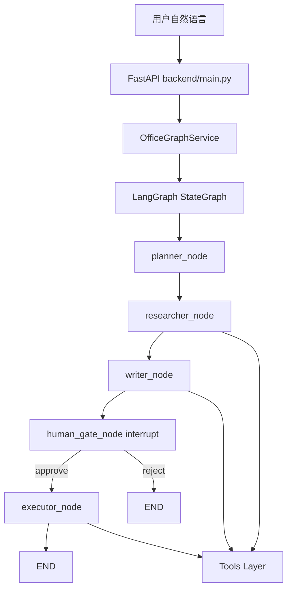
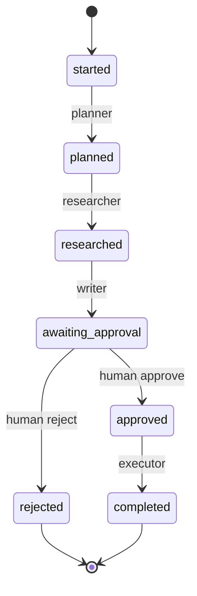

# Day 48 课堂讲义（扩展版）· Project3 架构深度导读

> 本文件与 `04_课堂讲义.md`、`03_架构与设计.md` 合并阅读。  
> **源码唯一树**：`day48/code/project3/` — Day 49–50 **禁止复制第二份 backend**。

---

## 第 0 节 · 项目定位与启动（20 min）

### 0.1 三阶段项目对照

| 项目 | 天 | 形态 | 核心技术 |
|------|-----|------|----------|
| Project1 | Day14 | CLI | 多轮对话 |
| Project2 | Day36–38 | Web RAG | Hybrid + citations |
| **Project3** | **Day48–50** | **多 Agent + 审批** | **LangGraph + 8 tools** |

星火智服 **智能办公助手**：查政策、起草邮件、预约会议 —— **外发前人工门控**。

### 0.2 目录树

```text
day48/code/project3/
├── agents/          planner, researcher, writer
├── tools/           8 个办公工具
├── graph/           office_graph.py, state.py
├── backend/         FastAPI（Day49 联调重点）
├── frontend/        任务时间线 + 审批 UI（Day49）
├── data/sample_docs/
├── verify_project3.py
└── run.sh
```

### 0.3 环境

```bash
cd day48/code/project3
export PYTHONPATH=$PWD
export SPARKTECH_MOCK=1
pip install -r requirements.txt
python3 verify_project3.py
```

---

## 第 1 节 · 总体架构（45 min）



### 1.1 设计原则（张工白板）

1. **一 Agent 一职责** — Planner 只规划，Writer 不 `email_send`  
2. **读写分离** — `calendar_list` vs `calendar_schedule`  
3. **敏感写操作** — 必须经 `human_gate` + `executor`  
4. **工具返回契约** — 含 `tool` 字段，便于 `steps[].details` 审计  

---

## 第 2 节 · OfficeState 状态机（50 min）

打开 `graph/state.py`：

| 字段 | 写入节点 | 用途 |
|------|----------|------|
| `thread_id` | start_task | Checkpointer 隔离 |
| `user_request` | 初始 | 全链路上下文 |
| `plan` | planner | 三步计划展示 |
| `research_summary` | researcher | Writer 输入 |
| `draft_id` | writer | executor 发信 |
| `email_preview` | writer | 审批预览 |
| `calendar_preview` | writer | 可选会议 |
| `pending_approval` | writer | interrupt 载荷 |
| `approval_decision` | human_gate | approve/reject |
| `steps` | 各节点 | 时间线 UI |
| `status` | 各节点 | API 状态机 |
| `result` | executor / reject | 最终结果 |



---

## 第 3 节 · 图编排 office_graph.py（60 min）

### 3.1 节点函数模式

每个 `*_node` 返回 **局部 state 更新 dict**，LangGraph 自动 merge：

```python
def planner_node(state: OfficeState) -> dict[str, Any]:
    agent = PlannerAgent()
    out = agent.run(state["user_request"])
    step = {"agent": agent.name, "summary": out["summary"], "details": out["details"]}
    return {
        "plan": out["plan"],
        "steps": _append_step(state, step),
        "status": "planned",
    }
```

### 3.2 human_gate_node 与 interrupt

```python
decision = interrupt({
    "type": "human_approval",
    "thread_id": state.get("thread_id"),
    "action": payload.get("action"),
    "preview": payload.get("preview"),
    "reason": payload.get("reason"),
})
```

**关键**：`compile(checkpointer=MemorySaver())` — 无 checkpointer 则 interrupt 无法跨请求 resume。

### 3.3 条件边 route_after_gate

```python
def route_after_gate(state) -> Literal["executor", "end"]:
    if state.get("approval_decision") == "approve":
        return "executor"
    return "end"
```

reject 路径直接 `END`，`result.message` = 「用户拒绝发送」。

### 3.4 OfficeGraphService 三 API

| 方法 | 调用场景 |
|------|----------|
| `start_task` | POST /api/tasks |
| `resume_task` | POST .../resume + `Command(resume=)` |
| `get_state` | GET /api/tasks/{id} |

---

## 第 4 节 · Agent 层精读（55 min）

### 4.1 PlannerAgent (`agents/planner.py`)

```python
plan = mock_plan(user_request)  # 关键词 → 3 步
```

生产可换 LLM + JSON schema 输出 `plan[]`。

### 4.2 ResearcherAgent (`agents/researcher.py`)

```python
rag = document_rag_search(user_request, top_k=3)
web = web_search(user_request, top_k=2)
summary = mock_research_summary(...)
```

**课堂提问**：为何 Researcher 同时调 RAG 与 web？  
**答**：内部政策用 `sample_docs`；外部动态信息用搜索 mock（接口与 Serper 一致）。

### 4.3 WriterAgent (`agents/writer.py`)

```python
drafted = email_draft(to, subject, body, cc)
# 不调用 email_send — 留给 executor
```

`needs_meeting` 检测「会议」「日程」「预约」→ 生成 `calendar_preview`。

---

## 第 5 节 · 工具层 TOOL_REGISTRY（50 min）

`tools/__init__.py` 注册 8 个工具：

| 工具 | 读/写 | 调用者 |
|------|-------|--------|
| calendar_list | 读 | Researcher（可扩展） |
| calendar_schedule | 写 | Executor（审批后） |
| email_draft | 写草稿 | Writer |
| email_send | 写 | Executor |
| document_rag_search | 读 | Researcher |
| web_search | 读 | Researcher |
| task_list_add / list | 读写 | 扩展作业 |

### 5.1 document_rag

```bash
ls data/sample_docs/
# refund_policy.md  office_handbook.md
```

`lifespan` 启动时 `build_rag_index()` — 见 `backend/main.py`。

### 5.2 email 两阶段

```python
draft = email_draft(...)       # writer
send = email_send(draft_id)    # executor only
```

答辩必讲：**为何不能 Writer 直接 send？** — 绕过人工审批合规风险。

---

## 第 6 节 · Mock 策略与验收（40 min）

| 组件 | Mock |
|------|------|
| LLM | `backend/mock_llm.py` |
| web_search | 固定模板结果 |
| email/calendar | 内存 store |

```bash
python3 verify_project3.py
```

Day 48 预期：工具 + Agent 段全绿；图 interrupt 段 Day 49 详解。

### 6.1 踩坑表

| 现象 | 处理 |
|------|------|
| ModuleNotFoundError: tools | `export PYTHONPATH=$PWD` |
| RAG 无命中 | 确认 lifespan `build_rag_index` |
| 循环 import | tools 勿 import agents |

---

## 第 7 节 · Day 49 预习

- FastAPI 路由与 `schemas.py`  
- `frontend/app.js` 审批按钮  
- curl 创建任务 + resume  

**禁止** 在 `day49/` 下复制 project3。

---

## 课堂 CHECKLIST

- [ ] 能默画五节点 LangGraph  
- [ ] 能列举 8 个工具及读写属性  
- [ ] 能解释 interrupt 与 checkpointer 关系  
- [ ] verify 工具段全绿  

---

## 第 8 节 · backend/main.py 与 schemas 对照（40 min）

### 8.1 lifespan 启动链

```python
ensure_dirs()       # 数据目录
build_rag_index()   # 扫描 sample_docs
```

若跳过 lifespan，Researcher RAG hits 为空 —— Demo 前必须 curl health。

### 8.2 Pydantic 校验边界

`TaskCreateRequest.request`：2–4000 字，对应前端 `#requestInput` 应加 `maxlength`。

`ApprovalPayload.decision` 枚举严格 —— 传 `approved` 字符串会导致 422。

---

## 第 9 节 · tools 单文件走读清单

| 文件 | 课堂重点 |
|------|----------|
| `calendar.py` | list 只读 vs schedule 写 |
| `email_tool.py` | draft_id 生命周期 |
| `document_rag.py` | build + search 分离 |
| `web_search.py` | mock 模板与 live 替换点 |
| `task_list.py` | 衔接 Day4 任务 API 概念 |

```bash
python3 -c "from tools import TOOL_REGISTRY; print(len(TOOL_REGISTRY))"
# 期望 8
```

---

## 第 10 节 · mock_llm 关键词计划（20 min）

`mock_plan(user_request)` 根据关键词生成三步计划，例如含「退款」：

```text
1. 检索退款政策文档
2. 汇总要点
3. 起草客户邮件并提交审批
```

生产替换为 LLM JSON schema 输出，图结构 **不变**。

---

## 第 11 节 · 与 Project2 RAG 差异

| 项 | Project2 | Project3 |
|----|----------|----------|
| 向量库 | Chroma | 教学简化索引 |
| 引用 UI | citations 徽章 | steps.details.rag |
| 重建 | POST /api/kb/rebuild | lifespan 自动 |
| 用户上传 | 支持 | 固定 sample_docs |

答辩：P3 聚焦 Agent 编排，RAG 有意简化。

---

## 第 12 节 · Day 48 答辩彩排问题

1. 为何 Writer 不直接发邮件？  
2. 8 个工具几个是写操作？  
3. interrupt 没有 checkpointer 会怎样？  
4. researcher 为何同时 rag + web？  

参考答案见上文各节。

---

## 第 13 节 · office_graph 节点入参出参速查

| 节点 | 读 state 字段 | 写回字段 | 下一跳 |
|------|---------------|----------|--------|
| planner | `user_task` | `plan`, `messages` | researcher |
| researcher | `plan` | `research_summary`, `steps` | writer |
| writer | `research_summary` | `draft_email`, `draft_event` | approval_gate |
| approval_gate | `draft_*` | `approval_status` | executor / END |
| executor | `draft_*`, `approval_status` | `result`, `steps` | END |

**记忆口诀**：Plan → Research → Write → **人** → Execute。

---

## 第 14 节 · 8 工具权限矩阵

| 工具 | 读 | 写 | 需审批后执行 |
|------|----|----|--------------|
| search_web | ✓ | — | — |
| document_rag | ✓ | — | — |
| list_calendar | ✓ | — | — |
| create_calendar_event | — | ✓ | ✓ |
| list_emails | ✓ | — | — |
| send_email | — | ✓ | ✓ |
| list_tasks | ✓ | — | — |
| create_task | — | ✓ | 可选 |

答辩必背：**写操作不进 Executor，除非 approval=approved**。

---

*扩展主课 · Day 48*
