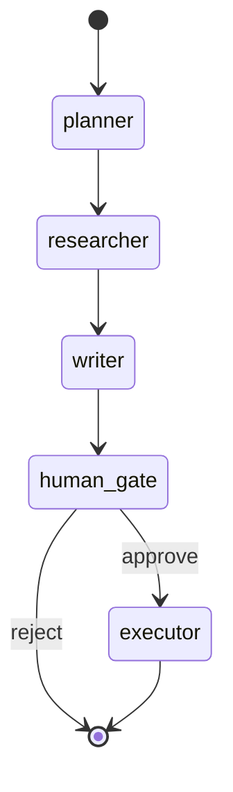
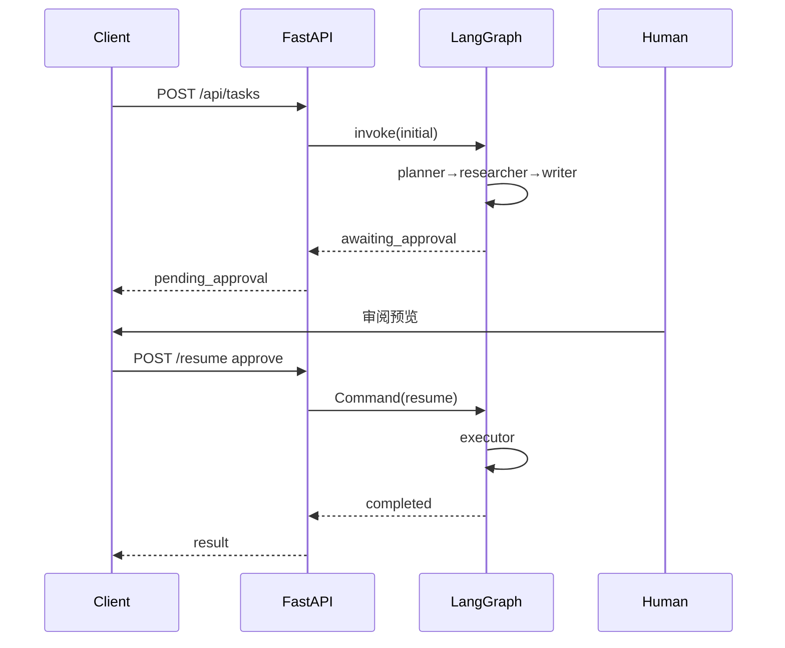

# Day 49 流程图与示意图

## 1. LangGraph 状态机



## 2. interrupt / resume 时序



## 3. API 路由图

```
/api/health
/api/tasks          POST 创建
/api/tasks/{id}     GET  状态
/api/tasks/{id}/resume  POST 审批
/api/tasks/{id}/interrupt GET 调试
```

## 4. 前后端部署

```
run.sh
 ├── uvicorn :8010  backend
 └── http.server :8088  frontend
```

---

*Day 49 流程图*
