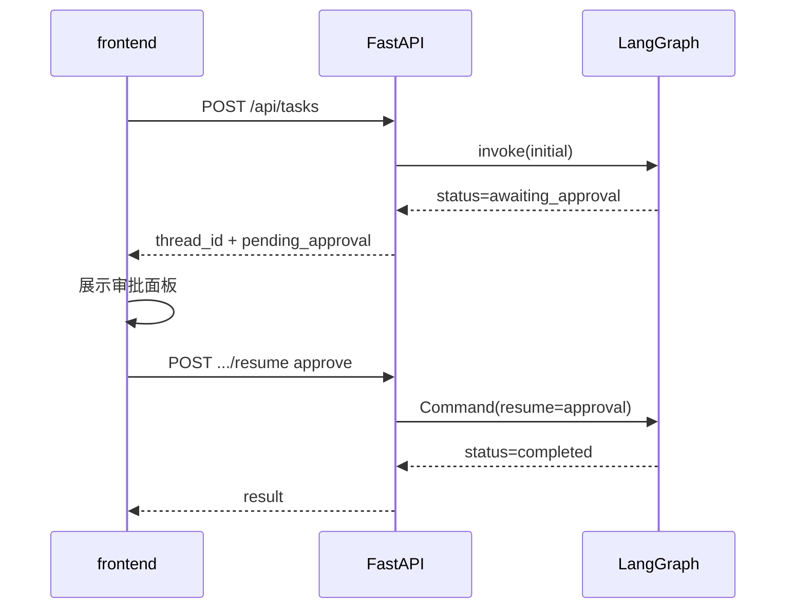

# Day 49 课堂讲义（扩展版）· 全栈联调与审批 UI 手把手

> 本文件与 `04_课堂讲义.md`、`08_补充讲义_LangGraph与审批门控.md` 合并阅读，构成 Day 49 完整主课。  
> **前提**：Day 48 架构与工具已验收；本日聚焦 **interrupt 联调 + FastAPI + frontend 审批 UI**。

---

## 第 0 节 · 今日与 Day 48 分工（15 min）

| 天 | 交付 |
|----|------|
| Day 48 | 架构、agents/、tools/、graph 骨架 |
| **Day 49** | **interrupt 联调**、FastAPI 路由、frontend 审批 UI |
| Day 50 | 答辩、Rubric、三项目复盘 |

**禁止** 在 `day49/` 下复制第二份 backend；只改 `day48/code/project3/`。

```bash
cd day48/code/project3
bash run.sh    # 8010 API + 8088 静态
```

---

## 第 1 节 · OfficeState 字段精读（40 min）

打开 `graph/state.py`，对照 API 响应 `TaskStateResponse`：

| 字段 | 前端展示位置 | 备注 |
|------|--------------|------|
| `task` / `user_request` | `#requestInput` 历史 | 创建时传入 |
| `plan` | `#planBox` | 编号列表 |
| `steps` | `#stepsBox` | agent + summary |
| `pending_approval` | `#approvalPanel` | status=awaiting_approval |
| `result` | `#resultBox` | JSON 格式化 |
| `status` | `#statusLine` | 驱动按钮显隐 |

学员练习：在 `renderState` 打断点，观察 approve 前后字段变化。

---

## 第 2 节 · human_gate_node 逐步（50 min）

```python
def human_gate_node(state: OfficeState) -> dict[str, Any]:
    payload = state.get("pending_approval") or {}
    decision = interrupt({...})
```

### 2.1 interrupt 返回形态

前端/API `resume` 传入：

```json
{"decision": "approve", "comment": "内容无误"}
```

对应 `schemas.ApprovalPayload`。

### 2.2 approve 路径

`approval_decision == "approve"` → `route_after_gate` → `executor_node` → `email_send` + 可选 `calendar_schedule`。

### 2.3 reject 路径

```python
return {
    "approval_decision": "reject",
    "status": "rejected",
    "result": {"message": "用户拒绝发送，流程已终止"},
}
```

图走向 `END`，**不会** 进入 executor。

### 2.4 Command(resume=) 机制

```python
def resume_task(self, thread_id: str, approval: dict) -> dict:
    result = self._graph.invoke(Command(resume=approval), self._config(thread_id))
```

**与 input() 区别**：interrupt 可跨 HTTP 请求、多用户审批队列。



---

## 第 3 节 · FastAPI 路由实战（55 min）

### 3.1 路由表（对照 `backend/main.py`）

| 方法 | 路径 | 说明 |
|------|------|------|
| GET | `/api/health` | mode + agents + tools 列表 |
| POST | `/api/tasks` | 创建任务 |
| GET | `/api/tasks/{thread_id}` | 全状态 |
| POST | `/api/tasks/{thread_id}/resume` | 人工审批 |
| GET | `/api/tasks/{thread_id}/interrupt` | 调试 pending |

### 3.2 POST /api/tasks

请求体 `TaskCreateRequest`：

```json
{"request": "帮我查退款政策并起草给客户的邮件"}
```

响应 `TaskCreateResponse` 含 `thread_id`、`status`（常为 `awaiting_approval`）。

### 3.3 POST /api/tasks/{thread_id}/resume

```json
{"approval": {"decision": "approve", "comment": ""}}
```

409 冲突：任务已 `completed` / `rejected`。

### 3.4 lifespan 与 CORS

```python
@asynccontextmanager
async def lifespan(_app: FastAPI):
    ensure_dirs()
    build_rag_index()
    yield
```

CORS 默认允许 `8088` — 改端口时同步 `CORS_ORIGINS` 环境变量。

---

## 第 4 节 · 前端 app.js 审批流（60 min）

### 4.1 API_BASE 动态端口

```javascript
const port = new URLSearchParams(window.location.search).get("api_port") || "8010";
return `http://${host}:${port}`;
```

### 4.2 创建任务

```javascript
const created = await api("/api/tasks", {
  method: "POST",
  body: JSON.stringify({ request }),
});
currentThreadId = created.thread_id;
const full = await api(`/api/tasks/${currentThreadId}`);
renderState(full);
```

### 4.3 awaiting_approval UI

```javascript
if (state.pending_approval && state.status === "awaiting_approval") {
  els.approvalPanel.hidden = false;
  els.approvalPreview.textContent = JSON.stringify(state.pending_approval.preview, null, 2);
}
```

### 4.4 resume 按钮

```javascript
await api(`/api/tasks/${currentThreadId}/resume`, {
  method: "POST",
  body: JSON.stringify({
    approval: { decision: "approve", comment: els.approvalComment.value },
  }),
});
```

上机：先 approve 跑通，再新建任务走 reject，对比 `result`。

---

## 第 5 节 · 5 分钟 Demo 脚本（项目三）

1. 打开 `http://127.0.0.1:8088`  
2. 输入：「根据退款政策起草客户邮件」  
3. 展示 steps：plan → research → draft  
4. 出现审批门 → 展开 email preview  
5. 点击批准 → result 显示邮件已发送（mock）  
6. 再建任务 → 拒绝 → 说明 reject 终止路径  

**星火智服话术**：「外发动作必须人工确认，符合企业合规。」

---

## 第 6 节 · 排错 15 则

| # | 现象 | 处理 |
|---|------|------|
| 1 | 8010 占用 | `BACKEND_PORT` 或 kill |
| 2 | CORS 红字 | `allow_origins` 含 8088 |
| 3 | interrupt 不暂停 | checkpointer + MemorySaver |
| 4 | resume 404 | thread_id 错误或已过期 |
| 5 | steps 空 | mock_llm 未跑完图 |
| 6 | 工具 8 个少 | `tools/__init__.py` registry |
| 7 | RAG 无结果 | sample_docs + build_rag_index |
| 8 | 前端白屏 | 控制台 JS 错 |
| 9 | verify 失败 | `PYTHONPATH=$PWD` |
| 10 | 双开 run.sh | kill 旧 uvicorn |
| 11 | 409 on resume | 任务已结束，新建 thread |
| 12 | preview 空 | writer 未生成 email_preview |
| 13 | health mode 错 | `SPARKTECH_MOCK=1` |
| 14 | 审批后仍 pending | 未 GET 刷新 state |
| 15 | executor 未发信 | approval 非 approve |

---

## 第 7 节 · curl 验收清单

```bash
export API=http://127.0.0.1:8010

# 健康
curl -s $API/api/health | jq .

# 创建
THREAD=$(curl -s -X POST $API/api/tasks \
  -H 'Content-Type: application/json' \
  -d '{"request":"根据退款政策起草客户邮件"}' | jq -r .thread_id)
echo $THREAD

# 查询
curl -s $API/api/tasks/$THREAD | jq .

# 批准
curl -s -X POST $API/api/tasks/$THREAD/resume \
  -H 'Content-Type: application/json' \
  -d '{"approval":{"decision":"approve"}}' | jq .

# 全量验收
python3 verify_project3.py
```

---

## 课堂 CHECKLIST（扩展）

- [ ] 能手绘 interrupt 时序图  
- [ ] 能口述 approve vs reject 图路径  
- [ ] Demo 脚本练 3 遍 < 5 分钟  
- [ ] verify_project3 全绿截图  

---

## 第 8 节 · frontend 完整交互路径（45 min）

### 8.1 bootstrap 与 health

```javascript
const health = await api("/api/health");
els.modeBadge.textContent = health.mode;
```

页面加载即检测后端；失败时 `#statusLine` 提示「后端未启动」。

### 8.2 reject 路径代码

```javascript
body: JSON.stringify({
  approval: { decision: "reject", comment: els.approvalComment.value },
}),
```

完成后 `status=rejected`，`approvalPanel` 隐藏。

### 8.3 样式与品牌

`style.css` 中审批面板使用醒目边框 —— 作业可改为公司 VI 色，截图提交。

---

## 第 9 节 · verify_project3 分段解读

| 段 | 内容 | Day |
|----|------|-----|
| tools | 8 工具可调用 | 48 |
| agents | 三 Agent 输出形状 | 48 |
| graph | compile + interrupt | 49 |
| api | FastAPI 冒烟 | 49 |

全绿是 Day 50 答辩入场券。

---

## 第 10 节 · 生产化差距清单

| 能力 | 教学实现 | 生产目标 |
|------|----------|----------|
| checkpointer | MemorySaver | Redis |
| 鉴权 | 无 | JWT + RBAC |
| 通知 | 轮询 GET | WebSocket |
| 邮件 | mock store | SMTP / Graph API |
| 审计 | steps JSON | 不可篡改日志 |

答辩主动讲「技术债」显成熟。

---

## 第 11 节 · 双任务并发 Demo

1. 浏览器 A 创建任务 T1，停在审批  
2. 浏览器 B（或 curl）创建 T2  
3. 分别 resume，验证 thread_id 不串  

证明 Checkpointer 隔离性。

---

## 第 12 节 · FastAPI 路由与前端事件对照

| 前端动作 | HTTP | 后端处理 | state 变化 |
|----------|------|----------|------------|
| 提交任务 | POST `/api/tasks` | `create_task` → graph.invoke | 新建 thread_id |
| 轮询状态 | GET `/api/tasks/{id}` | 读 checkpointer snapshot | 展示 steps |
| 点击批准 | POST `/api/tasks/{id}/resume` | `Command(resume=approved)` | executor 节点 |
| 点击拒绝 | 同上 `rejected` | 跳过写操作 | END + 原因 |

**DevTools 练习**：Network 里截一张「create → poll → resume」三张请求的瀑布图，写入作业。

---

## 第 13 节 · 常见联调故障树

```text
页面空白
├── 8088 未启动 → bash run.sh
├── 静态 404 → 检查 frontend 路径
└── JS 报错 → Console 看 CORS

任务一直 pending
├── MOCK 未开 → export SPARKTECH_MOCK=1
├── 8010 未监听 → lsof -i :8010
└── graph 异常 → 看 API 日志 stack

审批按钮无反应
├── thread_id 错误 → 对比 POST 响应
├── 未 interrupt → 检查 approval_gate 节点
└── resume body 格式 → 见 10_API契约
```

---

## 第 14 节 · Day 49 晚自习 checklist（45 min）

- [ ] `verify_project3.py` 全绿  
- [ ] 浏览器完成一次「调研+写邮件+审批发送」  
- [ ] curl 创建第二任务，验证 thread 隔离  
- [ ] 阅读 `office_graph.py` 画出 5 节点图  
- [ ] 在 `steps` JSON 里找到 `rag` 与 `web` 两条 observation  

---

*扩展主课 · Day 49*
