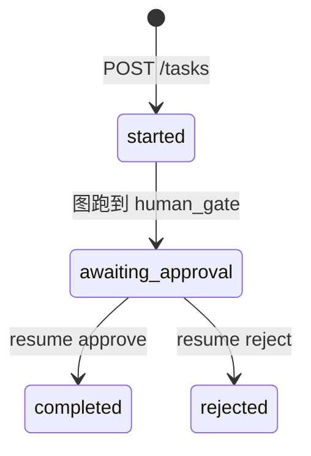

# Day 49 附录 B · Project3 API 契约与测试用例（完整版）

> 与 `09_附录_全栈联调手把手.md` 合并阅读。契约源码：`backend/schemas.py`、`backend/main.py`。

---

## 一、API 契约总表

| 方法 | 路径 | 请求体 | 响应模型 | HTTP 错误 |
|------|------|--------|----------|-----------|
| GET | `/api/health` | — | `HealthResponse` | — |
| POST | `/api/tasks` | `TaskCreateRequest` | `TaskCreateResponse` | 422 校验失败 |
| GET | `/api/tasks/{thread_id}` | — | `TaskStateResponse` | 404 |
| POST | `/api/tasks/{thread_id}/resume` | `TaskResumeRequest` | `TaskStateResponse` | 404/409 |
| GET | `/api/tasks/{thread_id}/interrupt` | — | interrupt info | 404 |

### 1.1 HealthResponse

```json
{
  "status": "ok",
  "mode": "mock",
  "agents": ["planner", "researcher", "writer", "executor"],
  "tools": ["calendar_list", "calendar_schedule", "..."]
}
```

答辩：现场打开 `/api/health`，背诵 tools 数量 **8**。

### 1.2 TaskCreateRequest 约束

- `request`：`min_length=2`, `max_length=4000`  
- `thread_id`：可选，最长 64（高级：指定会话）  

### 1.3 ApprovalPayload

```json
{
  "decision": "approve",
  "comment": "可选，最长 500 字"
}
```

`decision` 枚举：**仅** `approve` | `reject`。

### 1.4 TaskStateResponse 核心字段

| 字段 | 类型 | 说明 |
|------|------|------|
| thread_id | string | UUID |
| status | string | started → … → completed/rejected |
| plan | string[] | Planner 输出 |
| steps | AgentStep[] | 时间线 |
| pending_approval | object? | interrupt 时非空 |
| result | object? | 终态 payload |
| mode | mock/live | 与 health 一致 |

---

## 二、状态机与测试期望



| status | pending_approval | 可 resume? |
|--------|------------------|------------|
| awaiting_approval | 非空 | 是 |
| completed | 空 | 否（409） |
| rejected | 空 | 否（409） |

---

## 三、测试用例 T1–T16

| ID | 操作 | 输入/条件 | 期望 |
|----|------|-----------|------|
| T1 | POST /tasks | request 含「退款」 | steps 含 researcher；details 含 rag hits |
| T2 | POST /tasks | request 含「会议」 | calendar_preview 非空 |
| T3 | 完整流程 | approve | status=completed；result.email 存在 |
| T4 | 完整流程 | reject | status=rejected |
| T5 | POST /tasks | request="" | 422 |
| T6 | resume | 错误 thread_id | 404 |
| T7 | resume | 已完成任务再 approve | 409 |
| T8 | GET /health | SPARKTECH_MOCK=1 | mode=mock，无 Key 可跑 |
| T9 | verify | `verify_project3.py` | ALL PASSED |
| T10 | GET /tasks | 合法 thread | plan 长度 ≥1 |
| T11 | interrupt | awaiting 时 GET | next_nodes 含 human_gate |
| T12 | 前端 | 8088 提交 | approvalPanel 显示 |
| T13 | CORS | 浏览器跨域 | 无红字 |
| T14 | RAG | refund_policy 问题 | hits 非空 |
| T15 | executor | approve 后 | email_send status |
| T16 | 并发 | 两个 thread | thread_id 隔离 |

### 3.1 T1 断言示例（pytest 风格伪代码）

```python
state = client.post("/api/tasks", json={"request": "查退款政策"}).json()
full = client.get(f"/api/tasks/{state['thread_id']}").json()
assert any(s["agent"] == "researcher" for s in full["steps"])
```

---

## 四、错误响应契约

| status | detail 示例 | 前端处理 |
|--------|-------------|----------|
| 404 | thread not found | 提示会话过期 |
| 409 | task already completed | 禁用按钮，引导新建 |
| 422 | validation error | 高亮输入框 |
| 500 | 未捕获异常 | toast + 查后端日志 |

`frontend/app.js` 中 `api()` 已 `throw new Error(status + text)` — 作业可改为用户友好文案。

---

## 五、与 Project2 API 对比

| 维度 | Project2 Day36 | Project3 Day49 |
|------|----------------|----------------|
| 主接口 | POST /api/chat/stream | POST /api/tasks |
| 会话键 | session_id | thread_id |
| 流式 | SSE delta | 轮询 / 单次 GET |
| 人机 | 无 | resume 审批 |
| 状态 | messages 表 | LangGraph state |

---

## 六、Postman / curl 集合（可复制）

```bash
# 文件：day49_smoke.sh
set -e
API=${API:-http://127.0.0.1:8010}
curl -sf $API/api/health | jq -e '.tools | length == 8'
T=$(curl -sf -X POST $API/api/tasks -H 'Content-Type: application/json' \
  -d '{"request":"起草退款说明邮件"}' | jq -r .thread_id)
curl -sf $API/api/tasks/$T | jq -e '.status == "awaiting_approval"'
curl -sf -X POST $API/api/tasks/$T/resume -H 'Content-Type: application/json' \
  -d '{"approval":{"decision":"approve"}}' | jq -e '.status == "completed"'
echo "SMOKE OK"
```

---

## 七、答辩评委可能追问

1. **为何不用 WebSocket 推审批？** — 教学简化；生产可用 SSE 或 WS。  
2. **thread_id 存哪？** — MemorySaver 内存；生产换 Redis/Postgres checkpointer。  
3. **审批权限谁校验？** — 当前无鉴权；生产加 JWT + RBAC。  
4. **重复 approve？** — 409，幂等由状态机保证。  

---

## 八、AgentStep.details 字段约定

建议答辩展示 `steps[1].details` 结构：

```json
{
  "rag": {"hits": [...], "query": "..."},
  "web": {"results": [...]}
}
```

便于评委理解 Researcher 双源依据。

---

## 九、pytest 集成示例（作业扩展）

```python
def test_task_happy_path(client):
    r = client.post("/api/tasks", json={"request": "起草邮件"})
    tid = r.json()["thread_id"]
    assert client.get(f"/api/tasks/{tid}").json()["status"] == "awaiting_approval"
    done = client.post(f"/api/tasks/{tid}/resume", json={"approval": {"decision": "approve"}})
    assert done.json()["status"] == "completed"
```

与 `verify_project3.py` 互补。

---

## 十、前端 E2E 检查表

- [ ] health mode 显示 mock/live  
- [ ] plan 编号与后端一致  
- [ ] 审批预览含 email subject  
- [ ] approve 后 result 含 email  
- [ ] reject 后无 executor step  
- [ ] 空 request 不提交  

---

## 十一、与 Day 37 全栈联调对照

| 技巧 | Day37 P2 | Day49 P3 |
|------|----------|----------|
| API_BASE 端口 | 8000 | 8010 |
| 会话键 | session_id | thread_id |
| 关键 UI | citations 徽章 | approvalPanel |
| 流式 | SSE | 非流式 |

学员已具备迁移能力。

---

## 十二、评委压测问题

1. 两个用户同时审批同一 thread？— 应串行化或乐观锁。  
2. resume  body 缺 decision？— 422。  
3. 邮件正文谁负责合规？— OutputGuard + 人工门控双重。  

---

## 十三、Postman/curl 最小回归包

保存为 `day49/code/smoke_api.sh`（作业可选）：

```bash
#!/bin/bash
set -e
BASE=http://127.0.0.1:8010
T=$(curl -s -X POST "$BASE/api/tasks" -H 'Content-Type: application/json' \
  -d '{"task":"调研竞品并草拟跟进邮件"}' | python3 -c "import sys,json; print(json.load(sys.stdin)['thread_id'])")
curl -s "$BASE/api/tasks/$T" | python3 -m json.tool | head -20
curl -s -X POST "$BASE/api/tasks/$T/resume" -H 'Content-Type: application/json' \
  -d '{"decision":"approved"}' | python3 -m json.tool | head -10
echo "thread_id=$T OK"
```

答辩演示可不用 UI，纯 curl 证明 API 契约稳定。

---

## 十四、SSE vs 轮询选型备忘

Project2 用 SSE 因「token 流式 + citations 增量」；Project3 状态跳跃大（interrupt），轮询更简单。生产可升级为 WebSocket 推送 `step_added` 事件——图结构无需改动。

---

*附录 B · Day 49*
