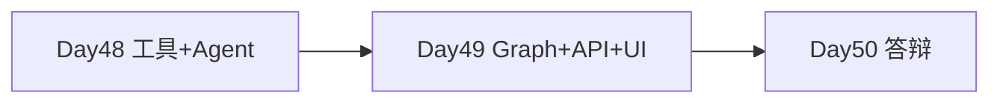

# Day 49 · STAGE PROJECT 3（中）· LangGraph 编排与全栈联调

> **旁白（讲师口吻）**  
> 周二下午，测试同学打断联调：*「邮件草稿有了，但 **没点确认就发出去** 合规过不了。」*  
> 张工在 `office_graph.py` 写下 `interrupt()`：**今天把状态机、审批 API、前端按钮串起来，并验证断点恢复。**

---

## 今日学习地图

| 时段 | 主题 | 产出物 |
|------|------|--------|
| 09:00–10:00 | LangGraph 状态机与 checkpointer | `graph/office_graph.py` |
| 10:00–12:00 | Human-in-the-loop interrupt/resume | `human_gate_node` |
| 14:00–15:30 | FastAPI 任务 API | `backend/main.py` |
| 15:30–17:00 | 前端审批 UI 联调 | `frontend/*` |
| 17:00–17:30 | `verify_project3.py` 全绿 | 截图 |
| 19:00–21:00 | 彩排 Demo 脚本 | `06_课后作业.md` |

## 里程碑定位



**Day 49 是 Project 3 第二天**：LangGraph 全链路、人工审批、后端 API、简易前端。

## 项目代码（与 Day 48 同仓）

```
day48/code/project3/   ← 唯一代码主线
day49/                 ← 课件 + verify 委托
```

## 今日文件清单

| 文件 | 用途 |
|------|------|
| [01_业务背景.md](./01_业务背景.md) | 审批合规背景 |
| [02_需求文档.md](./02_需求文档.md) | API 与 interrupt PRD |
| [03_架构与设计.md](./03_架构与设计.md) | Graph + API 设计 |
| [04_课堂讲义.md](./04_课堂讲义.md) | **主课** LangGraph 联调 |
| [05_流程图与示意图.md](./05_流程图与示意图.md) | interrupt 时序 |
| [06_课后作业.md](./06_课后作业.md) | Demo 彩排作业 |
| [07_作业参考答案.md](./07_作业参考答案.md) | 参考答案 |
| [08_补充讲义_LangGraph与审批门控.md](./08_补充讲义_LangGraph与审批门控.md) | interrupt 速查 |

## 今日验收标准

- [ ] `office_graph`：planner→researcher→writer→human_gate→executor  
- [ ] `interrupt` 后 `status=awaiting_approval`  
- [ ] `POST /api/tasks/{id}/resume` approve 后 `completed`  
- [ ] reject 后 `rejected`，不调用 `email_send`  
- [ ] 前端可提交任务、展示 steps、点批准/拒绝  
- [ ] `python3 verify_project3.py` **全部** `[OK]`  
- [ ] `bash run.sh` 一键启动  
- [ ] Git commit 含 `day49`

## 快速开始

```bash
cd day48/code/project3
bash run.sh
# 另开终端
python3 ../../verify_project3.py   # 或 day49/verify_project3.py
```

---

**状态**：✅ Day 49 Project 3（中）完整课件已发布
