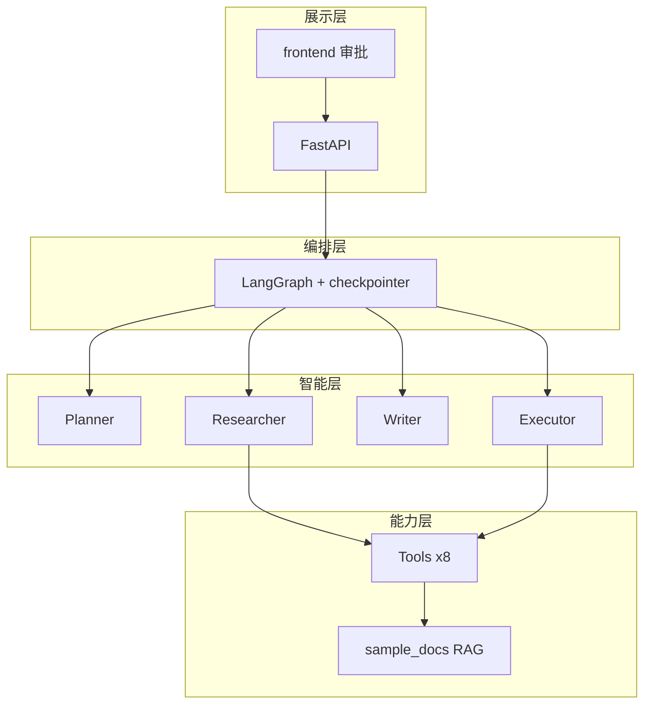

# Day 50 架构与设计 · 评审关注点

## 1. 评委视角架构图

## 2. 评分映射

| 架构点 | Rubric 维度 |
|--------|-------------|
| Agent 边界 | 功能完成度 / 代码质量 |
| interrupt | 功能 / 异常健壮性 |
| TOOL_REGISTRY | 工程化 |
| steps 审计轨迹 | 演示表达 |
| mock 策略 | 功能 + 工程化 |

## 3. Code Review 关注文件

1. `graph/office_graph.py` — 门控与条件边  
2. `backend/main.py` — API 语义与 409  
3. `agents/researcher.py` — 工具组合  
4. `tools/email_tool.py` — draft/send 分离  
5. `verify_project3.py` — 测试覆盖  

## 4. 常见缺陷

| 缺陷 | 扣分 |
|------|------|
| 全逻辑写 main.py | 代码质量 |
| 无 reject 路径 | 异常健壮性 |
| 前端无审批区 | 功能完成度 |
| 工具返回不统一 | 代码质量 |

---

*Day 50 评审架构说明*
