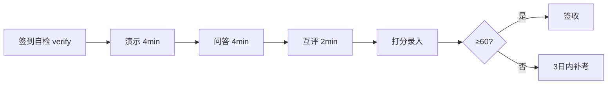
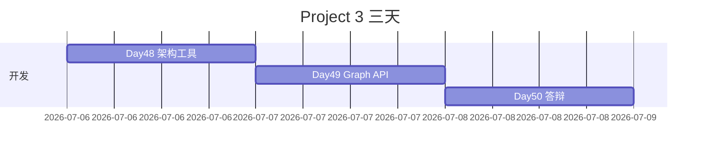

# Day 50 流程图与示意图

## 1. 答辩流程



## 2. Demo 叙事线

```
health → create task → steps → approval preview → resume → result
                    └→ reject 分支（可选第二条）
```

## 3. 三天项目时间轴



## 4. 结业后能力地图

```
Project3 结业 ──→ Day51+ Agent进阶 / 毕业设计选题
```

---

*Day 50 流程图*
