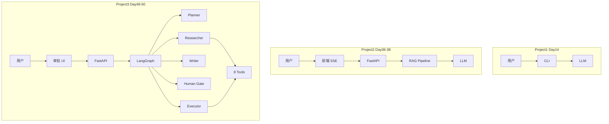

# Day 50 附录 B · 三阶段项目技术对比表（扩展版）

> 与 `09_附录_答辩评委30题.md` 合并阅读。作业范文 + 答辩 **必背矩阵**。

---

## 一、总对比表

| 维度 | 项目一 Day14 | 项目二 Day36–38 | 项目三 Day48–50 |
|------|--------------|-----------------|-----------------|
| **产品名** | 星火智服 CLI 助手 | 知识库问答 Web | 智能办公多 Agent |
| **形态** | 终端 REPL | 浏览器双栏 Chat | 任务时间线 + 审批 |
| **用户** | 开发自测 | 客服/运营查文档 | 员工办公自动化 |
| **记忆** | messages JSON 文件 | SQLite session | LangGraph State + thread_id |
| **模型调用** | 单轮/多轮 chat | RAG 增强单链 | 多节点多轮 + 工具 |
| **检索** | 无 | Hybrid + Rerank + Chroma | document_rag_search |
| **人机协同** | 无 | 无 | interrupt 审批门 |
| **前端** | 无 | SSE 流式 + citations | 轮询 state + 批准/拒绝 |
| **后端** | 脚本内 | FastAPI 8080 | FastAPI 8010 |
| **核心技术** | requests/mock | ingest + hybrid_retriever | LangGraph + 8 tools |
| **验收** | 手动 | verify_project2.py | verify_project3.py |
| **答辩重点** | 指令遵循/持久化 | 引用徽章/上传重建 | 图/审批/工具链 |
| **技术债** | 无鉴权 | 单用户 Chroma | 内存 checkpointer |

---

## 二、架构演进图



---

## 三、共用模块与复用率

| 模块 | P1 | P2 | P3 | 说明 |
|------|----|----|-----|------|
| mock/live 切换 | ✅ | ✅ | ✅ | SPARKTECH_MOCK 约定 |
| FastAPI | — | ✅ | ✅ | CORS + health |
| 工具 registry | — | — | ✅ | TOOL_REGISTRY |
| RAG 概念 | — | ✅ | ✅ | P3 简化版 sample_docs |
| verify 脚本 | — | ✅ | ✅ | CI 回归文化 |
| 护栏 | — | — | 应接 Day46 | 答辩加分项 |

**简历写法**：三项目共用「可测试 Agent 工程化」方法论，而非三个无关 Demo。

---

## 四、接口风格对比

| 项目 | 主入口 | 会话标识 | 流式 |
|------|--------|----------|------|
| P2 | POST /api/chat/stream | session_id | SSE delta + citations |
| P3 | POST /api/tasks | thread_id | 非流式（GET 刷新） |

**为何 P3 未用 SSE？** — 教学聚焦状态机与 interrupt；生产可对 `steps` 推送部分事件。

---

## 五、数据与状态对比

| 项目 | 状态存哪 | 重启后 |
|------|----------|--------|
| P1 | JSON 文件 | 可恢复 |
| P2 | SQLite messages | 可恢复 |
| P3 | MemorySaver | **丢失**（技术债） |

答辩必答：**生产换 Postgres checkpointer**。

---

## 六、安全与合规对比

| 能力 | P2 | P3 |
|------|----|----|
| 上传文件类型 | 扩展白名单 | 固定 sample_docs |
| 外发邮件 | — | human_gate |
| 写日历 | — | executor 后 |
| InputGuard | 建议加 | 建议加 |
| 引用溯源 | citations 徽章 | research steps details |

---

## 七、选型决策树（面试用）

```text
用户要什么？
├─ 只聊天 → P1 / 简单 Chain
├─ 问企业文档 → P2 RAG
└─ 多步办公 + 敏感写 → P3 Agent + 审批
```

---

## 八、学员复盘三问（扩展参考答案）

### 8.1 哪一个项目最能写进简历？为什么？

**建议答 Project3**，因多 Agent + LangGraph + Human-in-the-loop 代表 2025–2026 企业 Agent 主流架构；若应聘 RAG 岗可强调 P2 混合检索调参经验。

### 8.2 三项目中共用哪些模块？

LLMClient/mock 模式、FastAPI 脚手架、工具化思想、verify 驱动开发、星火智服业务语境。

### 8.3 毕业设计 Day58 想基于哪个扩展？

| 方向 | 基于 |
|------|------|
| 客服知识库商业化 | P2 + 混合检索实验台 |
| 办公自动化 | P3 + 持久化 + 真实邮件 API |
| 数据分析 | Day47 Text-to-SQL + P3 Researcher |

---

## 九、答辩 PPT 建议页序（10 页）

1. 封面 — 星火智服三阶段  
2. 业务背景 — Phase1→3  
3. P1 架构图（简）  
4. P2 架构图 + citations 截图  
5. P3 LangGraph 图（**手绘拍照加分**）  
6. Demo 截图 — 审批前后  
7. 技术对比表（本附录表一）  
8. 技术债与生产路线图  
9. 个人贡献与分工  
10. Q&A  

---

## 十、量化指标（可写进答辩）

| 指标 | P2 | P3 |
|------|----|----|
| API 路由数 | ~8 | ~5 |
| 工具/能力数 | RAG pipeline | 8 tools |
| Agent 节点 | 1 链 | 5 节点 |
| verify 用例 | project2 多项 | project3 多项 |
| 前端页面 | 双栏 chat | 单页任务板 |

---

## 十一、技术栈版本备忘（答辩防问）

| 层 | 项目 | 典型依赖 |
|----|------|----------|
| P1 | CLI | requests, python-dotenv |
| P2 | Web RAG | fastapi, chromadb, sse-starlette |
| P3 | Agent | langgraph, langchain-core, fastapi |

统一 Python 3.10+；`requirements.txt` 可现场展示。

---

## 十二、里程碑时间线（简历项目描述）

```text
2026-Q2 Week4  P2 知识库上线内测
2026-Q2 Week5  Agent 专题 + 低代码选型
2026-Q2 Week6  P3 办公助手 + 答辩
```

按周写进简历比「参与 LLM 项目」更有说服力。

---

## 十三、若只能演示一个项目

| 应聘方向 | 演示 | 原因 |
|----------|------|------|
| RAG 工程师 | P2 | 检索调参 + citations |
| Agent 工程师 | P3 | LangGraph + 工具链 |
| 全栈 | P2 或 P3 | 有完整前后端 |
| 算法岗 | P2 检索实验 | 可讲 Recall@K |

---

## 十四、三项目 Git 提交规范建议

```bash
git commit -m "feat(project3): human gate resume API"
git commit -m "fix(project2): citations SSE ordering"
```

清晰 commit 是工程素养信号。

---

## 十五、毕业设计 Day58 方向脑暴

| 方向 | 描述 |
|------|------|
| 混合 Agent | P3 Supervisor 加子 Agent |
| 合规增强 | Day46 护栏全链路接入 P3 |
| 数据分析 | Day47 SQL tool 接入 Researcher |
| 低代码桥接 | Dify FAQ → P3 工单 API |

---

## 十六、Mock 模式三项目联跑脚本

答辩前夜在仓库根目录依次执行：

```bash
cd day14/project1 && python3 -m project1.main --demo-once
cd day36/code/project2 && python3 verify_project2.py
cd day48/code/project3 && SPARKTECH_MOCK=1 PYTHONPATH=$PWD python3 verify_project3.py
```

全绿应在 5 分钟内完成。

---

## 十七、评委追问「和 ChatGPT 有什么区别」

| 维度 | 通用 ChatGPT | 星火智服三项目 |
|------|--------------|----------------|
| 知识来源 | 训练数据 | 企业上传文档 |
| 引用 | 无稳定溯源 | citations / steps |
| 写操作 | 不可控 | P3 审批门 |
| 可测 | 黑盒 | verify 脚本 |

---

*附录 B · Day 50*
