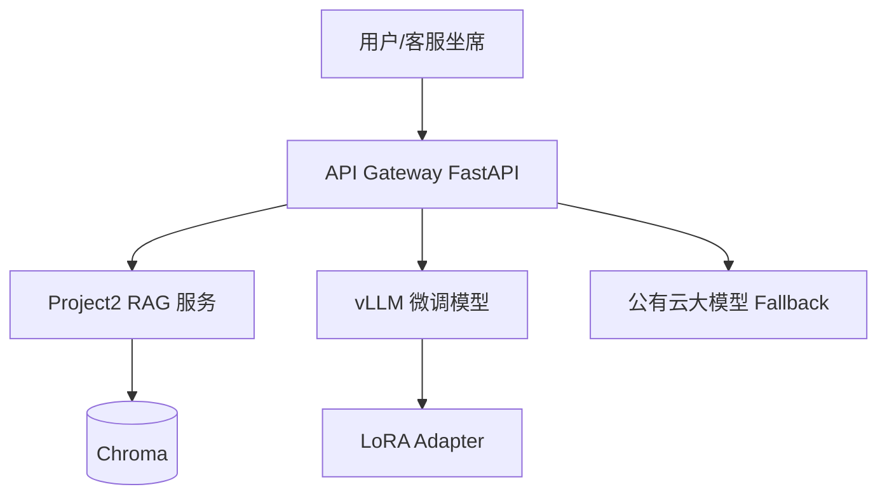

# Day 51 架构与设计 · Phase4 技术栈总览

## 1. 目标架构（Day 57 终点）

## 2. 本周模块划分

| 天 | 模块 |
|----|------|
| 51 | 选型与概念 |
| 52 | 数据集 |
| 53 | LoRA 原理 |
| 54 | LLaMA-Factory 训练 |
| 55 | 离线评估 |
| 56 | vLLM 推理 |
| 57 | Docker Compose 联调 |

## 3. 环境约定

| 变量 | 含义 |
|------|------|
| `SPARKTECH_MOCK=1` | 无 GPU 时模拟训练/推理 |
| `CUDA_VISIBLE_DEVICES` | 有 GPU 学员真训 |
| `VLLM_BASE_URL` | 推理服务地址 |
