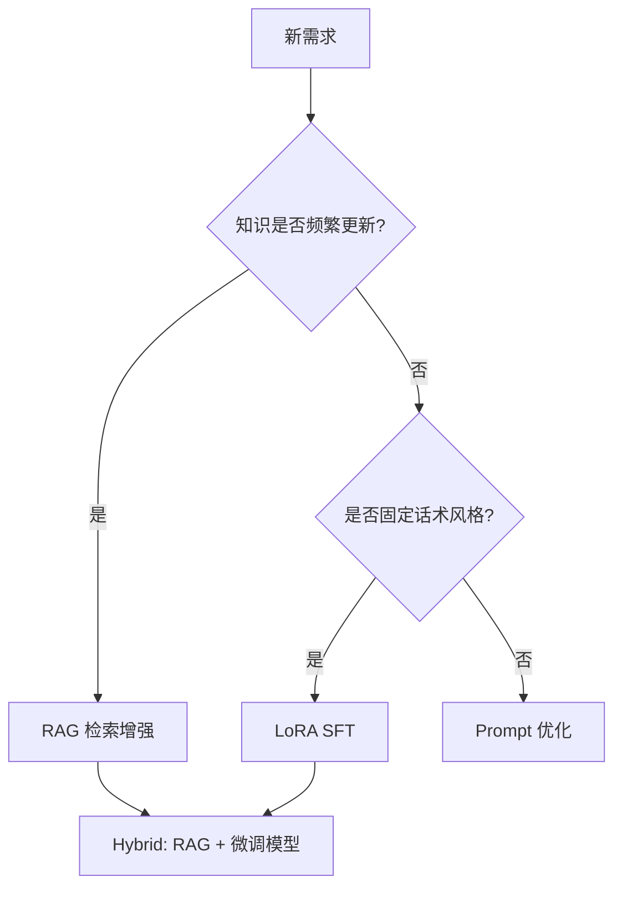

# Day 51 流程图 · 微调选型

```mermaid
flowchart TD
    Q[新需求] --> U{知识是否频繁更新?}
    U -->|是| RAG[RAG 检索增强]
    U -->|否| S{是否固定话术风格?}
    S -->|是| FT[LoRA SFT]
    S -->|否| P[Prompt 优化]
    FT --> H[Hybrid: RAG + 微调模型]
    RAG --> H
```
